## 部署BladeX-Boot

1. 修改application-test.yml，将redis和mysql节点改为刚刚设定的配置

   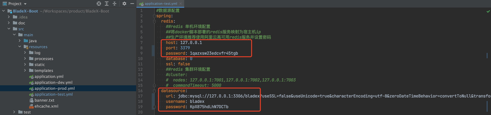

2. 根目录执行打包

   ~~~shell
   mvn clean package -Dmaven.test.skip=true
   ~~~

   

3. 前往宝塔新建的web站点，创建一个api文件夹

   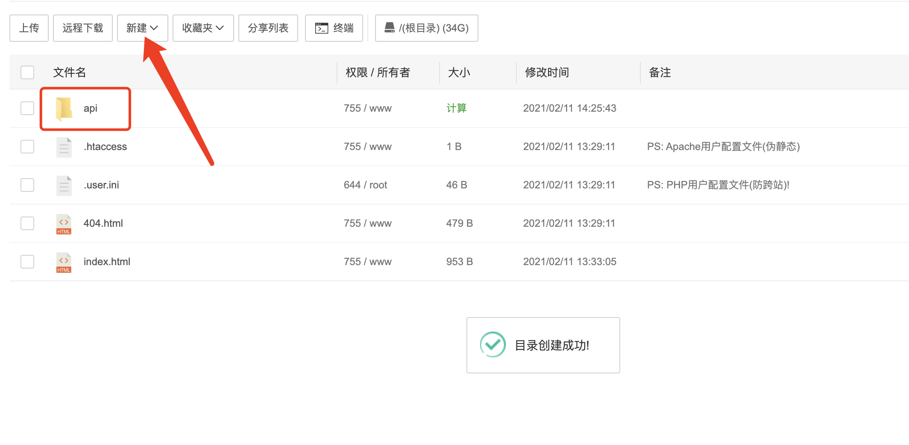

4. 进入api文件夹，上传刚刚打包后的`blade-api.jar`文件

   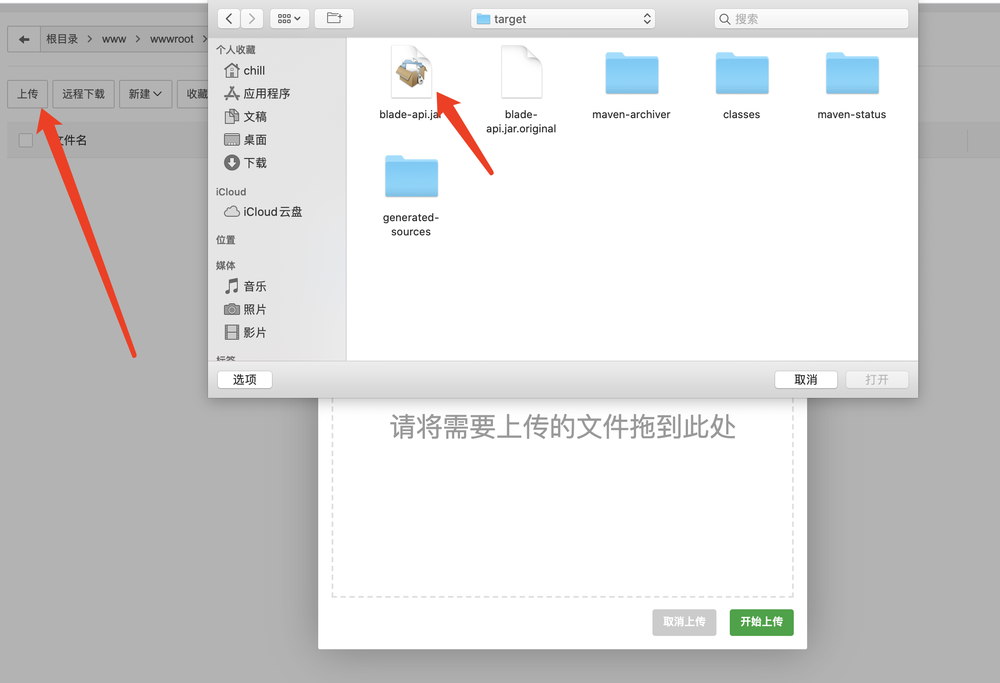

   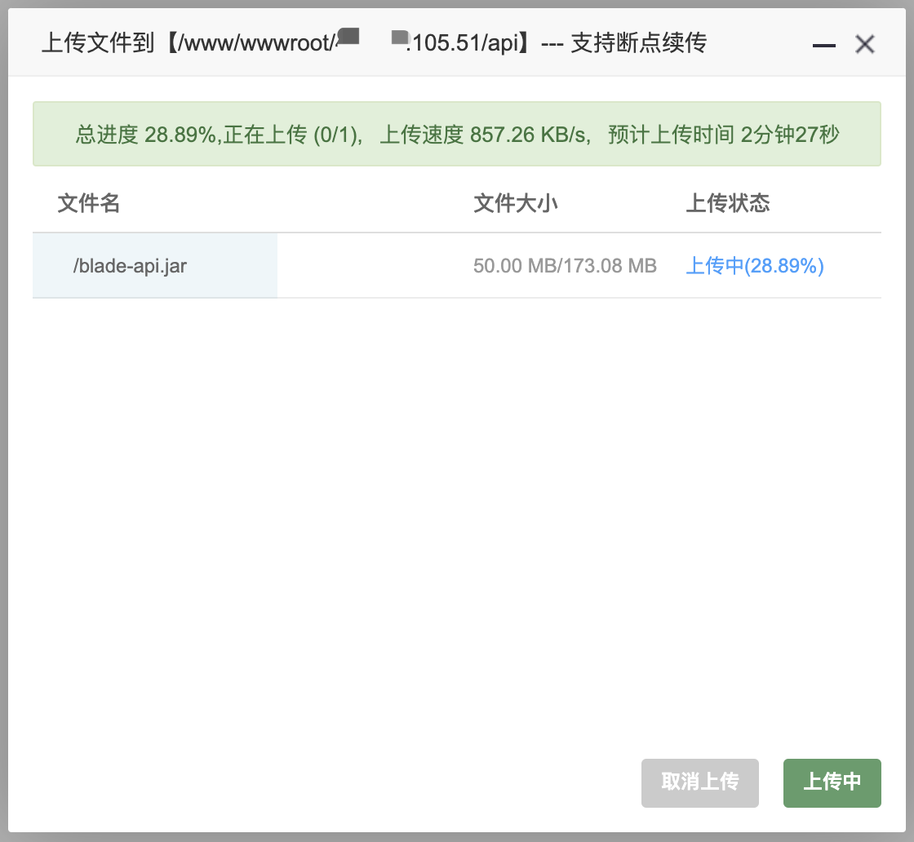

   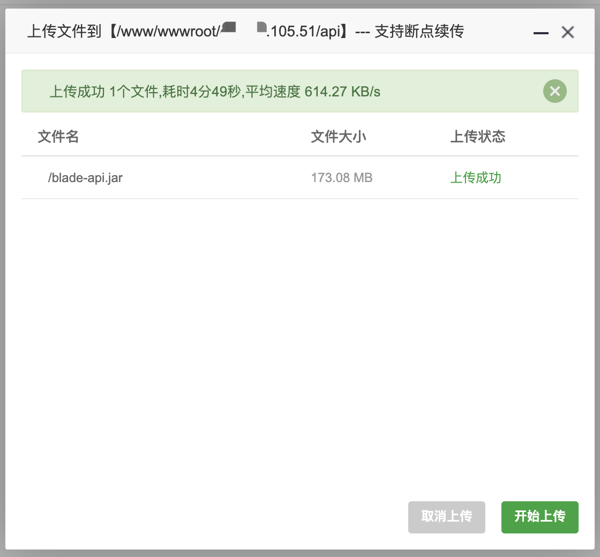

5. 修改部署脚本同样上传至api文件夹

   > 默认端口为80，我们需要改成其他不容易被占用的端口，比如88，给启动命令加上 `--server.port=88`

   > 为了生效`application-test.yml`，给启动命令加上`--spring.profiles.active=test`

   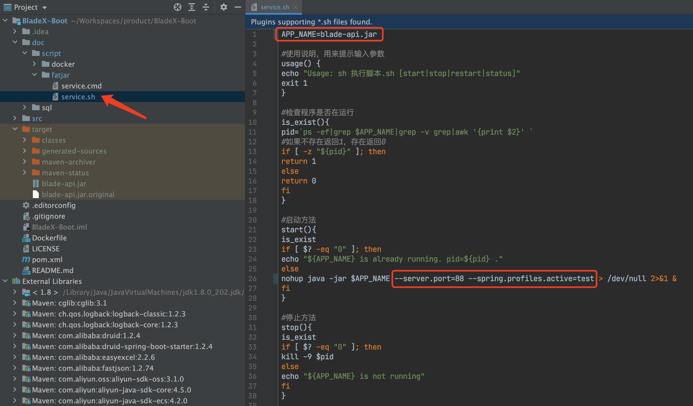

   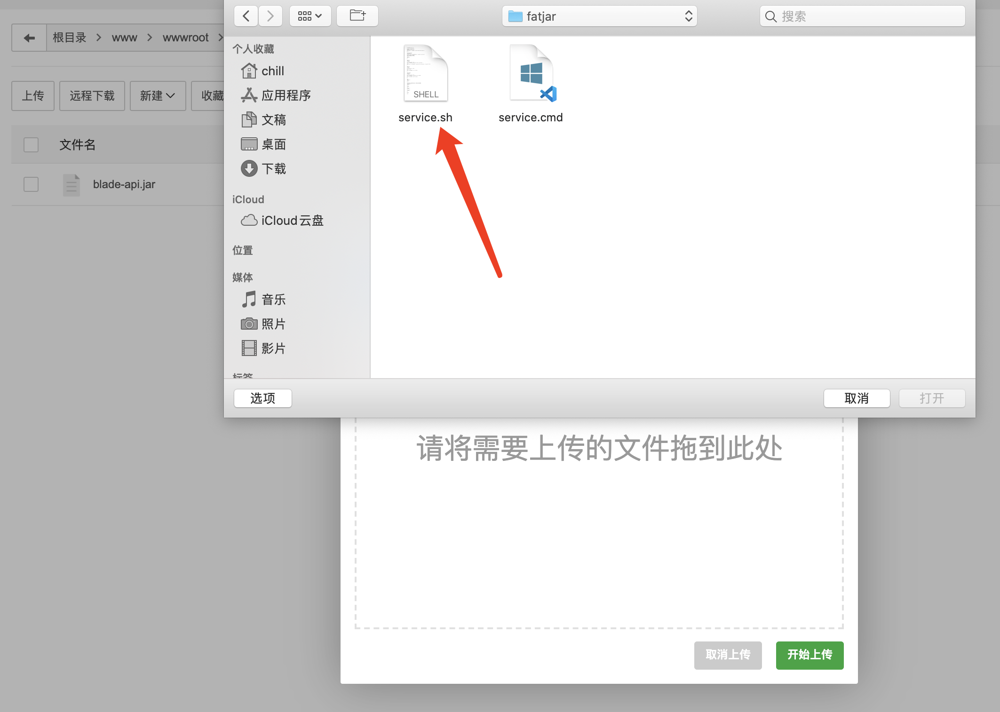

   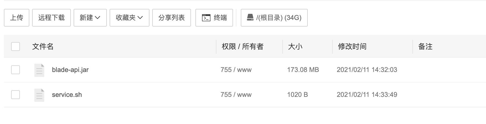

6. 给脚本赋予可执行权限

   

   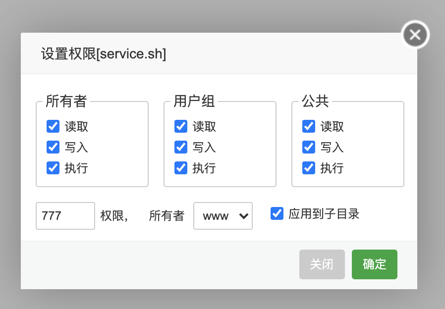

## 启动BladeX-Boot

1. 返回首页，点击SSH终端，输入密码后登录

   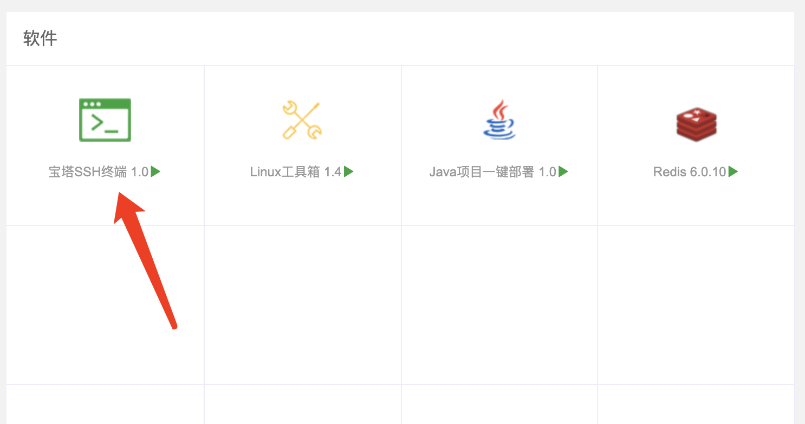

   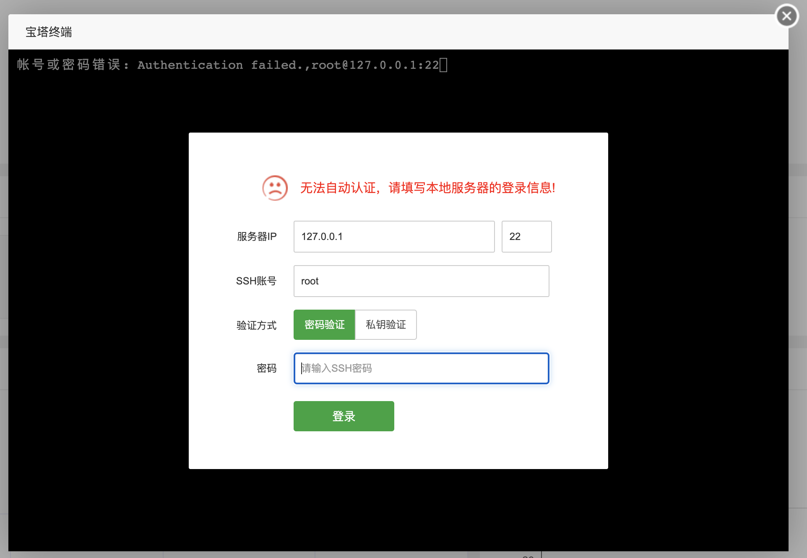

   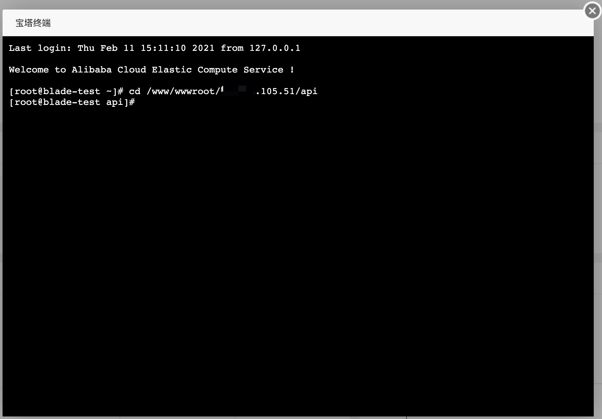

   

2. 进入终端后，先执行 `java -version` 查看环境是否已经配置好，若没有则看上一章节安装`Java一键部署`插件

   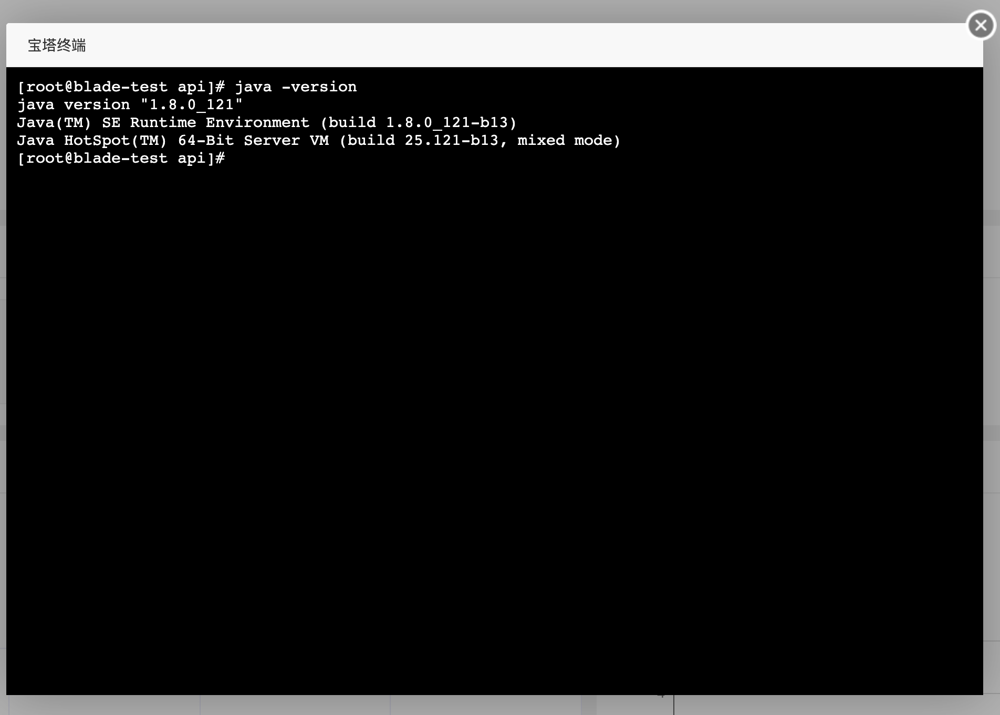

3. 环境无误，则执行脚本进行启动

   ~~~shell
   [root@blade-test api]# ls
   blade-api.jar  service.sh
   [root@blade-test api]# ./service.sh start
   [root@blade-test api]# ./service.sh status
   blade-api.jar is running. Pid is 16110
   ~~~

   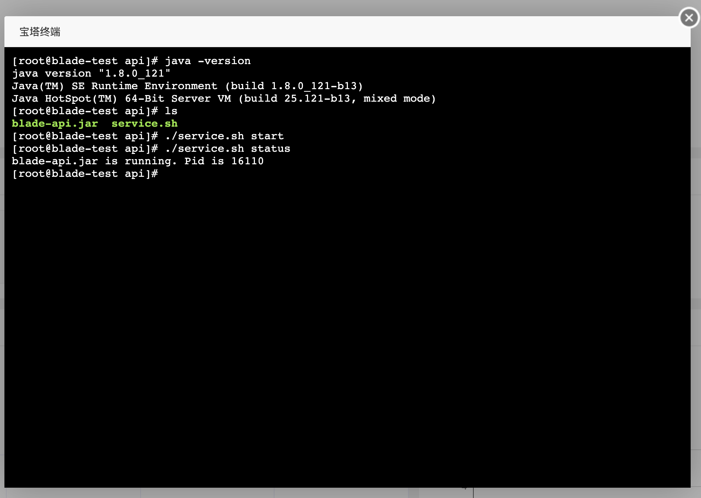

4. 测试一下接口，返回success说明启动成功

   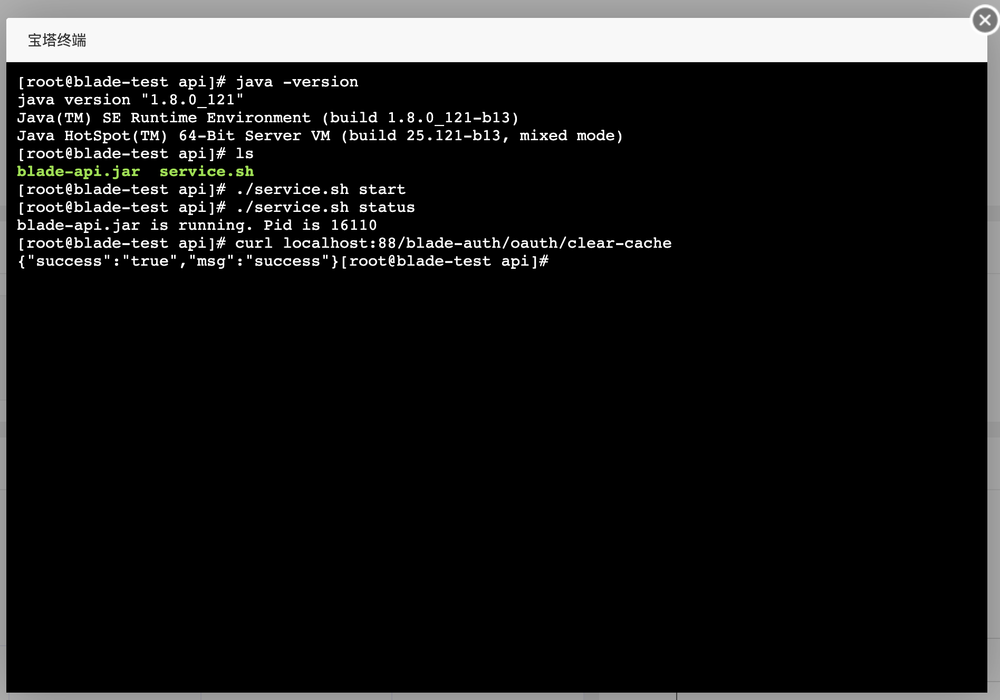
   
5. 下一节我们来看一下前端的部署流程

