## 前言

* 很多时候项目的正式环境都是用于域名访问
* 使用域名的同时也会使用https的形式
* 下面我们演示如何部署一个域名并且配置免费https证书

## 新建站点

1. 给站点起名使用域名形式，这里我们写为`web.bladex.vip`并且给域名做好映射

   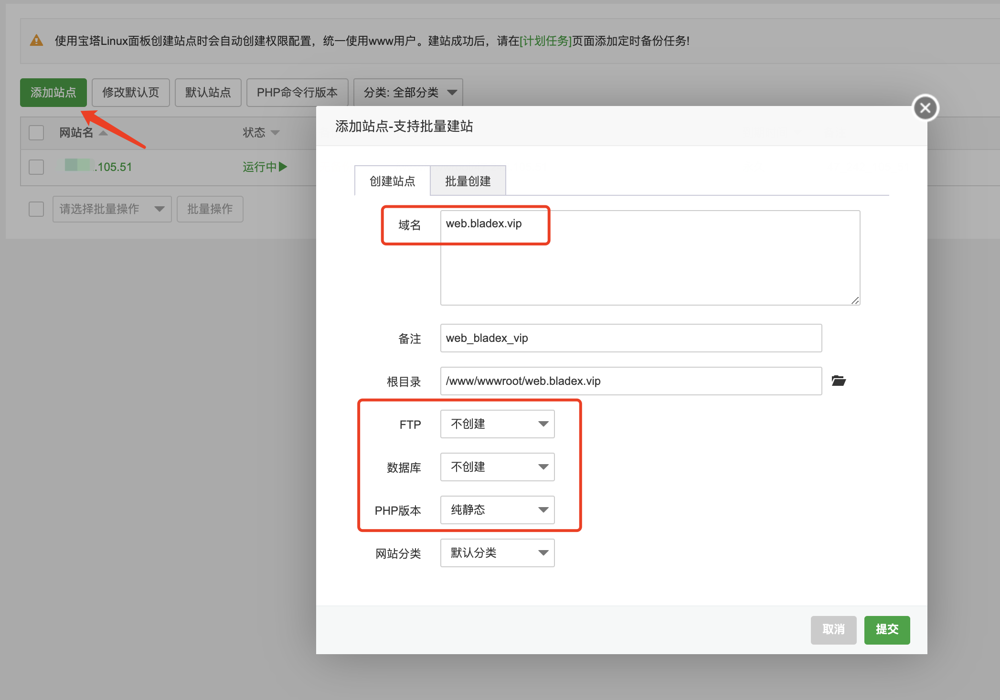

   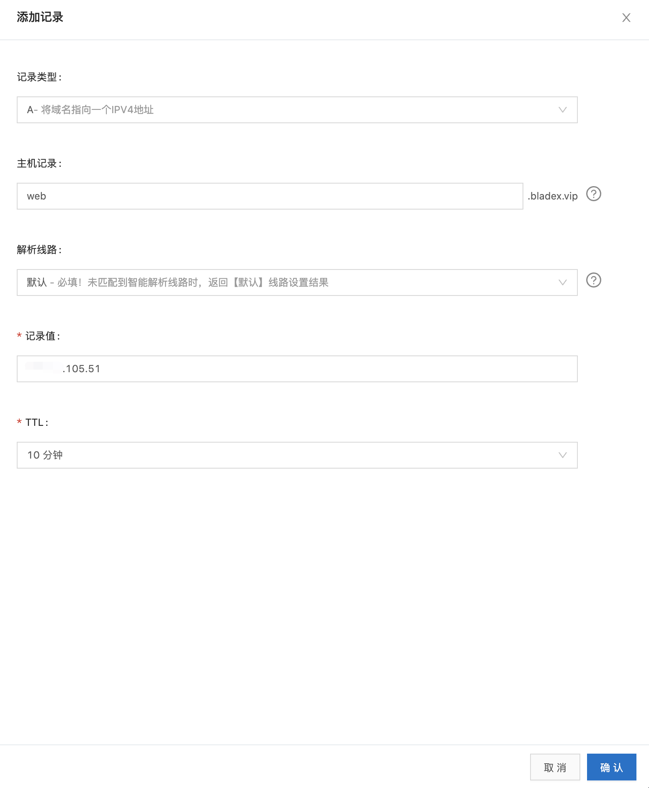

2. 稍等片刻，访问 http://web.bladex.vip，可以看到域名访问生效

   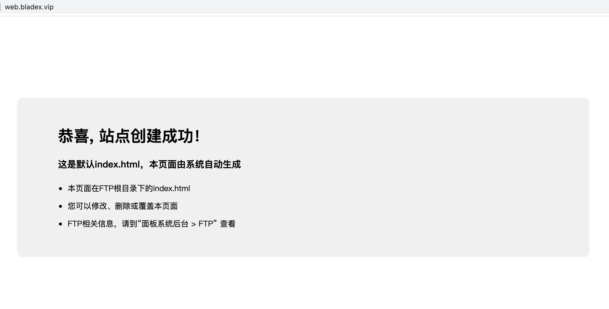

3. 我们将saber部署包上传至新的站点并解压

   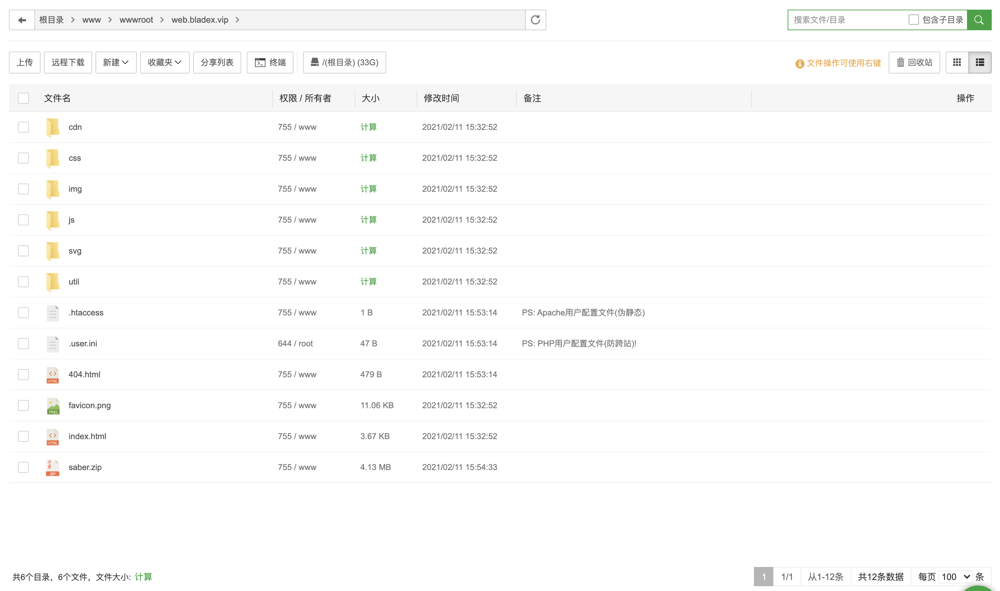

4. 配置伪静态

   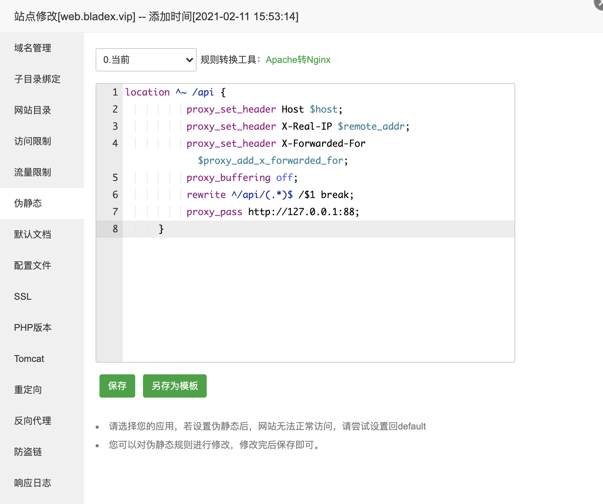

5. 再次刷新 http://web.bladex.vip，可以看到Saber部署成功，也可以正确登录系统

   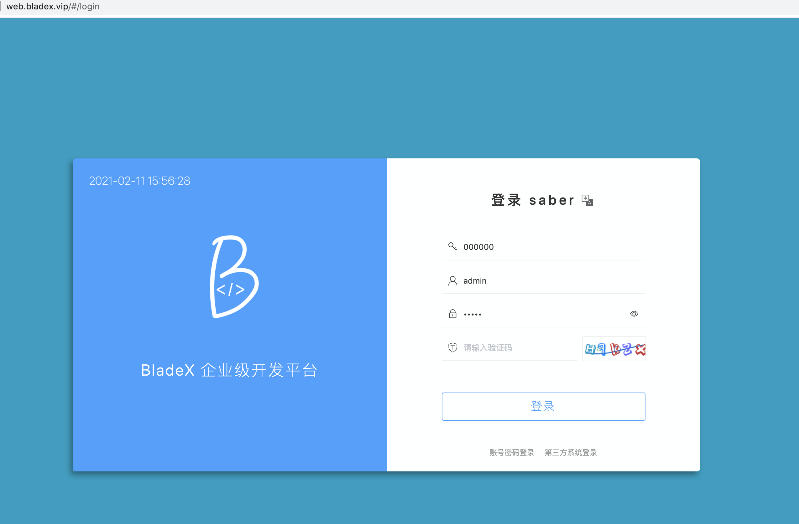

   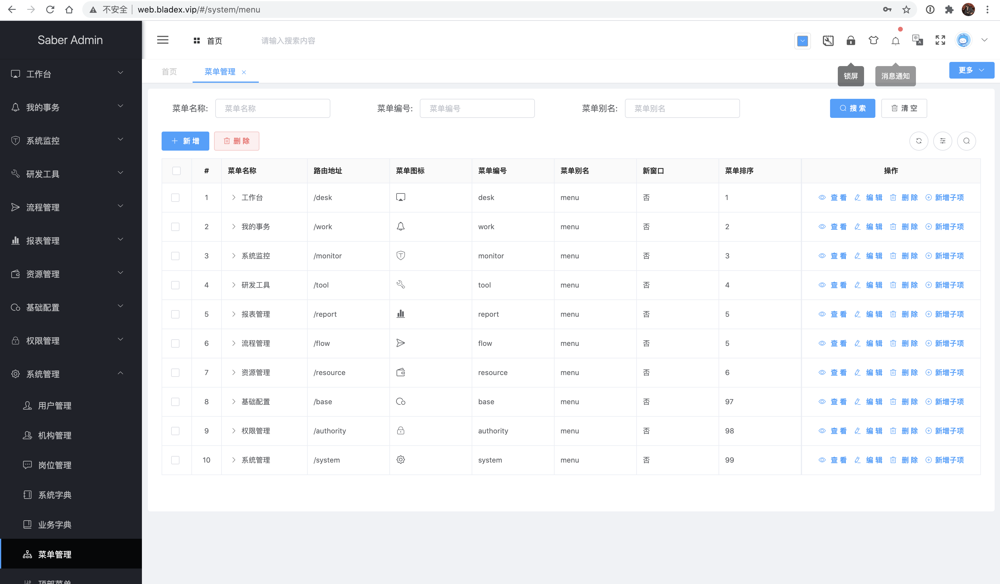

## 配置Https

1. 打开SSL栏目，点击免费的Let's Encrypt，选中域名并点击申请

   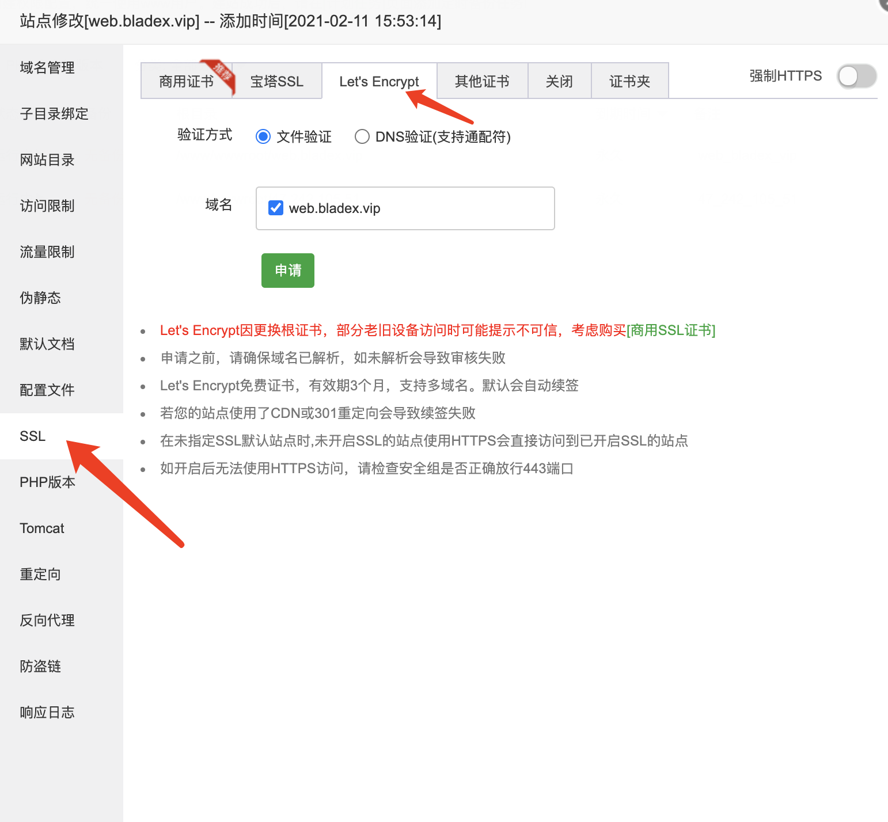

   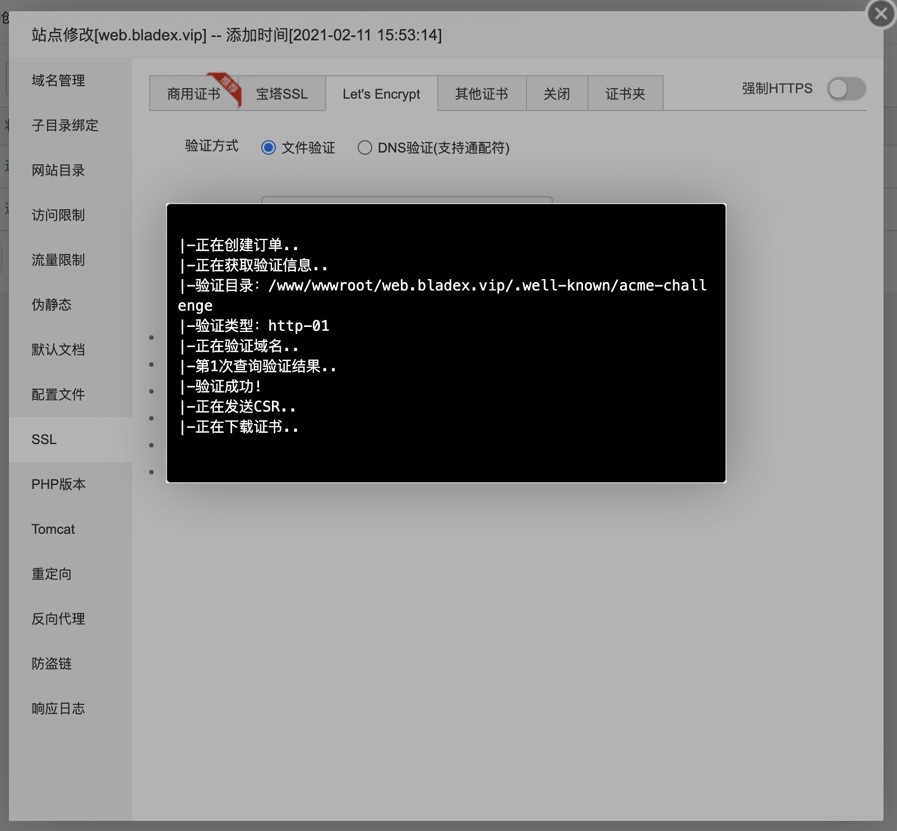

   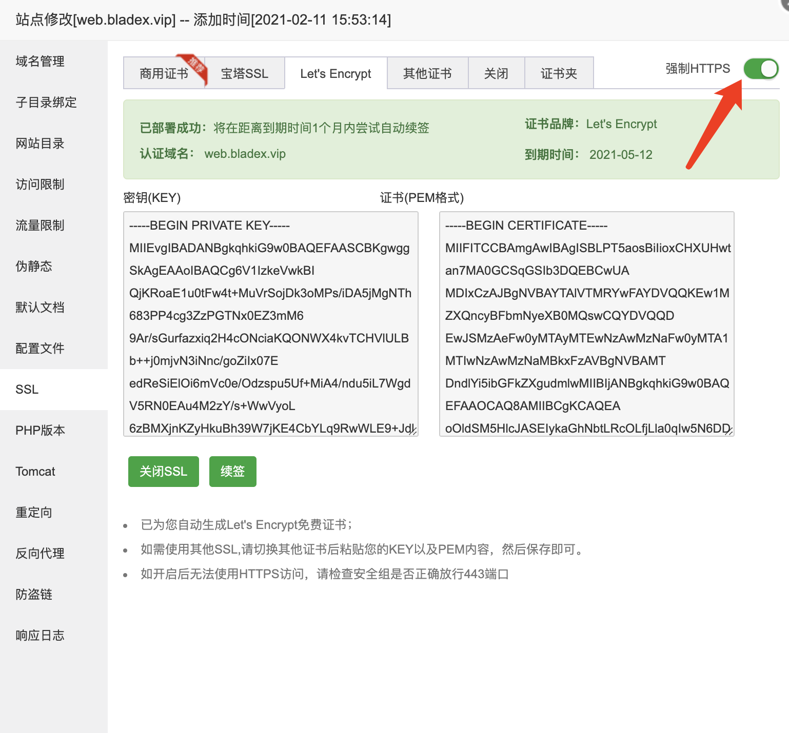

2. 再次刷新 http://web.bladex.vip，可以看到Saber正确访问，并且域名已经变为了https

   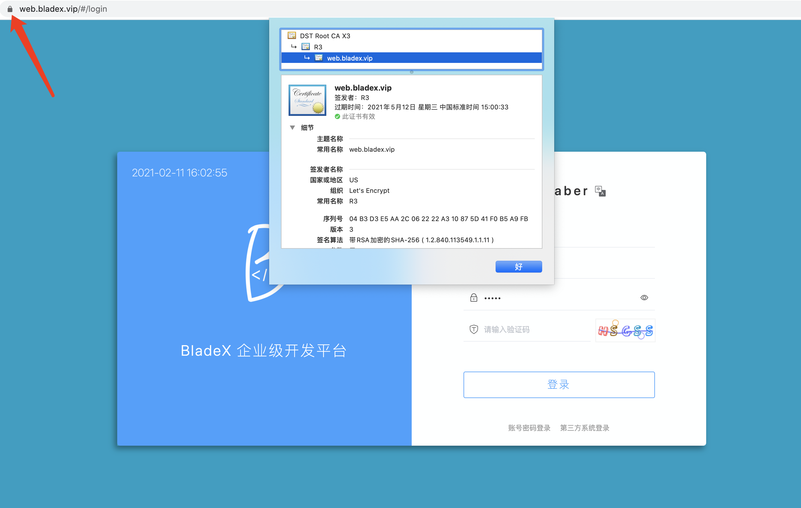
   
3. 登录后一切操作也没有问题，说明部署完美成功

   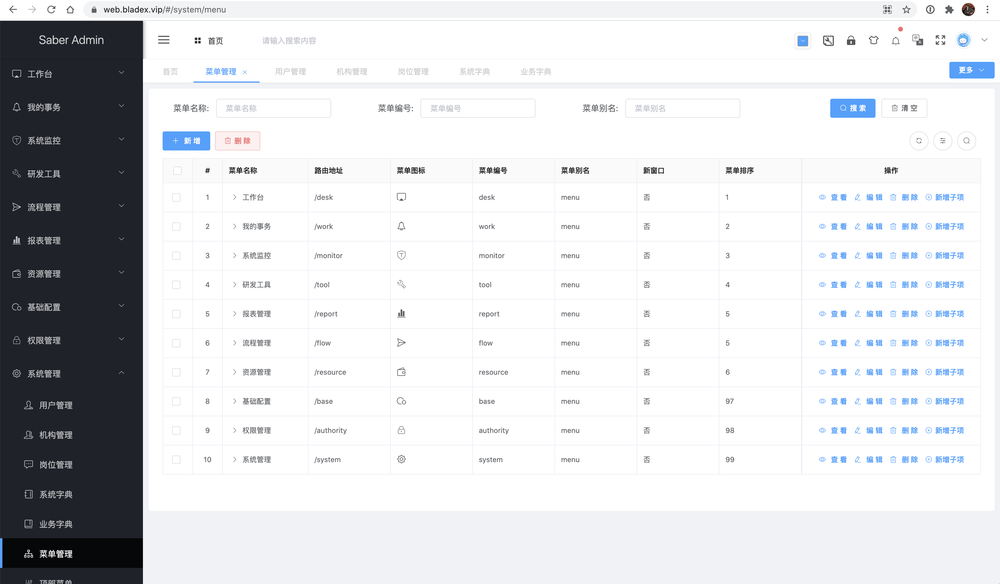

   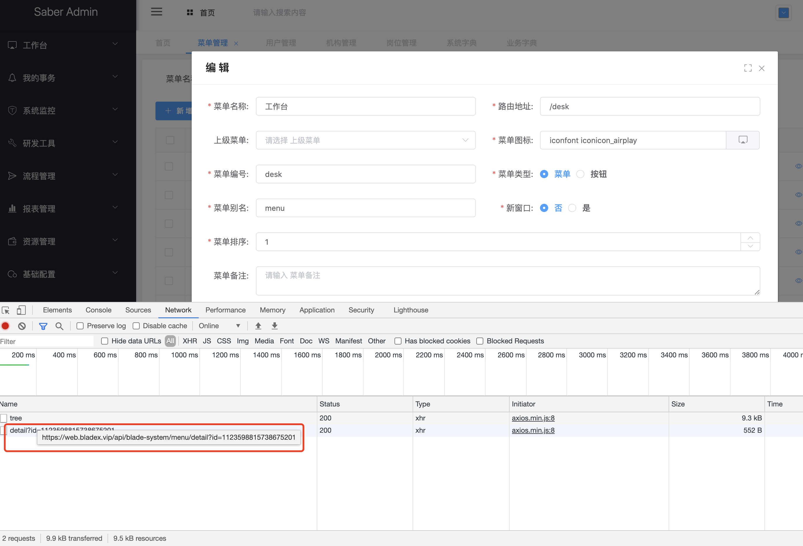

