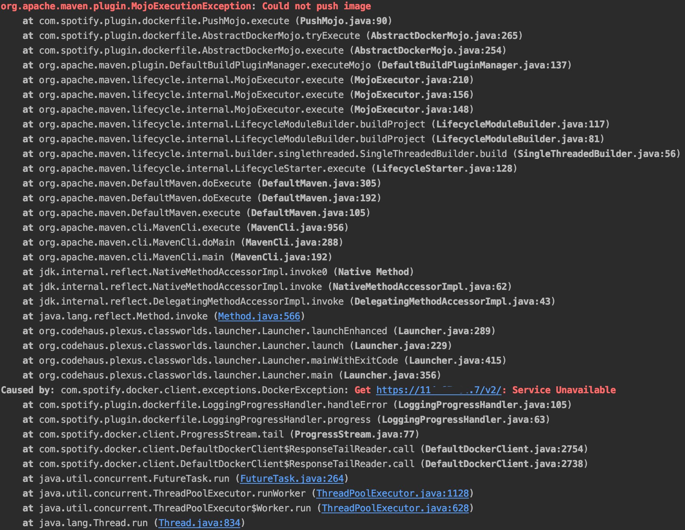
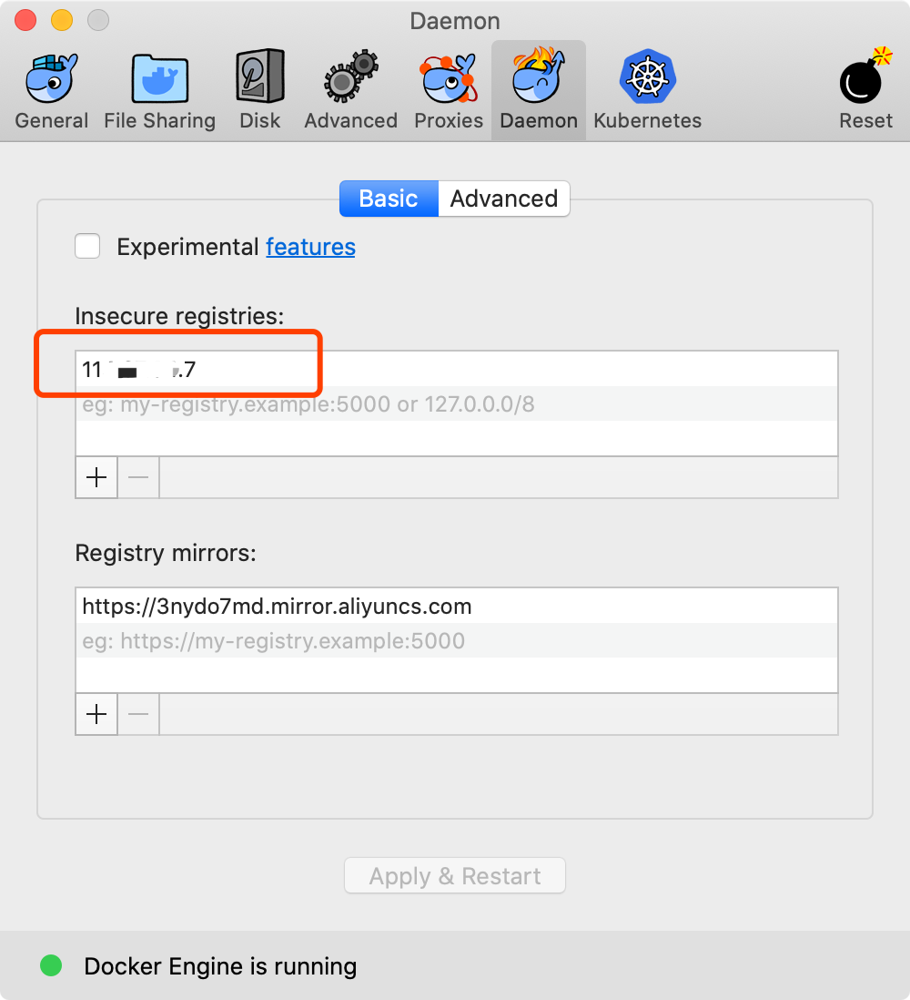

## 常见问题汇总
1. **docker推送镜像报错：Request error: GET unix://localhost:80/version: 503**

**答**：配置好docker插件进行远程推送的时候报错，若出现如下错误，一般是因为开启了vpn等梯子，把它关掉再执行即可。具体可以看对应issue：[https://github.com/spotify/dockerfile-maven/issues/249](https://github.com/spotify/dockerfile-maven/issues/249)

2. **docker推送镜像报错：Get https://xxx.xxx.x.x/v2/: Service Unavailable**
 
**答**：docker默认支持https的协议，而私有库是http的协议
* mac可以在Preferences-->Docker Engine里配置以下代码，xx.xx.xx.xx是自己私有库的地址

* centos系统，修改 /etc/docker/daemon.json，新增如下配置
~~~javascript
{
    "insecure-registries":[
        "xx.xx.xx.xx"
    ]
}
~~~

