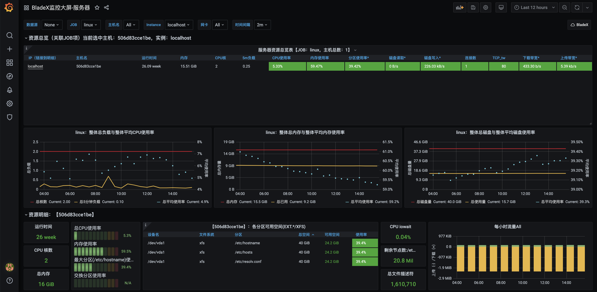
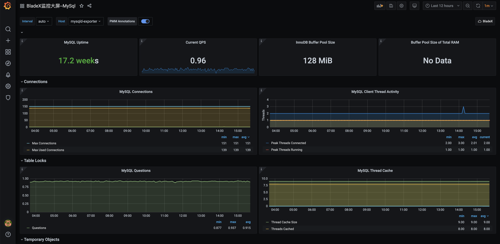
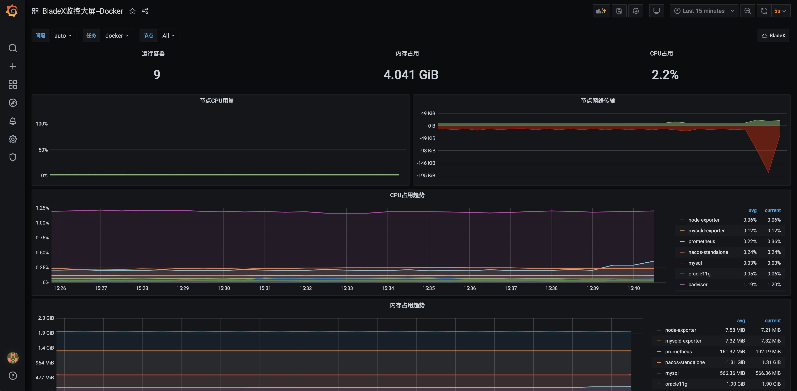
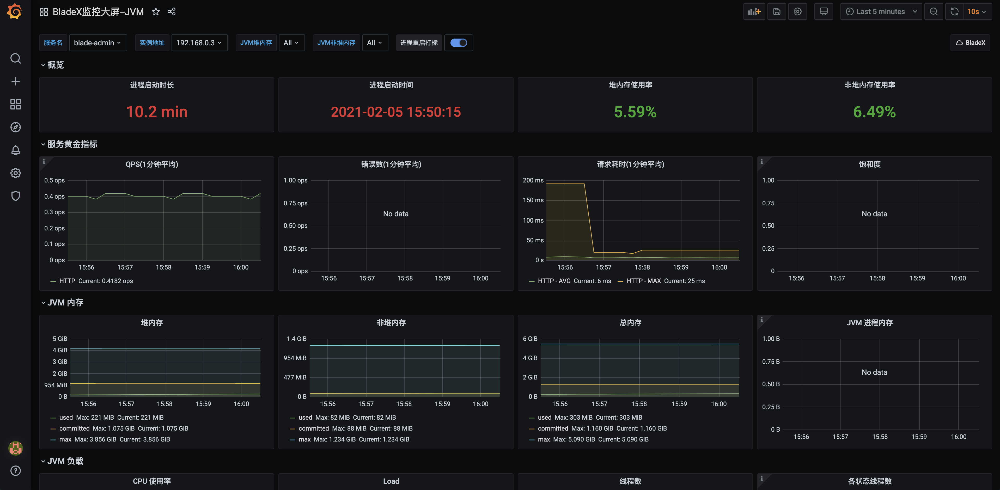
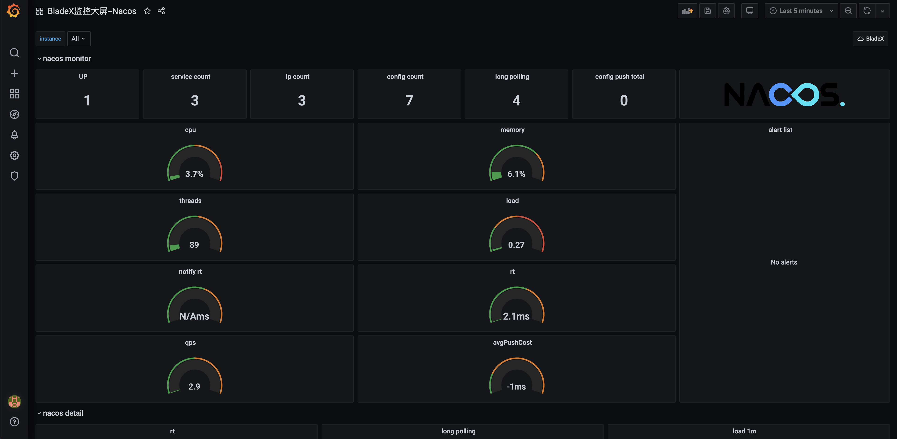

## 前言
* 对于微服务时代来说，监控是必不可少的生产手段
* 有一个良好的监控系统，可以更全面的掌控生产系统的整体状况
* 若生产系统遇到情况也可以第一时间收到告警信息，这对我们来说可以极大地降低生产风险
* 下面我们来看一下基于BladeX构建的Prometheus监控体系
* 看完后我们就开始正式学习如何从0搭建一套Prometheus监控体系

## Linux服务器监控

## Mysql服务监控

## Docker服务监控

## Jvm微服务监控

## Naocs服务监控

