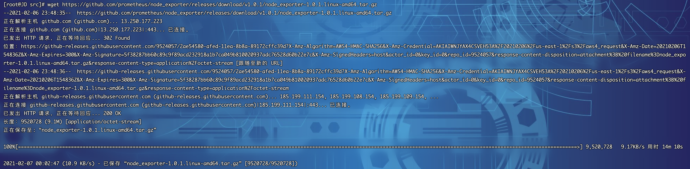
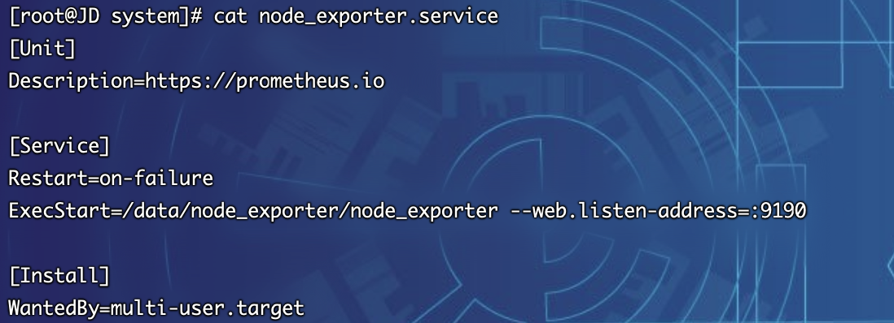
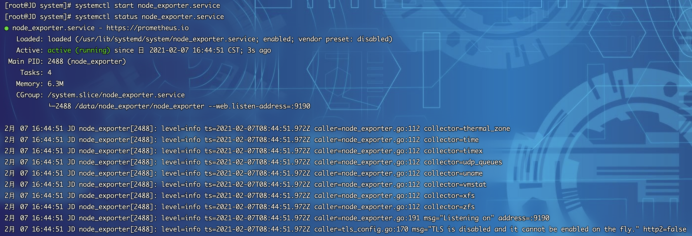
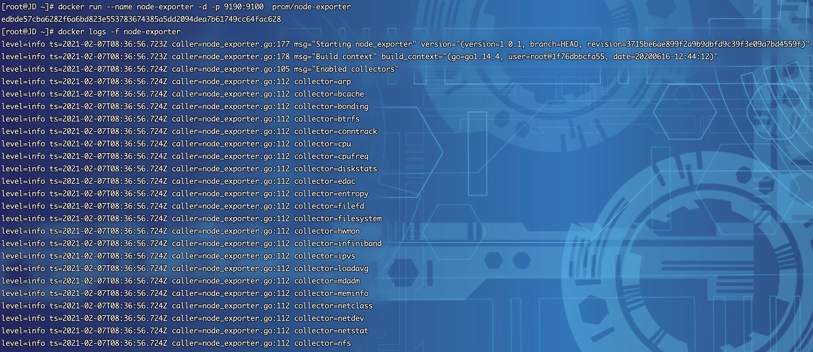
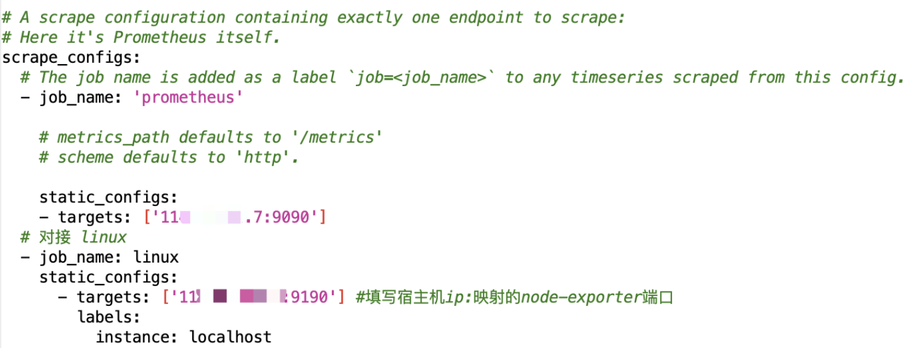
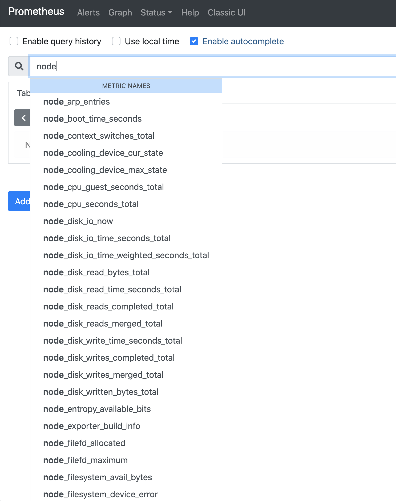
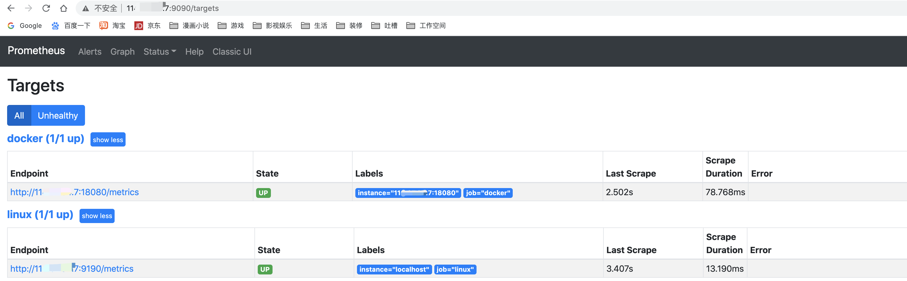

## 简介
> node-exporter采用go语言开发，专门用来收集Linux系统中硬件、系统指标。既可以用二进制安装部署，也可以通过容器形式部署

## 二进制部署
1.  部署前大家可以先前往github发行版地址看一下最新的部署包：https://github.com/prometheus/node_exporter/releases
2.  截至目前最新版本为`1.0.1`，以后若有更新，大家根据版本修改下方的脚本即可
3.  登录Linux服务器（以Centos7.x为例），下载部署包，由于是github，网络会有些慢，大家若等不及可以开发机下载，然后再传至服务器也可。下载包为：`node_exporter-1.0.1.linux-amd64.tar.gz`
~~~shell
[root@JD ~]# cd /usr/local/src/
[root@JD src]# wget https://github.com/prometheus/node_exporter/releases/download/v1.0.1/node_exporter-1.0.1.linux-amd64.tar.gz
~~~

4. 部署包下载完毕，开始安装
~~~shell
[root@JD src]# tar xf node_exporter-1.0.1.linux-amd64.tar.gz -C /data
[root@JD src]# mv /data/node_exporter-1.0.1.linux-amd64 /data/node_exporter
~~~
~~~shell
[root@JD src]# cd /data/node_exporter/
[root@JD node_exporter]# ls
LICENSE  node_exporter  NOTICE
~~~

5. 进行系统service编写
*   创建`node_exporter.service`配置文件
~~~shell
[root@JD node_exporter]# cd /usr/lib/systemd/system
[root@JD system]# vim node_exporter.service
~~~
*   node_exporter.service 文件填入如下内容后保存`:wq`
~~~shell
[Unit]
Description=https://prometheus.io

[Service]
Restart=on-failure
ExecStart=/data/node_exporter/node_exporter --web.listen-address=:9190

[Install]
WantedBy=multi-user.target
~~~
* 查看配置文件
~~~shell
[root@JD system]# cat node_exporter.service
[Unit]
Description=https://prometheus.io

[Service]
Restart=on-failure
ExecStart=/data/node_exporter/node_exporter --web.listen-address=:9190

[Install]
WantedBy=multi-user.target
~~~

*   刷新服务配置并启动服务
~~~shell
[root@JD system]# systemctl daemon-reload
[root@JD system]# systemctl start node_exporter.service
~~~
*   查看服务运行状态
~~~shell
[root@JD system]# systemctl status node_exporter.service
~~~

*   设置开机自启动
~~~shell
[root@JD system]# systemctl enable node_exporter.service
Created symlink from /etc/systemd/system/multi-user.target.wants/node_exporter.service to /usr/lib/systemd/system/node_exporter.service.
~~~

* 测试服务返回
~~~shell
[root@JD node_exporter]# curl localhost:9190/metrics
~~~

## Docker部署
1.  在Docker部署之前，首先要确保拥有Docker环境，具体安装可以参考文档`6.2.3.3章节`
2.  拉取node-exporter最新镜像
~~~shell
[root@JD ~]# docker pull prom/node-exporter
~~~

3. 启动容器
注意：⚠️ 若二进制章节部署后，需要执行`systemctl stop node_exporter.service`关闭服务，否则会造成端口冲突，或者docker的端口映射改为`-p 9190:9100`也可
~~~shell
[root@JD ~]# docker run --name node-exporter -d -p 9190:9100  prom/node-exporter
~~~

4. 测试服务返回
~~~shell
[root@JD node_exporter]# curl localhost:9190/metrics
~~~

## 对接prometheus
1. 打开prometheus.yml，增加如下配置(9100会与elasticsearch端口冲突，推荐映射为9190)
~~~yaml
  # 对接 linux
  - job_name: linux
    static_configs:
      - targets: ['11x.xx.xx.7:9190'] #填写宿主机ip:映射的node-exporter端口
        labels:
          instance: localhost
~~~

2. 执行prometheus配置刷新
~~~shell
[root@JD ~]# curl -XPOST localhost:9090/-/reload
~~~
3. 打开prometheus，搜索node，可以看到出现了很多的参数指标

4. 打开targets，可以看到节点状态已经UP

5. node-exporter插件安装完毕，接下来就是对接监控大屏了，通过它我们可以很轻松地监控linux服务器的各项指标
6. 具体对接grafana导入监控大屏请看后续章节
