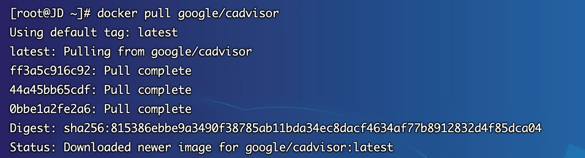
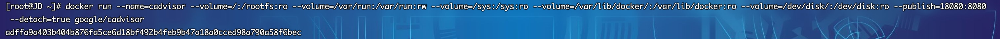
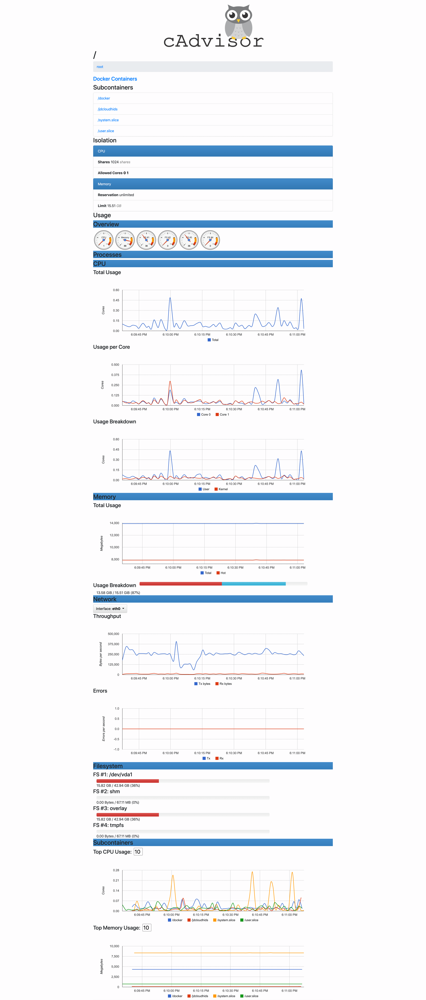
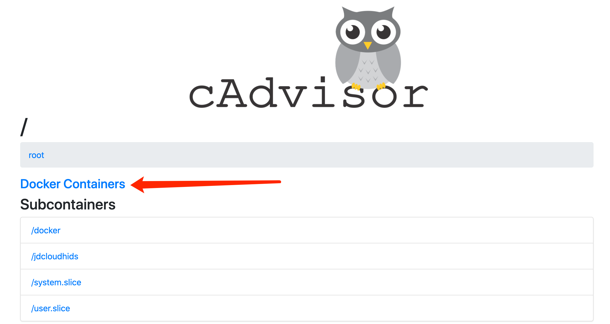
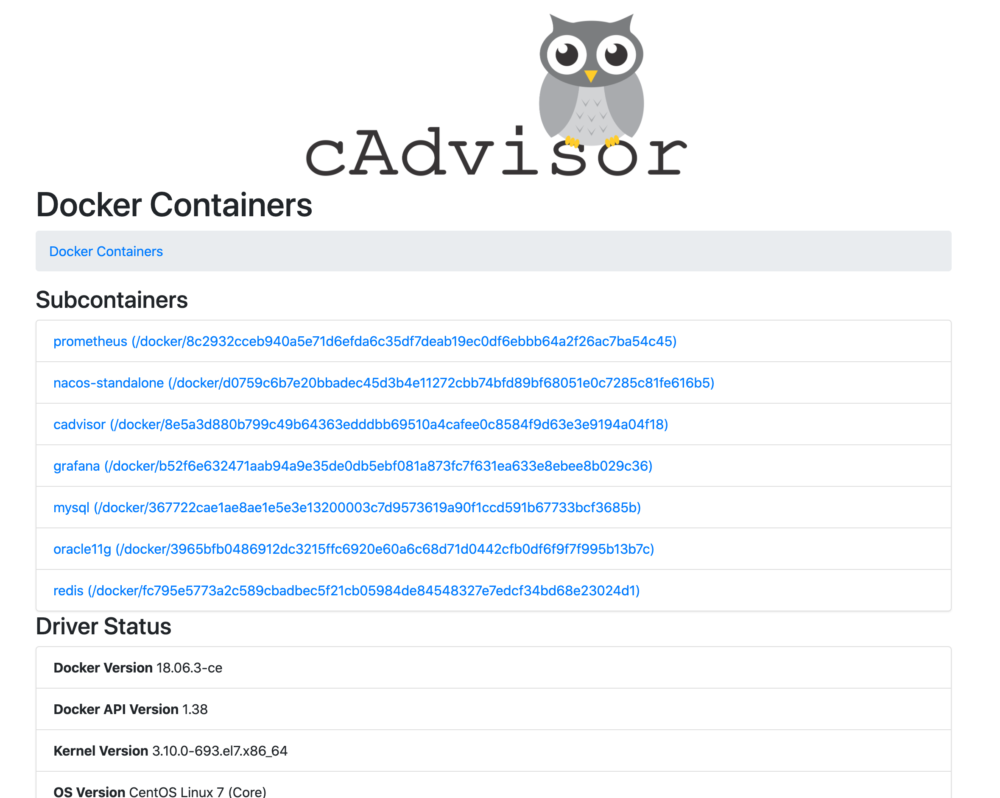
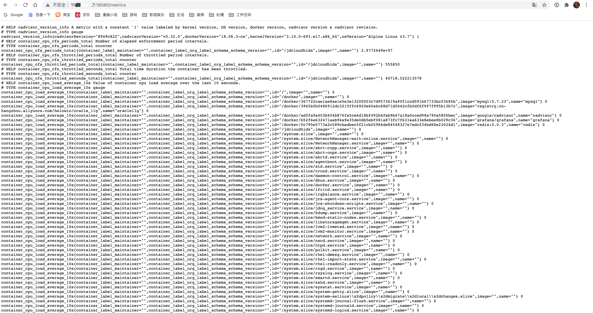

## 简介
* 当docker服务数量到一定程度，为了保证系统的稳定，我们就需要对docker进行监控。一般情况下我们可以通过docker status命令来做简单的监控，但是无法交给prometheus采集，因此谷歌的cadvisor诞生了。
* cadvisor不仅可以轻松收集到所有的容器状态，还对外提供http接口方便prometheus数据抓取。
* cadvisor可以进行实时监控和服务器性能数据采集，包括CUP、内存、网络、容量等数据。但cadvisor不能保存数据只能实时展示，这时候就需要对接到prometheus，由其内置的tsdb进行存储达到可以观看历史数据的目的

## 安装cadvisor监控
1. 在Docker部署之前，首先要确保拥有Docker环境，具体安装可以参考文档`6.2.3.3章节`
2. 拉取cadvisor最新镜像
~~~shell
[root@JD ~]# docker pull google/cadvisor
~~~

3. 启动docker容器
~~~shell
[root@JD ~]# docker run --name=cadvisor --volume=/:/rootfs:ro --volume=/var/run:/var/run:rw --volume=/sys:/sys:ro --volume=/var/lib/docker/:/var/lib/docker:ro --volume=/dev/disk/:/dev/disk:ro --publish=18080:8080 --detach=true google/cadvisor
~~~

4. 访问服务器 http://服务器ip:18080，就可以看到相关信息了

5. 点击 `Docker Containers`，可以看到服务器目前运行的所有容器

6. 访问 http://服务器ip:18080/metrics 看到支持prometheus采集的数据集合

