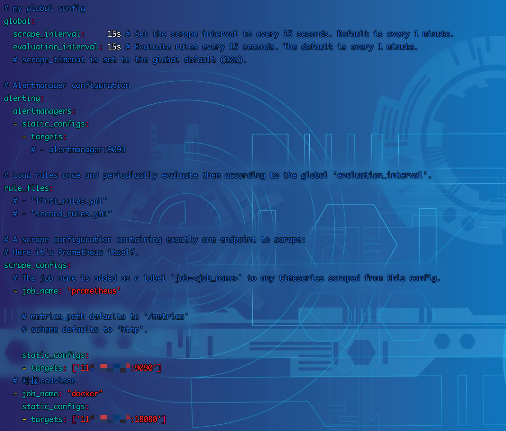
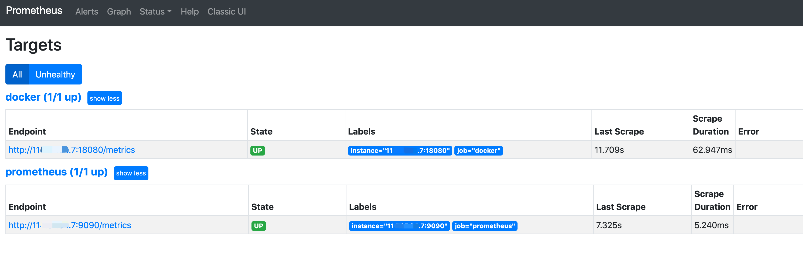
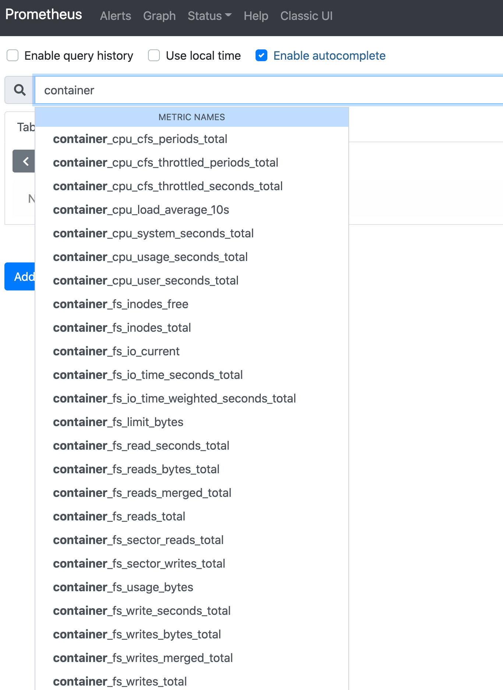

## 对接开始
1. 进入 /data/prometheus，修改prometheus.yml，加入如下配置
~~~yaml
  # 对接cadvisor
  - job_name: "docker"
    static_configs:
    - targets: ['11x.xx.xx.7:18080']
~~~
~~~shell
[root@JD ~]# cd /data/prometheus/
[root@JD prometheus]# ls
console_libraries  consoles  data  LICENSE  NOTICE  prometheus  prometheus.yml  promtool
[root@JD prometheus]# vim prometheus.yml 
~~~

2. 执行动态刷新API，post地址为服务器ip
~~~shell
[root@JD system]# curl -XPOST 11x.xx.xx.7:9090/-/reload
~~~
3. 打开prometheus，可以看到docker主机监控状态已经启动

4. 搜索container，可以看到已经自动关联出相关匹配信息

