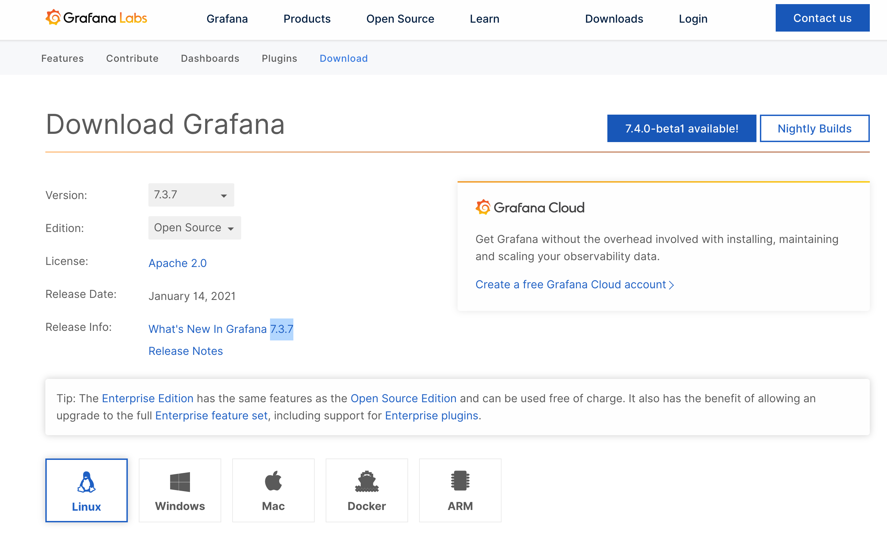
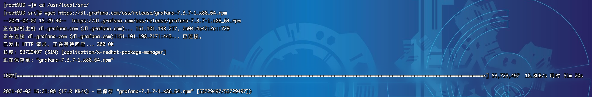
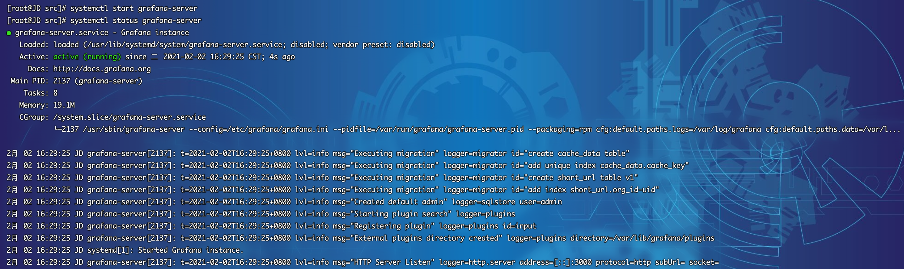
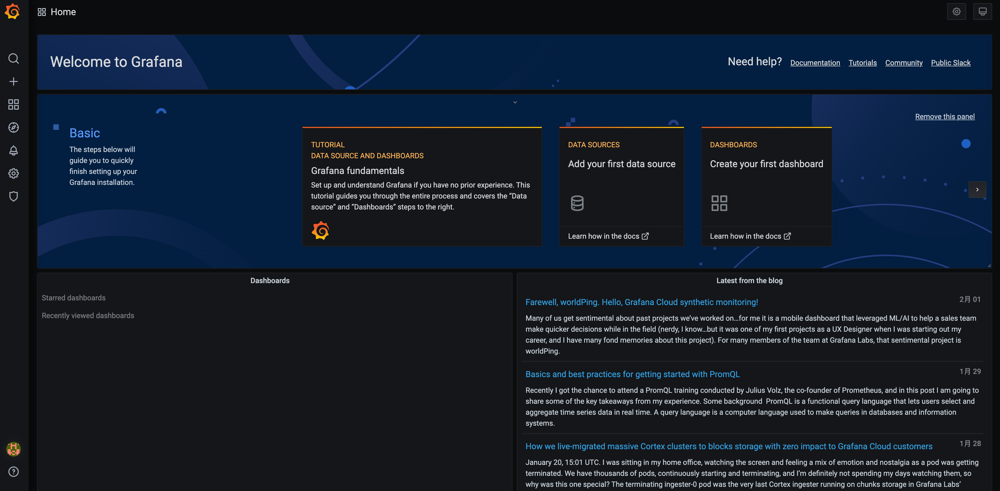

## 二进制部署
1. 部署前大家可以先前往官网地址看一下最新的部署包：https://grafana.com/grafana/download?platform=linux
2. 截至目前最新版本为 `7.3.7` ，以后若有更新，大家根据版本修改下方的脚本即可

3. 登录Linux服务器（以Centos7.x为例），下载部署包，由于是国外网址，网络会有些慢，大家若等不及可以开发机下载，然后再传至服务器也可。下载包为：`grafana-7.3.7-1.x86_64.rpm`
~~~shell
[root@JD ~]# cd /usr/local/src/
[root@JD src]# wget https://dl.grafana.com/oss/release/grafana-7.3.7-1.x86_64.rpm
~~~

4. 部署包下载完毕，开始安装
~~~shell
[root@JD src]# ls
grafana-7.3.7-1.x86_64.rpm
[root@JD src]# sudo yum install -y grafana-7.3.7-1.x86_64.rpm
~~~

5. 配置文件位于 `/etc/grafana/grafana.ini`，后续若有需要可以自行配置
~~~shell
[root@JD src]# cat /etc/grafana/grafana.ini
~~~

6. 启动服务并查看状态
~~~shell
[root@JD src]# systemctl start grafana-server
[root@JD src]# systemctl status grafana-server
~~~

7. 设置开机自启动
~~~shell
[root@JD src]# systemctl enable grafana-server
Created symlink from /etc/systemd/system/multi-user.target.wants/grafana-server.service to /usr/lib/systemd/system/grafana-server.service.
~~~

## 访问系统
1. 执行`systemctl start grafana-server`，访问系统 http://服务器ip:3000，注意防火墙或安全组开放端口。

2. 首次访问，帐号密码均为`admin`，登录成功后会强制修改密码，修改完毕登录

3. 成功登录首页

 

