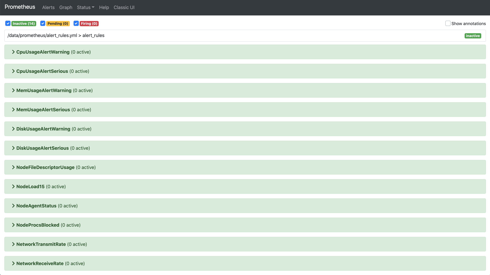
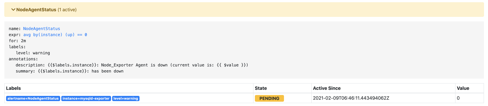
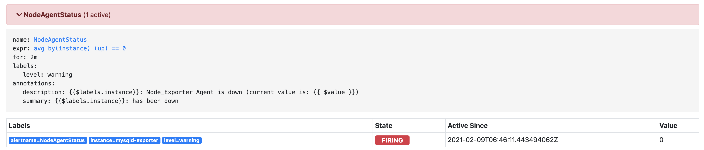
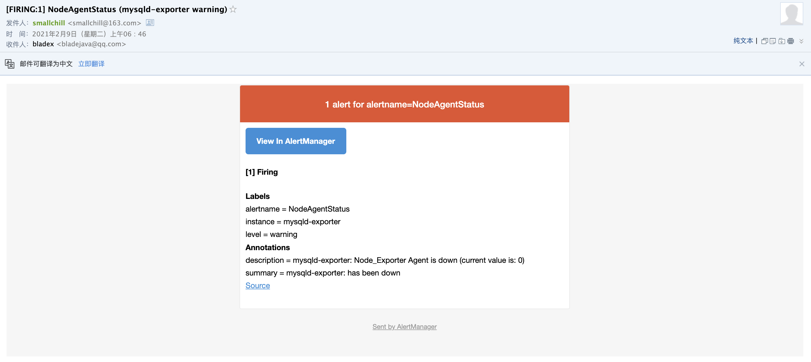

## 配置邮箱信息

1. 打开`/data/alertmanager/alertmanager.yml`文件，将原配置删除，加入如下内容并重启`alertmanger服务`

   ~~~yaml
   global:
     # 在没有报警的情况下声明为已解决的时间
     resolve_timeout: 5m
     # 配置邮件发送信息
     smtp_smarthost: 'smtp.163.com:25'
     # 邮箱地址
     smtp_from: 'youremail@163.com'
     # 邮箱地址
     smtp_auth_username: 'youremail@163.com'
     # 邮箱授权码，需要自行开启设置，非邮箱密码
     smtp_auth_password: 'xxxxxxxx'
     # 邮箱地址
     smtp_hello: 'youremail@163.com'
     smtp_require_tls: false
   
   route:
     # 接收到告警后到自定义分组
     group_by: ["alertname"]
     # 分组创建后初始化等待时长
     group_wait: 10s
     # 告警信息发送之前的等待时长
     group_interval: 30s
     # 重复报警的间隔时长
     repeat_interval: 5m
     # 默认消息接收
     receiver: "email"
   
   receivers:
     # 邮件
     - name: 'email'
       email_configs:
         - to: 'your email'
           send_resolved: true
   
   ~~~

2. 在prometheus文件夹根目录增加`alert_rules.yaml`配置文件，内容如下

   ~~~yaml
   groups:
     - name: alert_rules
       rules:
         - alert: CpuUsageAlertWarning
           expr: sum(avg(irate(node_cpu_seconds_total{mode!='idle'}[5m])) without (cpu)) by (instance) > 0.60
           for: 2m
           labels:
             level: warning
           annotations:
             summary: "Instance {{ $labels.instance }} CPU usage high"
             description: "{{ $labels.instance }} CPU usage above 60% (current value: {{ $value }})"
         - alert: CpuUsageAlertSerious
           #expr: sum(avg(irate(node_cpu_seconds_total{mode!='idle'}[5m])) without (cpu)) by (instance) > 0.85
           expr: (100 - (avg by (instance) (irate(node_cpu_seconds_total{job=~".*",mode="idle"}[5m])) * 100)) > 85
           for: 3m
           labels:
             level: serious
           annotations:
             summary: "Instance {{ $labels.instance }} CPU usage high"
             description: "{{ $labels.instance }} CPU usage above 85% (current value: {{ $value }})"
         - alert: MemUsageAlertWarning
           expr: avg by(instance) ((1 - (node_memory_MemFree_bytes + node_memory_Buffers_bytes + node_memory_Cached_bytes) / node_memory_MemTotal_bytes) * 100) > 70
           for: 2m
           labels:
             level: warning
           annotations:
             summary: "Instance {{ $labels.instance }} MEM usage high"
             description: "{{$labels.instance}}: MEM usage is above 70% (current value is: {{ $value }})"
         - alert: MemUsageAlertSerious
           expr: (node_memory_MemTotal_bytes - node_memory_MemAvailable_bytes)/node_memory_MemTotal_bytes > 0.90
           for: 3m
           labels:
             level: serious
           annotations:
             summary: "Instance {{ $labels.instance }} MEM usage high"
             description: "{{ $labels.instance }} MEM usage above 90% (current value: {{ $value }})"
         - alert: DiskUsageAlertWarning
           expr: (1 - node_filesystem_free_bytes{fstype!="rootfs",mountpoint!="",mountpoint!~"/(run|var|sys|dev).*"} / node_filesystem_size_bytes) * 100 > 80
           for: 2m
           labels:
             level: warning
           annotations:
             summary: "Instance {{ $labels.instance }} Disk usage high"
             description: "{{$labels.instance}}: Disk usage is above 80% (current value is: {{ $value }})"
         - alert: DiskUsageAlertSerious
           expr: (1 - node_filesystem_free_bytes{fstype!="rootfs",mountpoint!="",mountpoint!~"/(run|var|sys|dev).*"} / node_filesystem_size_bytes) * 100 > 90
           for: 3m
           labels:
             level: serious
           annotations:
             summary: "Instance {{ $labels.instance }} Disk usage high"
             description: "{{$labels.instance}}: Disk usage is above 90% (current value is: {{ $value }})"
         - alert: NodeFileDescriptorUsage
           expr: avg by (instance) (node_filefd_allocated{} / node_filefd_maximum{}) * 100 > 60
           for: 2m
           labels:
             level: warning
           annotations:
             summary: "Instance {{ $labels.instance }} File Descriptor usage high"
             description: "{{$labels.instance}}: File Descriptor usage is above 60% (current value is: {{ $value }})"
         - alert: NodeLoad15
           expr: avg by (instance) (node_load15{}) > 80
           for: 2m
           labels:
             level: warning
           annotations:
             summary: "Instance {{ $labels.instance }} Load15 usage high"
             description: "{{$labels.instance}}: Load15 is above 80 (current value is: {{ $value }})"
         - alert: NodeAgentStatus
           expr: avg by (instance) (up{}) == 0
           for: 2m
           labels:
             level: warning
           annotations:
             summary: "{{$labels.instance}}: has been down"
             description: "{{$labels.instance}}: Node_Exporter Agent is down (current value is: {{ $value }})"
         - alert: NodeProcsBlocked
           expr: avg by (instance) (node_procs_blocked{}) > 10
           for: 2m
           labels:
             level: warning
           annotations:
             summary: "Instance {{ $labels.instance }}  Process Blocked usage high"
             description: "{{$labels.instance}}: Node Blocked Procs detected! above 10 (current value is: {{ $value }})"
         - alert: NetworkTransmitRate
           #expr:  avg by (instance) (floor(irate(node_network_transmit_bytes_total{device="ens192"}[2m]) / 1024 / 1024)) > 50
           expr:  avg by (instance) (floor(irate(node_network_transmit_bytes_total{}[2m]) / 1024 / 1024 * 8 )) > 40
           for: 1m
           labels:
             level: warning
           annotations:
             summary: "Instance {{ $labels.instance }} Network Transmit Rate usage high"
             description: "{{$labels.instance}}: Node Transmit Rate (Upload) is above 40Mbps/s (current value is: {{ $value }}Mbps/s)"
         - alert: NetworkReceiveRate
           #expr:  avg by (instance) (floor(irate(node_network_receive_bytes_total{device="ens192"}[2m]) / 1024 / 1024)) > 50
           expr:  avg by (instance) (floor(irate(node_network_receive_bytes_total{}[2m]) / 1024 / 1024 * 8 )) > 40
           for: 1m
           labels:
             level: warning
           annotations:
             summary: "Instance {{ $labels.instance }} Network Receive Rate usage high"
             description: "{{$labels.instance}}: Node Receive Rate (Download) is above 40Mbps/s (current value is: {{ $value }}Mbps/s)"
         - alert: DiskReadRate
           expr: avg by (instance) (floor(irate(node_disk_read_bytes_total{}[2m]) / 1024 )) > 200
           for: 2m
           labels:
             level: warning
           annotations:
             summary: "Instance {{ $labels.instance }} Disk Read Rate usage high"
             description: "{{$labels.instance}}: Node Disk Read Rate is above 200KB/s (current value is: {{ $value }}KB/s)"
         - alert: DiskWriteRate
           expr: avg by (instance) (floor(irate(node_disk_written_bytes_total{}[2m]) / 1024 / 1024 )) > 20
           for: 2m
           labels:
             level: warning
           annotations:
             summary: "Instance {{ $labels.instance }} Disk Write Rate usage high"
             description: "{{$labels.instance}}: Node Disk Write Rate is above 20MB/s (current value is: {{ $value }}MB/s)"
   
   ~~~

3. 修改`prometheys.yaml`,最上方三个节点改为如下配置，执行`curl -XPOST localhost:9090/-/reload`刷新配置

   **注意⚠️：若prometheus为docker部署的服务，则需要关闭后重新启动，同时使用 -v 挂载目录才会读取到rules文件**
   
   ~~~yaml
   global:
     scrape_interval:     15s 
     evaluation_interval: 15s 
   
   alerting:
     alertmanagers:
     - static_configs:
     	# alertmanager服务地址
       - targets: ['11x.xx.x.7:9093']
   
   rule_files:
     - "alert_rules.yml"
   ~~~

## 验证配置

1. 打开prometheus服务，可以看到alerts栏出现了很多规则

   

2. 此时我们手动关闭一个节点

   ~~~shell
   [root@JD ~]# docker stop  mysqld-exporter
   ~~~

3. 刷新prometheus，可以看到有一个节点颜色改变，进入了pending状态

   

4. 稍等片刻，alertmanager.yaml 配置为等待5m，颜色变为红色，进入了firing状态

   

5. 这时候我们可以看到，收到一封邮件，说明告警监控发送成功

   

## 后记

* 邮件告警配置相对简单，若大家无法成功，可以到谷歌搜索相关alertmanger的集成帖子，按照帖子更加详细的步骤进行配置
* 邮件告警仅为参考，企业微信告警才是我们推荐的方案，后续我们会讲解一下企业微信的具体配置