## 微服务集成
1. SpringCloud与Prometheus对接，主要采用的是拉取 `/actuator/prometheus` 接口
2. 为了开启这个接口，我们需要在服务的pom.xml文件加上如下依赖
~~~xml
<dependency>
    <groupId>org.springblade</groupId>
    <artifactId>blade-starter-metrics</artifactId>
</dependency>
~~~
3. 加上后刷新maven依赖并启动一个服务查看是否生效，我们以`blade-auth`服务为例
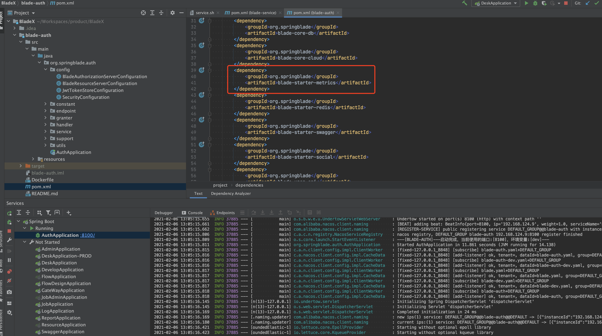
4. 可以看到prometheus格式的数据正确返回，说明服务集成成功
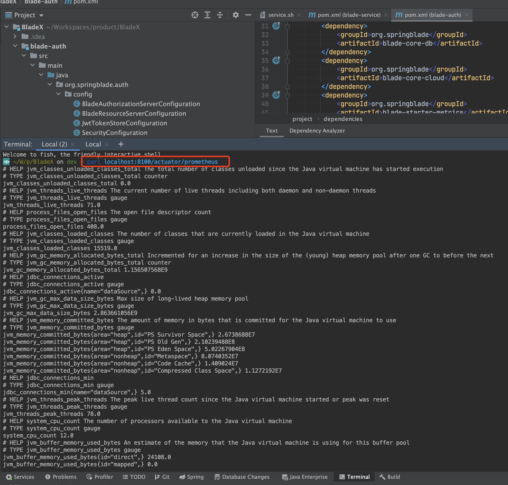

## Prometheus服务自动发现
1. 如果大家对prometheus有过了解，应该知道如果要对接springboot服务，需要如下配置。但这是静态配置，若后续有很多服务，配置起来非常不方便，再加上微服务会动态扩容等场景，等每次扩容都加载配置，必然不是可取的方案。
~~~yaml
- job_name: 'blade-auth'
  scrape_interval: 5s
  metrics_path: '/actuator/prometheus'
  static_configs:
    - targets: ['192.168.0.81:8100']
~~~
2. 虽然prometheus官方有服务动态发现的配置，但也只是支持consul等服务，并不支持nacos，对于我们使用nacos的用户来说又是一个小小的阻碍。
3. 正常consul配置如下，如果想要对接nacos，很可惜，官方是没有`nacos_sd_configs`配置的
~~~yaml
- job_name: 'consul'
  consul_sd_configs:
  - server: '192.168.0.85:8500'
    services: []  
~~~
4. 官方不支持nacos，难道我们要用回consul？虽然nacos有挺多bug，但官方更新还算及时，用起来也方便，要是就这样用回consul想必大家内心多少会有点不乐意。要是想直接实现`nacos_sd_configs`，那需要拓展prometheus，以插件的形式加入，到时候部署、源码编译又是一道门槛，这也是不可取的。
5. 那有没有办法不需要拓展prometheus，使用原生的配置，也不用做过多改动就能实现nacos服务发现呢？

## 实现Consul对外API
1. prometheus支持consul，是通过http请求来做服务发现，那我们就可以想办法自己实现一套consul的api，伪装成consul服务，等prometheus按照consul的api地址拉取服务的时候，保证返回一致就可以了。
2. 我们想一想，除了nacos，还有哪个服务可以获取到所有的微服务信息？当然是springbootadmin服务，也就是我们的blade-admin服务。
3. 启动blade-admin，登录密码在配置文件，登录后访问可以看到在线的实例
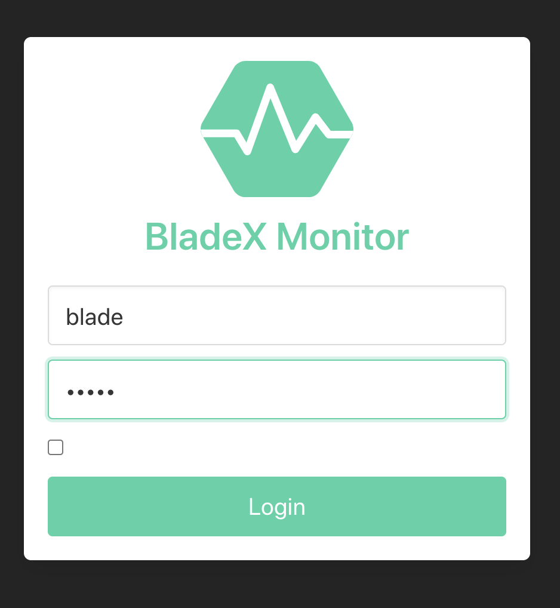

4. 到这里相信大家以及明白怎么做了，不需要拓展prometheus和nacos，只用在blade-admin基础上实现consul的api就行。对此我们已经实现完毕，作为 `blade-starter-prometheus` 依赖到blade-admin，若对源码有兴趣，大家可以去`BladeX-Tool`工程查看
5. 加入依赖，对接口进行放行并重新启动
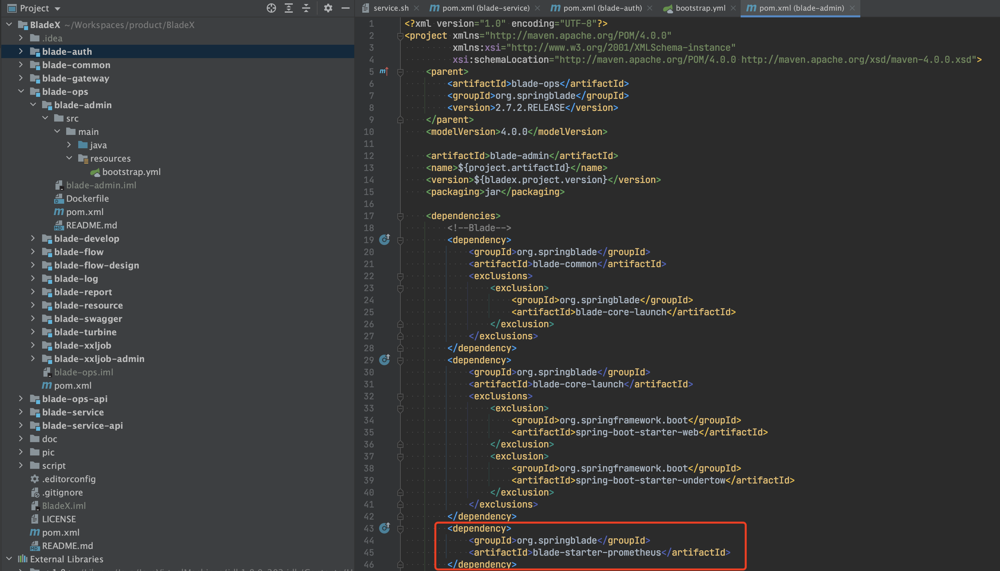
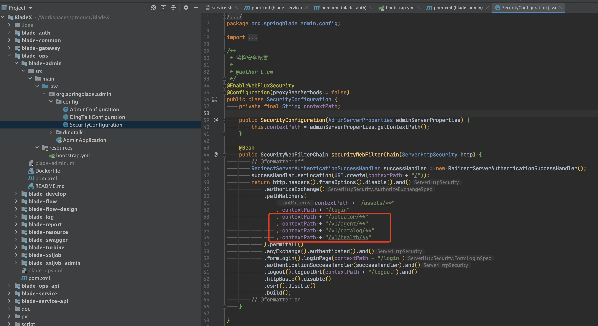
6. 访问 http://localhost:7002/v1/catalog/services ，可以看到服务正确返回（consul的api返回就是空数组，不用在意）
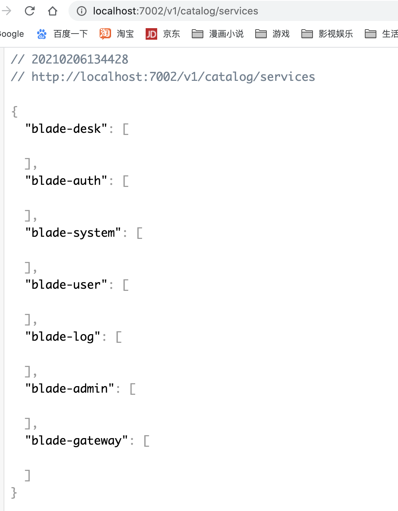
7. 接着访问 http://localhost:7002/v1/health/service/blade-auth ，可以看到数据正确返回
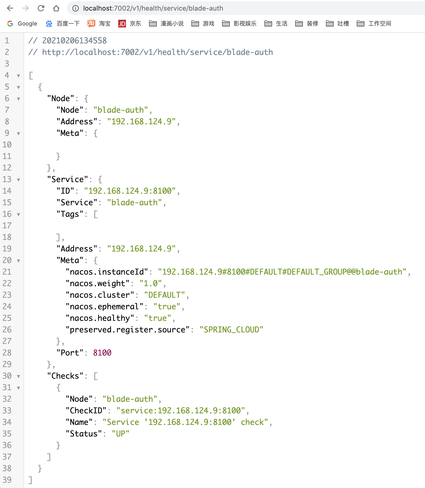

## 模拟Consul服务忽悠Prometheus
1. 将服务部署至服务器，此处不再赘述
2. 按照上一节第6第7点的地址访问服务器的blade-admin服务地址，查看是否正确返回
3. 前往修改 `/data/prometheus/prometheus.yaml`，增加如下配置
**注意⚠️：其中server节点填写的是blade-admin服务的ip和端口，需要一定注意的是，这个服务地址必须能够被prometheus本身调用，若无法调用，则不会显示在targets页面。**
~~~yaml
 #监控 bladex
- job_name: "bladex"
  metrics_path: "/actuator/prometheus"
  scrape_interval: 5s
  consul_sd_configs:
    #必须保证prometheus能调用否则不会显示
    #若是docker部署必须保证网络与各服务调通
    - server: '172.30.0.72:7002' #填写实现consul-api的blade-admin服务ip:端口
      #匹配所有service
      services: []
  relabel_configs:
    #service 源标签
    - source_labels: [__meta_consul_service]
      #匹配 "blade" 开头的service
      regex: "blade*"
      #执行的动作
      action: drop
      #将service的label重写为application
    - source_labels: [__meta_consul_service]
      target_label: application
    - source_labels: [__meta_consul_service_address]
      target_label: instance
    - source_labels: [__meta_consul_tags]
      target_label:  job
~~~
4. 刷新prometheus配置
~~~shell
[root@JD system]# curl -XPOST 11x.xx.xx.7:9090/-/reload
~~~
5. 访问blade-admin服务与prometheus的targets，可以看到服务都启动成功，prometheus拉取数据成功
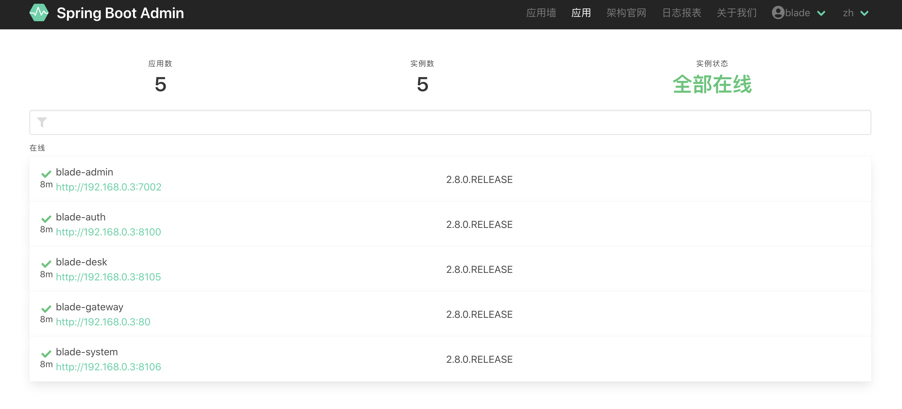
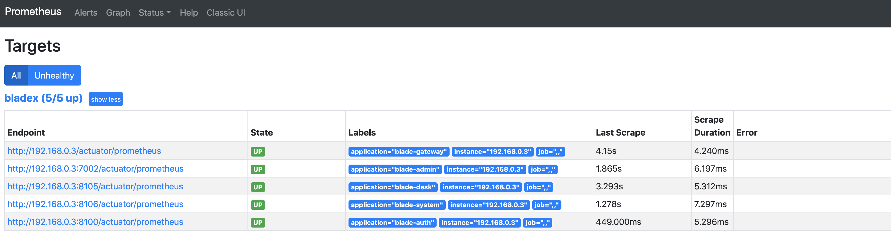
6. 关闭blade-gateway服务，稍后刷新，可以看到prometheus这边也同步减少了blade-gateway服务。
**注意⚠️：需要等待心跳刷新，会有一定延时**
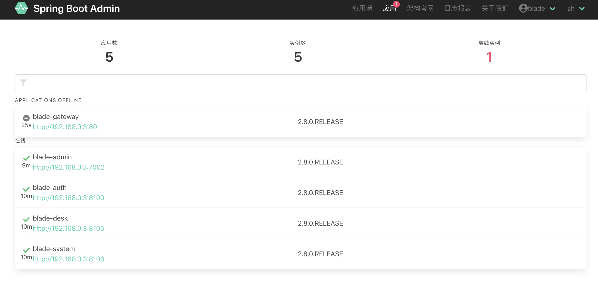
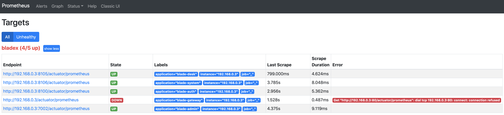
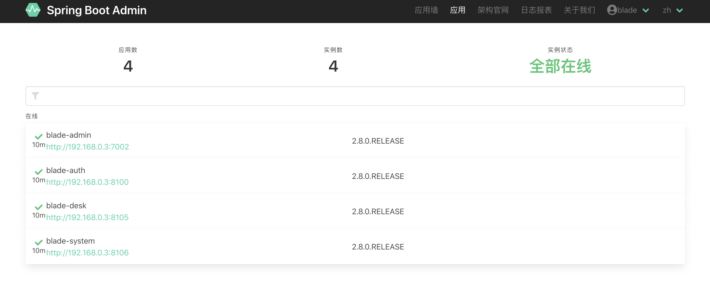
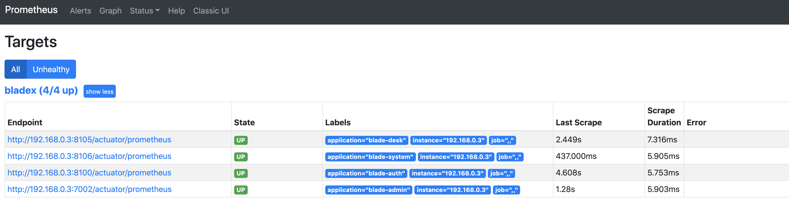
7. 若prometheus收集到的数据与blade-admin展示的数据完全同步，说明我们模拟consul服务成功，可以不用做较大改动就可以很轻松地通过nacos来做服务发现了。
