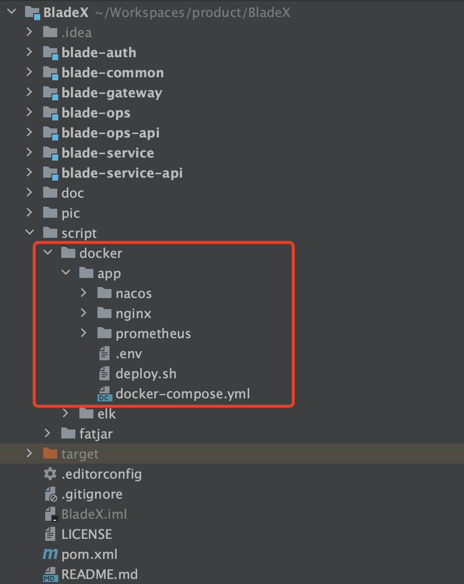
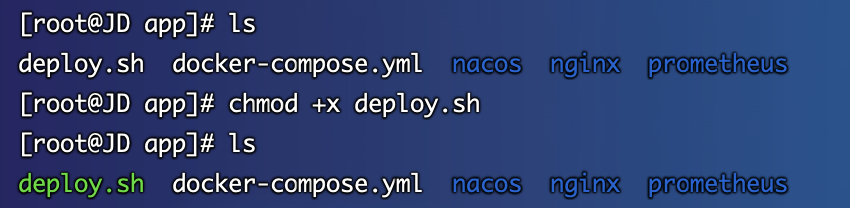
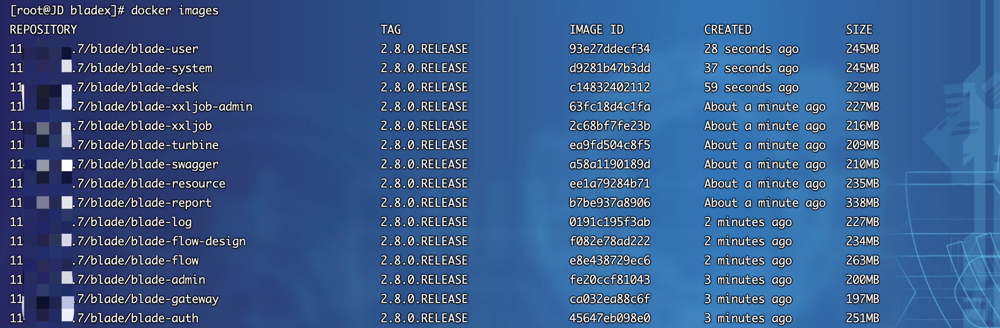
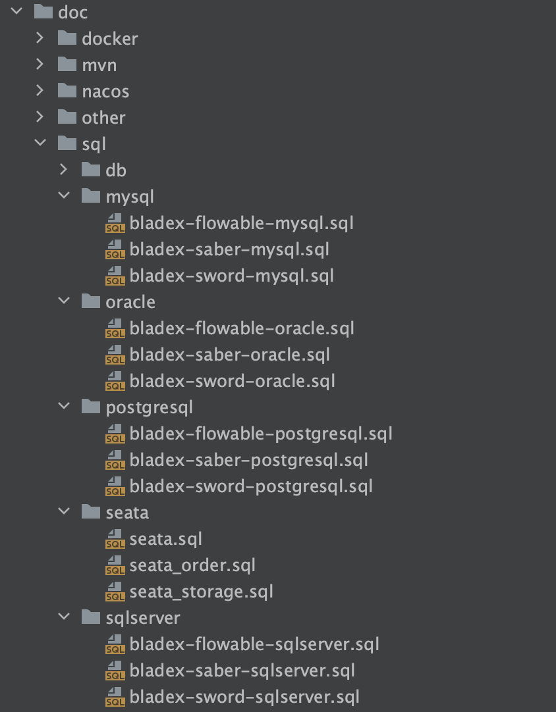

## Docker模式对接准备
2. 拷贝/docker/app文件夹至服务器并对`deploy.sh`赋予可执行权限

3. 从Harbor拉取镜像，执行 `docker images`，浏览目前所有的服务镜像。具体镜像推送流程请看文档`6.3.2.5、6.3.2.6章节`
**注意⚠️：若觉得Harbor部署麻烦，可以将BladeX-Tool与BladeX的源码拷贝至服务器，先在BladeX-Tool根目录执行 mvn clean install，再到BladeX根目录执行 mvn clean install，若均没问题，则再在BladeX根目录执行 mvn clean package docker:build 便可以把docker镜像安装至本机，无需再用Harbor，可直接进行部署。**

4. 由于BladeX不推荐将数据库作为容器部署，所以脚本没有包含数据库镜像。请大家先行部署，或二进制或阿里云等均可，部署完毕配置好帐号密码并导入相关数据库

