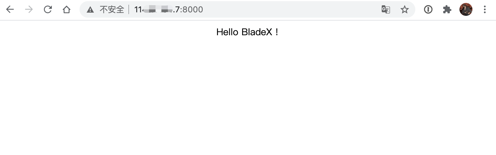
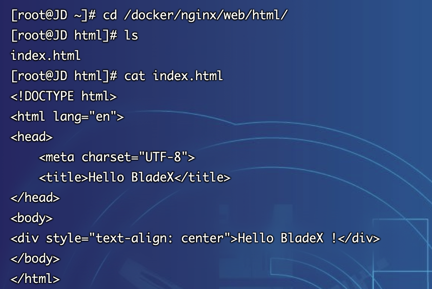
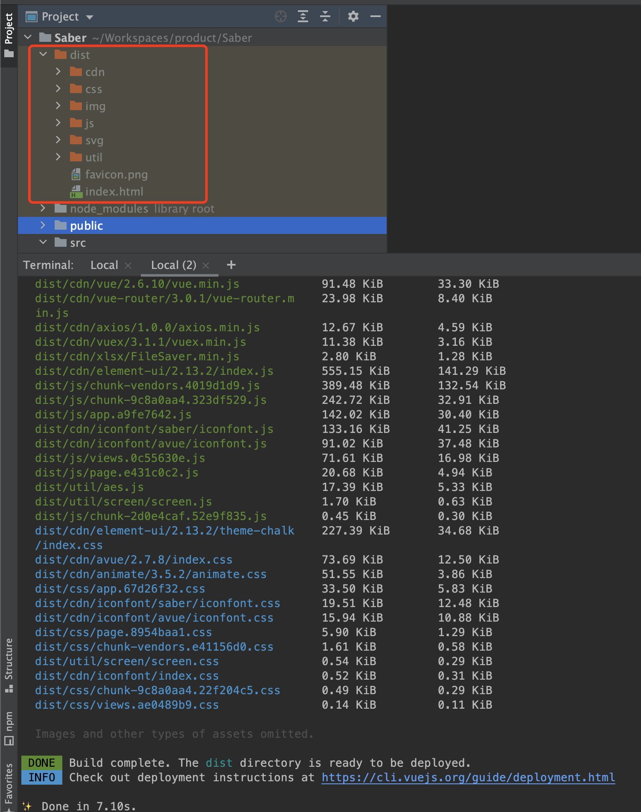
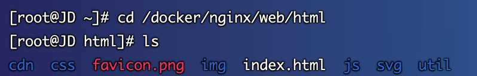
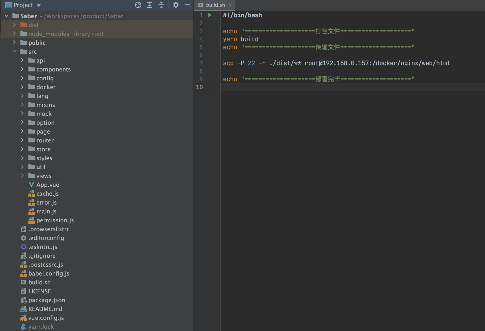
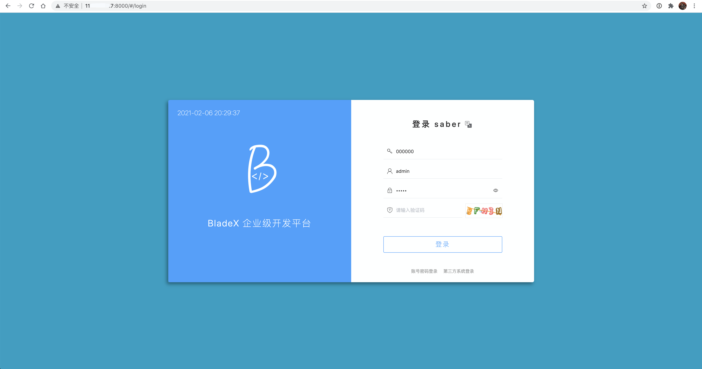
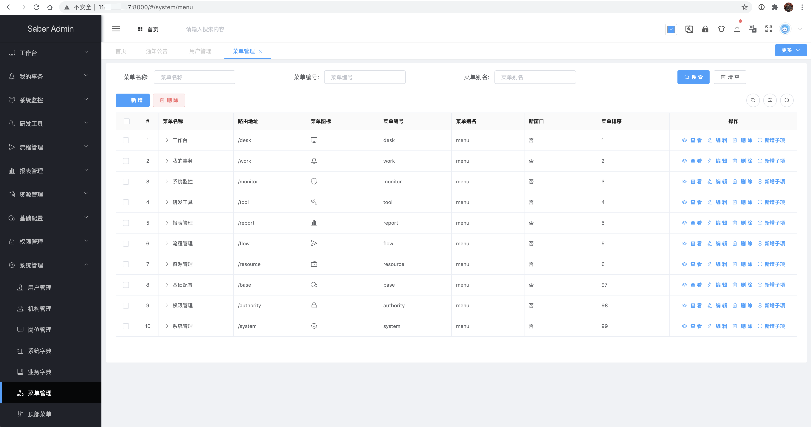

## 前端系统部署
1. 查看前端地址 http://服务器ip:8000 ，返回正确，下面以saber为例进行部署
注意⚠️：配置的意义及概念具体请看`6.2.3.6章节`，本章节只讲解部署步骤

2. 打开Saber工程，执行 `yarn run build`，并将dist目录下的文件上传至服务器的 `/docker/nginx/web/html` 目录

3. 除了使用手动上传，我们也可以使用Saber目录下的 build.sh 脚本快捷上传

~~~
<⋊> ~/W/p/Saber on dev ⨯ ./build.sh
  ====================打包文件====================
  yarn run v1.21.1
  $ vue-cli-service build

  File                                      Size             Gzipped

  dist/cdn/xlsx/xlsx.full.min.js            902.14 KiB       320.35 KiB
  dist/cdn/avue/2.7.8/avue.min.js           410.82 KiB       93.21 KiB
  dist/cdn/vue/2.6.10/vue.min.js            91.48 KiB        33.30 KiB
  dist/cdn/vue-router/3.0.1/vue-router.m    23.98 KiB        8.40 KiB
  in.js
  dist/cdn/axios/1.0.0/axios.min.js         12.67 KiB        4.59 KiB
  dist/cdn/vuex/3.1.1/vuex.min.js           11.38 KiB        3.16 KiB
  dist/cdn/xlsx/FileSaver.min.js            2.80 KiB         1.28 KiB
  dist/cdn/element-ui/2.13.2/index.js       555.15 KiB       141.29 KiB
  dist/js/chunk-vendors.4019d1d9.js         389.48 KiB       132.54 KiB
  dist/js/chunk-9c8a0aa4.323df529.js        242.72 KiB       32.91 KiB
  dist/js/app.a9fe7642.js                   142.02 KiB       30.40 KiB
  dist/cdn/iconfont/saber/iconfont.js       133.16 KiB       41.25 KiB
  dist/cdn/iconfont/avue/iconfont.js        91.02 KiB        37.48 KiB
  dist/js/views.0c55630e.js                 71.61 KiB        16.98 KiB
  dist/js/page.e431c0c2.js                  20.68 KiB        4.94 KiB
  dist/util/aes.js                          17.39 KiB        5.33 KiB
  dist/util/screen/screen.js                1.70 KiB         0.63 KiB
  dist/js/chunk-2d0e4caf.52e9f835.js        0.45 KiB         0.30 KiB
  dist/cdn/element-ui/2.13.2/theme-chalk    227.39 KiB       34.68 KiB
  /index.css
  dist/cdn/avue/2.7.8/index.css             73.69 KiB        12.50 KiB
  dist/cdn/animate/3.5.2/animate.css        51.55 KiB        3.86 KiB
  dist/css/app.67d26f32.css                 33.50 KiB        5.83 KiB
  dist/cdn/iconfont/saber/iconfont.css      19.51 KiB        12.48 KiB
  dist/cdn/iconfont/avue/iconfont.css       15.94 KiB        10.88 KiB
  dist/css/page.8954baa1.css                5.90 KiB         1.29 KiB
  dist/css/chunk-vendors.e41156d0.css       1.61 KiB         0.58 KiB
  dist/util/screen/screen.css               0.54 KiB         0.29 KiB
  dist/cdn/iconfont/index.css               0.52 KiB         0.31 KiB
  dist/css/chunk-9c8a0aa4.22f204c5.css      0.49 KiB         0.29 KiB
  dist/css/views.ae0489b9.css               0.14 KiB         0.11 KiB

  Images and other types of assets omitted.

  DONE  Build complete. The dist directory is ready to be deployed.
  INFO  Check out deployment instructions at https://cli.vuejs.org/guide/deployment.html

  ✨  Done in 5.39s.
  ====================传输文件====================
root@11x.xx.xx.7's password:
  animate.css                                                            100%   52KB 934.0KB/s
  index.js                                                               100%  555KB   4.0MB/s
  index.css                                                              100%  227KB   2.4MB/s
  element-icons.woff                                                     100%   28KB   1.8MB/s
  element-icons.ttf                                                      100%   55KB   3.3MB/s
  vue.min.js                                                             100%   91KB   6.2MB/s
  FileSaver.min.js                                                       100% 2864   232.6KB/s
  xlsx.full.min.js                                                       100%  902KB  11.0MB/s
  index.css                                                              100%   74KB   4.8MB/s
  avue.min.js                                                            100%  411KB   4.7MB/s
  iconfont.js                                                            100%  133KB   7.8MB/s
  iconfont.json                                                          100%   13KB 962.6KB/s
  iconfont.woff                                                          100%   13KB   1.0MB/s
  iconfont.eot                                                           100%   24KB   1.7MB/s
  iconfont.ttf                                                           100%   24KB   1.8MB/s
  iconfont.woff2                                                         100%   11KB 833.4KB/s
  iconfont.svg                                                           100%  133KB   7.7MB/s
  iconfont.css                                                           100%   20KB   1.4MB/s
  index.css                                                              100%  532    41.4KB/s
  iconfont.js                                                            100%   91KB   5.5MB/s
  iconfont.json                                                          100% 7272   418.4KB/s
  iconfont.woff                                                          100%   11KB 807.0KB/s
  iconfont.eot                                                           100%   17KB   1.2MB/s
  iconfont.ttf                                                           100%   17KB   1.3MB/s
  iconfont.woff2                                                         100%   10KB 753.7KB/s
  iconfont.svg                                                           100%   88KB   5.7MB/s
  iconfont.css                                                           100%   16KB   1.1MB/s
  vuex.min.js                                                            100%   11KB 898.9KB/s
  vue-router.min.js                                                      100%   24KB   1.5MB/s
  axios.min.js                                                           100%   13KB 989.5KB/s
  app.67d26f32.css                                                       100%   34KB   2.1MB/s
  chunk-vendors.e41156d0.css                                             100% 1650   124.0KB/s
  views.ae0489b9.css                                                     100%  148    11.1KB/s
  page.8954baa1.css                                                      100% 6044   492.4KB/s
  chunk-9c8a0aa4.22f204c5.css                                            100%  506    40.7KB/s
  favicon.png                                                            100%   11KB 800.8KB/s
  card-1.jpg                                                             100%   51KB   3.1MB/s
  card-2.jpg                                                             100%   20KB   1.5MB/s
  card-3.jpg                                                             100%  141KB   8.4MB/s
  card-4.jpg                                                             100%   26KB   1.8MB/s
  2.png                                                                  100%  240KB  11.6MB/s
  3.png                                                                  100%  407KB   5.9MB/s
  1.png                                                                  100%  211KB  10.8MB/s
  iconfont.png                                                           100%  267KB  12.1MB/s
  logo.png                                                               100%   26KB   2.0MB/s
  500.svg                                                                100%   87KB   4.4MB/s
  login.png                                                              100%  239KB  12.1MB/s
  403.svg                                                                100%   54KB   3.4MB/s
  404.svg                                                                100%   87KB   5.2MB/s
  star-squashed.jpg                                                      100%  359KB  16.6MB/s
  img-logo.png                                                           100%   11KB 761.8KB/s
  vip1.png                                                               100% 2229   166.0KB/s
  vip3.png                                                               100% 3814   303.9KB/s
  bg4.jpg                                                                100%  136KB   7.2MB/s
  logo.png                                                               100%   26KB   1.8MB/s
  vip2.png                                                               100% 3650   278.0KB/s
  cloud.jpg                                                              100%   11KB 827.9KB/s
  bg1.jpg                                                                100%  254KB  11.5MB/s
  bg3.jpg                                                                100%  190KB  10.2MB/s
  bg2.jpg                                                                100%  310KB  13.6MB/s
  vip4.png                                                               100% 3805   259.5KB/s
  bg.jpg                                                                 100%   25KB 963.2KB/s
  index.html                                                             100% 3763   256.8KB/s
  app.a9fe7642.js                                                        100%  142KB   2.0MB/s
  chunk-vendors.4019d1d9.js                                              100%  389KB  15.7MB/s
  page.e431c0c2.js                                                       100%   21KB   1.4MB/s
  views.0c55630e.js                                                      100%   72KB   4.3MB/s
  chunk-2d0e4caf.52e9f835.js                                             100%  462    34.6KB/s
  chunk-9c8a0aa4.323df529.js                                             100%  243KB  10.3MB/s
  loading-spin.svg                                                       100%  422    30.2KB/s
  aes.js                                                                 100%   17KB   1.2MB/s
  screen.js                                                              100% 1740   141.2KB/s
  screen.css                                                             100%  550    41.8KB/s
  guge.png                                                               100%   65KB   3.8MB/s
  huohu.png                                                              100%  421KB  16.1MB/s   
====================部署完毕====================
~~~

4. 再次访问 http://服务器ip:8000 ，可以看到saber已经正确显示

5. 可以正常登录并访问，说明整套系统部署成功

6. 下面我们来看一下如何进行Prometheus监控系统的集成
