## 升级步骤
1. 升级数据库
* 执行对应文件夹下的sql更新脚本
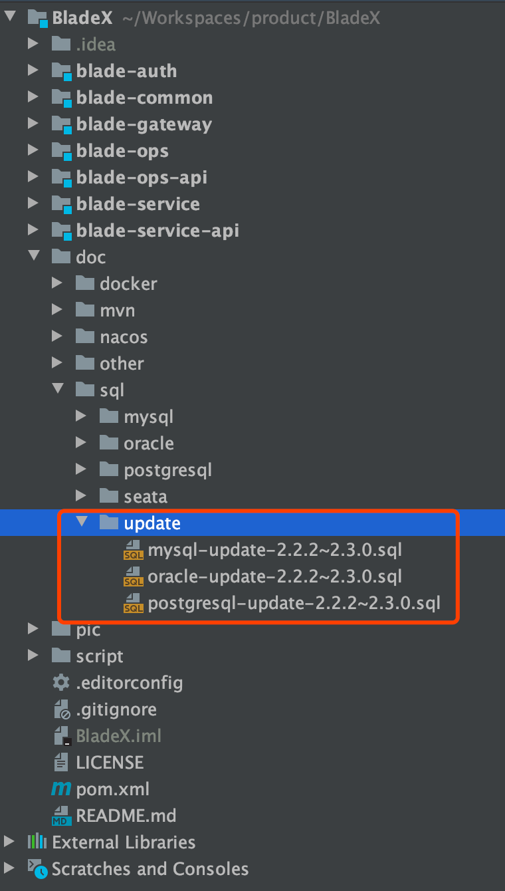

2. 下载最新版本，将自己写的业务代码覆盖

3. 若变更了包名、结构，则更新的时候需要针对git提交记录进行逐条比对、更新

4. 推荐使用git远程分支合并，若有冲突可手动进行合并（推荐大家业务模块开发在bladex-biz，这样bladex只需跟随主分支更新即可）
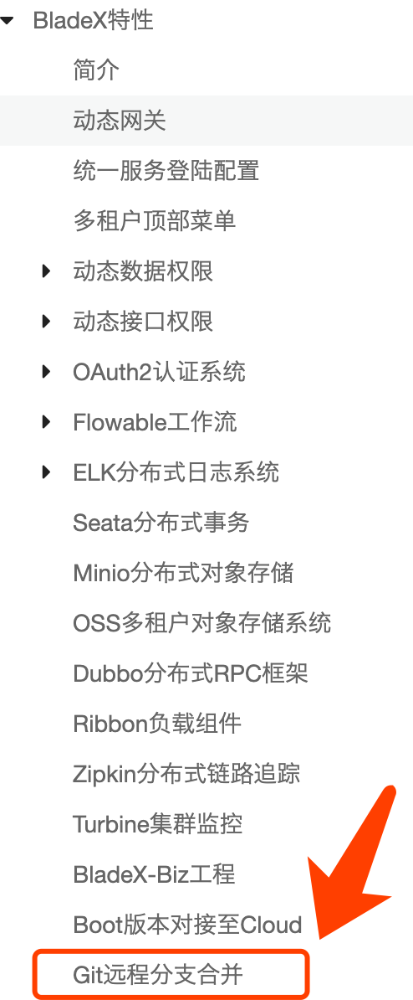

5. 更新完毕后，记得将redis执行flushdb命令

## 升级注意点，请务必确认
 **1.swagger-boostrap-ui 升级为 knife4j**
* 升级后ui界面焕然一新，之前的一些配置会有影响，所以需要**清空下浏览器缓存**
* 升级后有一个类的路径变了，需要删除原先的引用，并导入新的引用路径。（类名没变，所以只需要花一点时间就可以全部替换）

* 需要将原路径
~~~java
import io.swagger.annotations.ApiOperationSupport;
~~~
* 替换为
~~~java
import com.github.xiaoymin.knife4j.annotations.ApiOperationSupport;
~~~

 **2. 租户插件配置逻辑**
* 其实这个功能在2.2.2.RELEASE版本就已经生效了，可是还有不少用户没有注意，这回更新再次说明一下
* 重构了租户插件逻辑，由之前使用配置表名来生效租户过滤改为自动读取模型判断是否有租户id来自行进行过滤
所以之前关于租户表的配置可以直接删掉，但同时需要给租户表继承TenantEntity
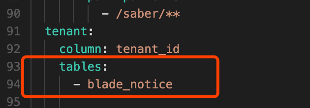
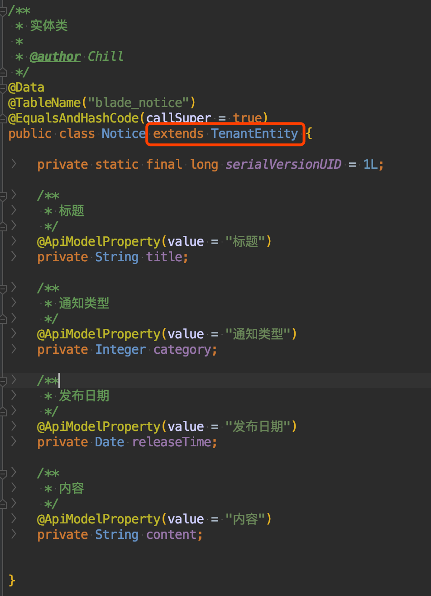
之前是手动指定需要进行租户过滤的表，2.2.2版本改为自动读取继承TenantEntity或者带tenantId字段的类，并加入租户插件。若有些表不需要进行租户过滤，可以通过如下配置进行排除，自行定义
~~~yaml
blade:
 tenant:
  exclude-tables:
   - blade_test
   - blade_demo
~~~

**3. BladeX-Tool底层逻辑变更**
* 核心封装包增加了不少新的组件，大家需要看历史记录详细比对，以免更新出错
* 将以前的`PropertySource`统一替换为`BladePropertySource`，提高系统安全性，具体修改很简单，详情请看下图
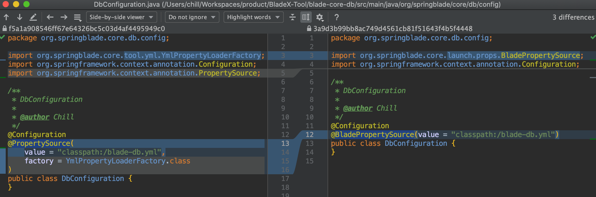
* 这样做便可以读取自定义的配置而不占用spring系统默认的application.yml了，非常实用
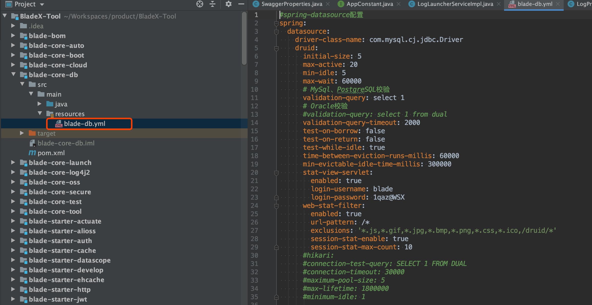

**4. Saber大版本升级**
* avue从2.2.x升级至2.3.x，改动较多，需要注意以下几点
* 1 ) 改动较多的当属search方法，因为把search模块改成了form组件，所以底层都变了，使用api也尽量做到改动很小
* 需要将以前的
~~~javascript
searchChange(params) {
 xxxxx
},
~~~
* 更改为
~~~javascript
searchChange(params, done) {
  xxxxx
  done();
},
~~~
* searchChange多了一个done的处理
* 2 ) 由于search模块底层改成了form组件，所以默认的查询按钮也跑到了最下方，如下图
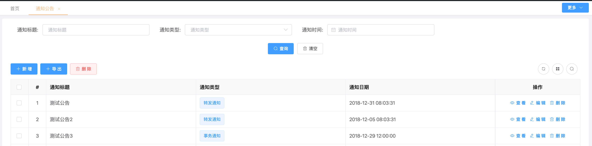
* 如果觉得占地方或者不好看的，有两种方式
* 第一种：默认隐藏搜索栏，option配置`sarchShow:false`，效果如下
 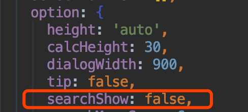
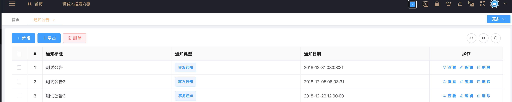
* 第二种：显示搜索栏，同时设置`searchMenuSpan: 6`，这样就和以前的样式一致了，效果如下
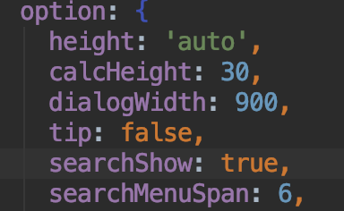
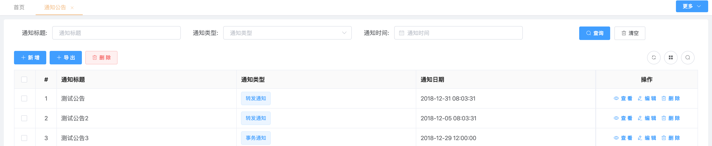
* 3 ) 表格高度与底部距离自动适配底层修改
* 此算法已经变更，需要重新设定`calcHeight`，一般我们设置到30即可，具体如下图
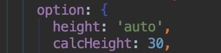
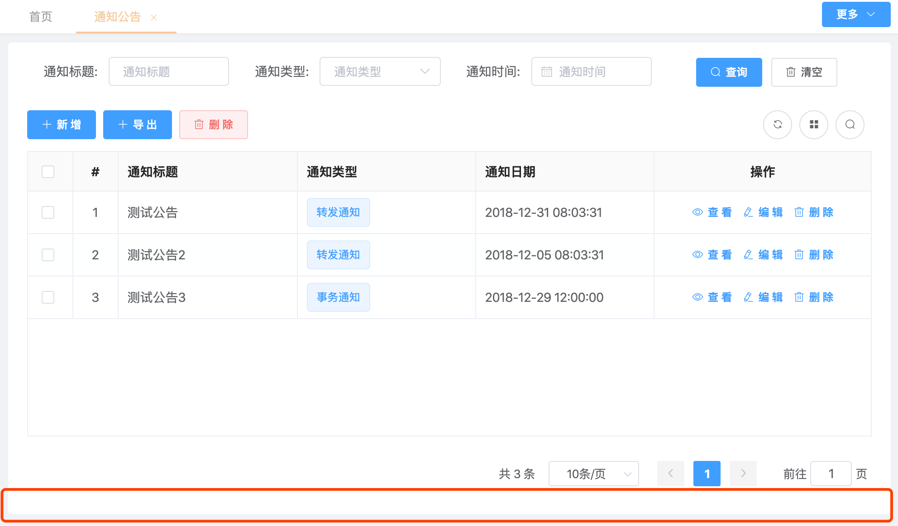
* 4 ) avue-crud组件的弹框自适应高度，不再需要配置弹框高度，也不会出现滚动条，这个改动深得我心
* 修改方法：直接删除`dialogHeight`即可,若需要配置弹框的宽度，可以配置`dialogWidth`自行定义
* 5 ) 为了提高性能，Saber将树表模块加上了懒加载的模式，有较多改动，大家更新的时候请仔细对照记录查看变更处
