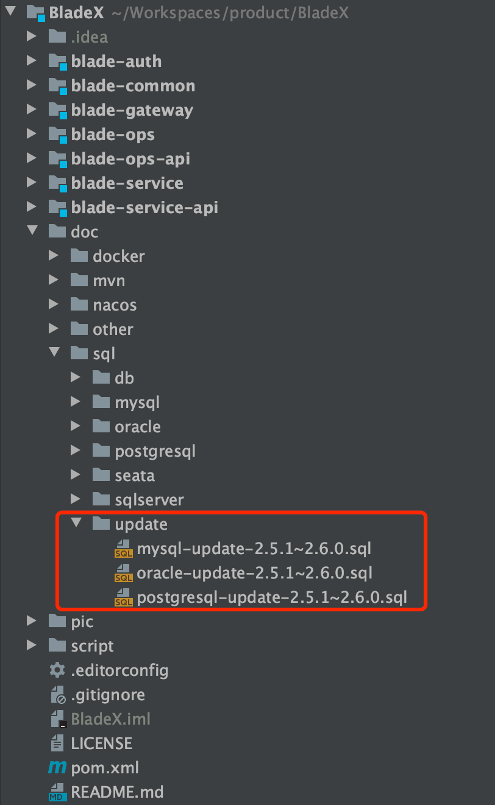
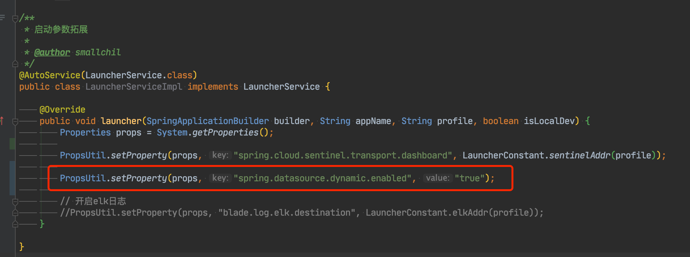

## 升级步骤
 1. 升级数据库，执行对应文件夹下的sql更新脚本

2. 下载最新版本，将自己写的业务代码覆盖

3. 若变更了包名、结构，则更新的时候需要针对git提交记录进行逐条比对、更新

4. 推荐使用git远程分支合并，若有冲突可手动进行合并（推荐大家业务模块开发在bladex-biz，这样bladex只需跟随主分支更新即可）

5. 更新完毕后，记得将redis执行flushdb命令

6. 若修改包名或工程结构，导致无法直接通过git merge合并的同学，请看下方的注意点，不要遗漏～ 否则更新容易出错

## 升级注意点，请务必确认
1. Saber核心升级至Avue2.6.15，和Avue作者沟通对接兼容性，最后仅有小部分需要改动，具体请看：[https://git.bladex.vip/blade/Saber/commit/b6d3f0f28f4104e181501cdb18395f3ada6790a3](https://git.bladex.vip/blade/Saber/commit/b6d3f0f28f4104e181501cdb18395f3ada6790a3)
2. 新增多租户数据库隔离功能，具体请看`5.2.4章节`
3. 新增报表功能，具体请看`5.11章节`
4. 启用多租户数据库隔离，会默认关闭mybatis-plus多数据源插件的启动，从而使用自定义的数据源识别
5. 若不需要租户数据库隔离只需要字段隔离，而又需要用到多数据源的情况，需要前往LauncherService单独配置

