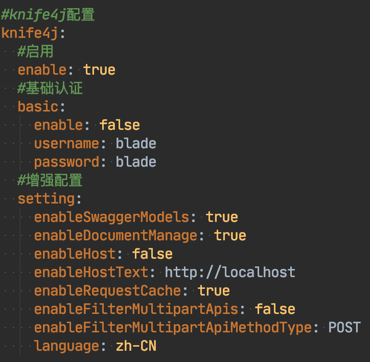
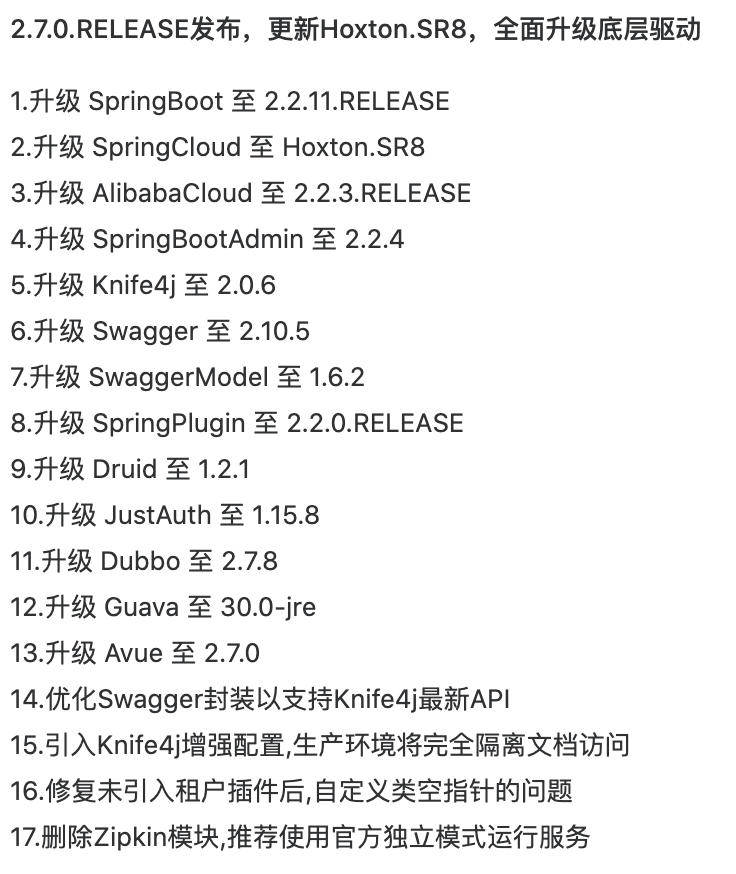

## 升级注意点，请务必确认
1. 2.7.0底层驱动全面升级了版本，SpringBoot升级至2.2.11，SpringCloud升级至Hoxton.SR8，没有针对业务功能的增加
2. 请大家升级的时候务必仔细对比，不要遗漏更新的功能点，具体可以看在私服提交的commit
3. 如果项目已经上线或者项目开发进度已经超过80%，则不推荐做大版本升级
4. 新项目或者起步没多久的项目，升级前请务必做好充足的备份，待一切准备完毕后再尝试升级，这样万一升级出问题也可以无损失地回退到升级前的版本
5. 本次升级改动较大的是Knife4j，升级了springfox以及spring-plugin，有些地方变动较大，大家升级完毕后请再次阅读一遍官方的文档以及升级日志，查看是否有遗漏的地方
6. Knife4j 2.0.6版本更新说明：https://gitee.com/xiaoym/knife4j/releases/v2.0.6
7. Knife4j新增配置如下

8. 删除了原有的Zipkin工程，推荐使用官方提供的服务运行：https://zipkin.io/pages/quickstart.html
9. 2.7.0更新日志如下

