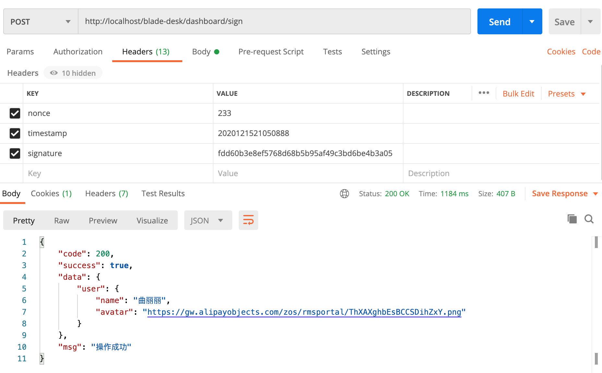
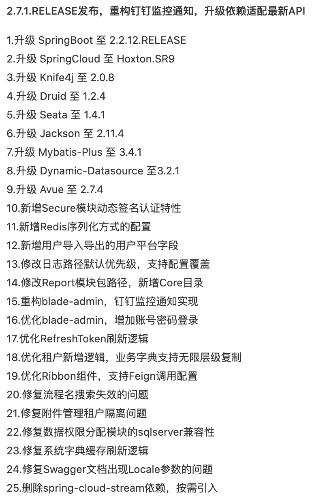

## 升级注意点，请务必确认
1. 本次主要为架构底层升级以及功能优化，没有数据库更新
2. 新增了Secure动态签名特性，具体配置说明如下
~~~yaml
#blade配置
blade:
  #安全框架配置
  secure:
    #动态签名认证配置
    sign:
      - method: ALL
        pattern: /blade-desk/dashboard/sign
        crypto: "sha1"
~~~
~~~java
@Configuration
public class BladeConfiguration {

   @Bean
   public SecureRegistry secureRegistry() {
      // 创建认证类
      SecureRegistry secureRegistry = new SecureRegistry();
      // 签名认证配置
         secureRegistry.addSignPattern(HttpMethod.POST, "/blade-desk/dashboard/sign", "sha1");
      // 返回认证类
      return secureRegistry;
   }

}
~~~

注意⚠️：

*   配置中的 blade-chat、blade-desk只有在boot版本才需要加，cloud版本的blade-chat实则为注册在nacos的服务名，gateway转发需要带上，但实际controller并没有
*   所以cloud版本无需加上blade-chat、blade-desk

配置使用说明⚠️：

*   sign配置的crypto为加密规则，可以自己定义
*   调用接口需要定义timestamp、nonce、signature三个字段放到请求头
*   signature为timestamp+nonce后进行加密的字符串
*   后端获取到这三个值后，也会根据加密规则对timestamp+nonce进行加密
*   最后将后端的加密串与请求的加密串进行比对，如果相等，则鉴权成功
*   具体调用如下，下图为sha1加密  
   

3. 新增了redis序列化配置方式，若想在redis直接看到存储结果，可以将序列化方式配置为`json`，配置后请执行`flushdb`再启动服务，另外除了默认的`protostuff`外还有`jdk`的序列化方式可供使用
~~~yaml
#blade配置
blade:
  #redis序列化方式
  redis:
    serializer-type: json
~~~

4. 重构了`blade-admin`模块，采用了新的钉钉推送实现方式，大家升级的时候请务必仔细
5. 增强了`Ribbon`组件，目前支持`feign`调用也可以设定优先调用的ip段，具体改动如下：将`blade-gateway`的`blade-starter-ribbon`依赖移动到了`blade-common`，同时将`blade-gateway`的`application-dev.yml`配置迁移到`nacos`。具体改动可以看如下commit：

https://git.bladex.vip/blade/BladeX/commit/77276b1396cdfc0cde520ff310badce4586b9e84

https://git.bladex.vip/blade/BladeX-Tool/commit/ecc465e01f6c8e79c0cf3c8a09c6b2044fe8c855

6. 2.7.1更新日志如下

