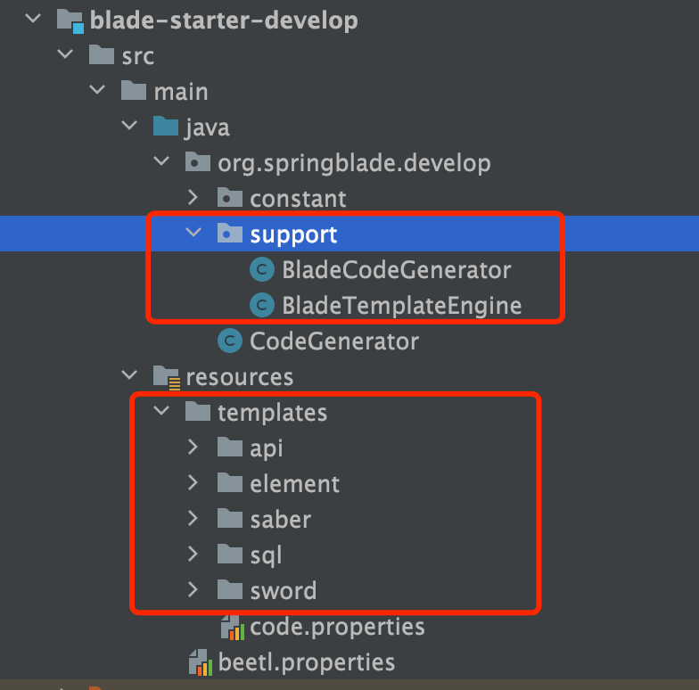

## 数据库结构升级

⚠️**本次升级涉及数据库字段改动，代码生成模块进行了全面重构，请大家升级之前务必将原有库备份几份以防万一，生产库必须多次确认才可操作！**

1. 升级数据库，执行/doc/sql文件夹下的sql更新脚本
2. 下载最新版本，将自己写的业务代码覆盖
3. 若变更了包名、结构，则更新的时候需要针对git提交记录进行逐条比对、更新
4. 推荐使用git远程分支合并，若有冲突可手动进行合并（推荐大家业务模块开发在bladex-biz，这样bladex只需跟随主分支更新即可）
   
5. 更新完毕后，记得将redis执行flushdb命令
6. 若修改包名或工程结构，导致无法直接通过git merge合并的同学，请看下方的注意点，不要遗漏～ 否则更新容易出错

## 升级注意点，请务必确认

1. 重构了代码生成模块，将原先的velocity全部替换为beetl，模版更清爽，相关文档请看：http://ibeetl.com/guide/#/beetl/basic

   

2. 新增了代码生成模块教程，详情请见 `3.6章节`