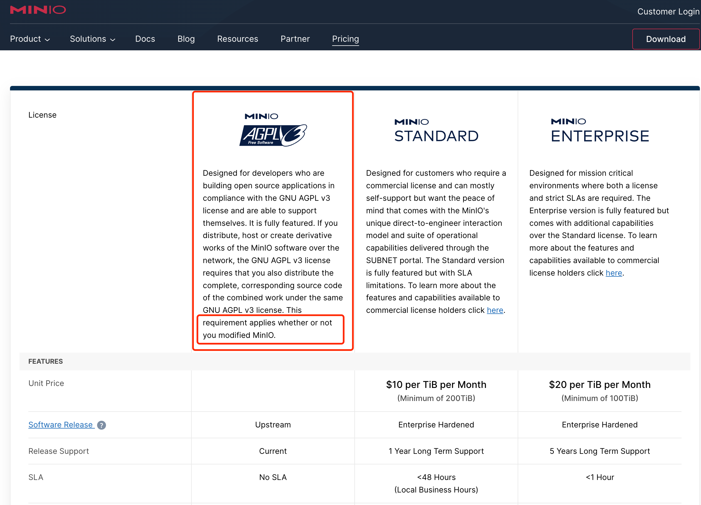

## 数据库结构升级

* 本次升级不设计数据库改动，无需关注

## 升级注意点，请务必确认

1. 新增JwtToken加密传输与解密功能，具体请看文档 `5.3.6章节`

2. 新增LiteFlow规则引擎集成，具体请看文档` 5.27章节`

3. 新增Skywalking集成，具体请看文档 `5.21章节`

4. ⚠️特别注意：

   * minio开源协议从Apache2.0变更为AGPLv3，新协议具有严重的约束，对商业不友好

   * AGPLv3规定，只要系统部署后接入minio服务，具有文件存储或读取行为，不论是否改造源码，不论发布在何处，都需要将整个产品源码开源

   * 若需要使用minio开源版则请下载部署Apache2.0的最后一个版本：`minio-RELEASE.2021-04-22T15-44-28Z`

   * 具体官方说明请见下图

     
