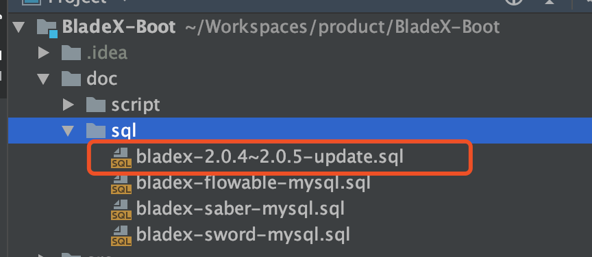

## 升级注意点
1. 升级数据库
* 新版本将blade_data_scope表更名为了blade_scope_data，并且增加了scope_field字段，更新脚本会删掉原表再建表，若大家有数据，请注意做下备份再迁移
* 准备工作结束，直接执行红框内的sql即可
 

2. 下载最新版本，将自己写的业务代码覆盖

3. 若变更了包名、结构，则更新的时候需要针对git提交记录进行逐条比对、更新

4. 更新完毕后，记得将redis执行flushdb命令
