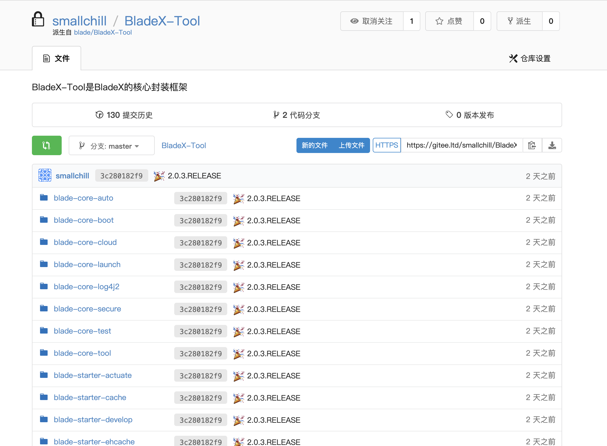
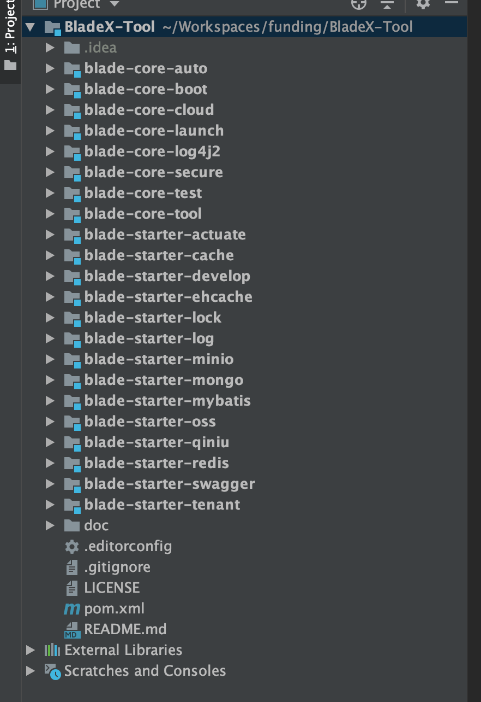
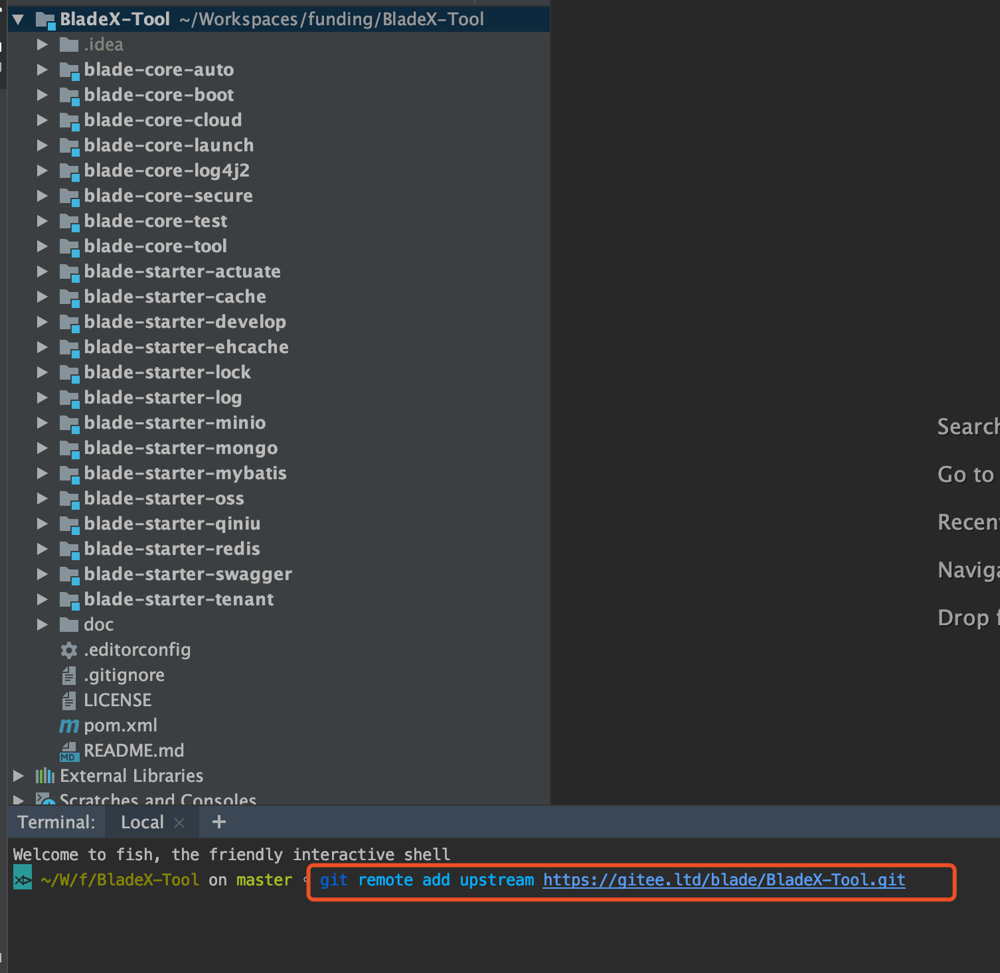
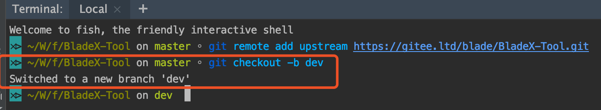
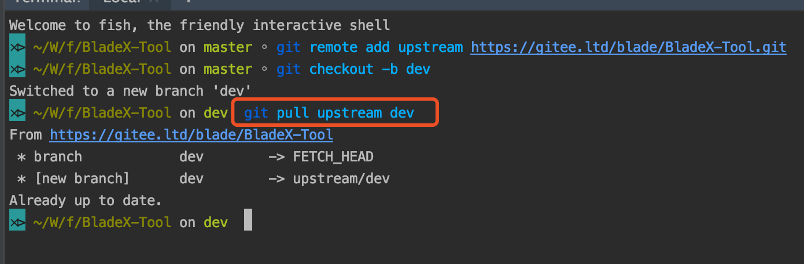
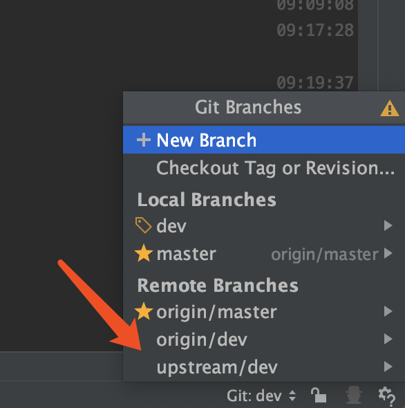
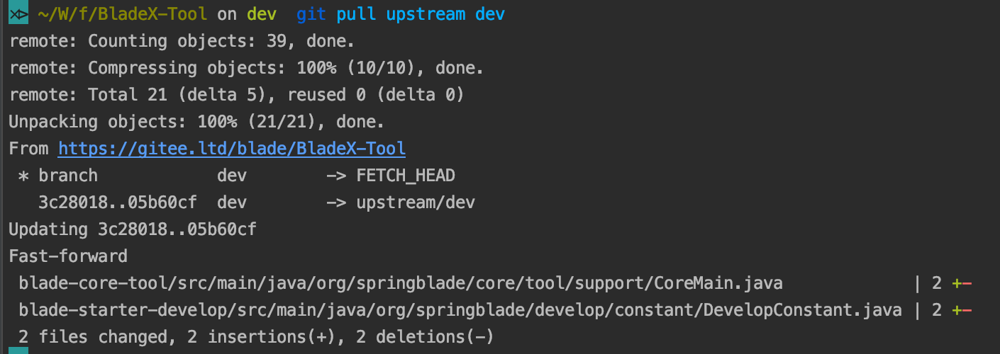
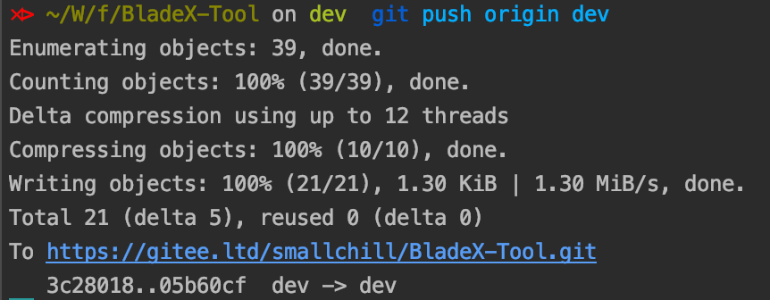
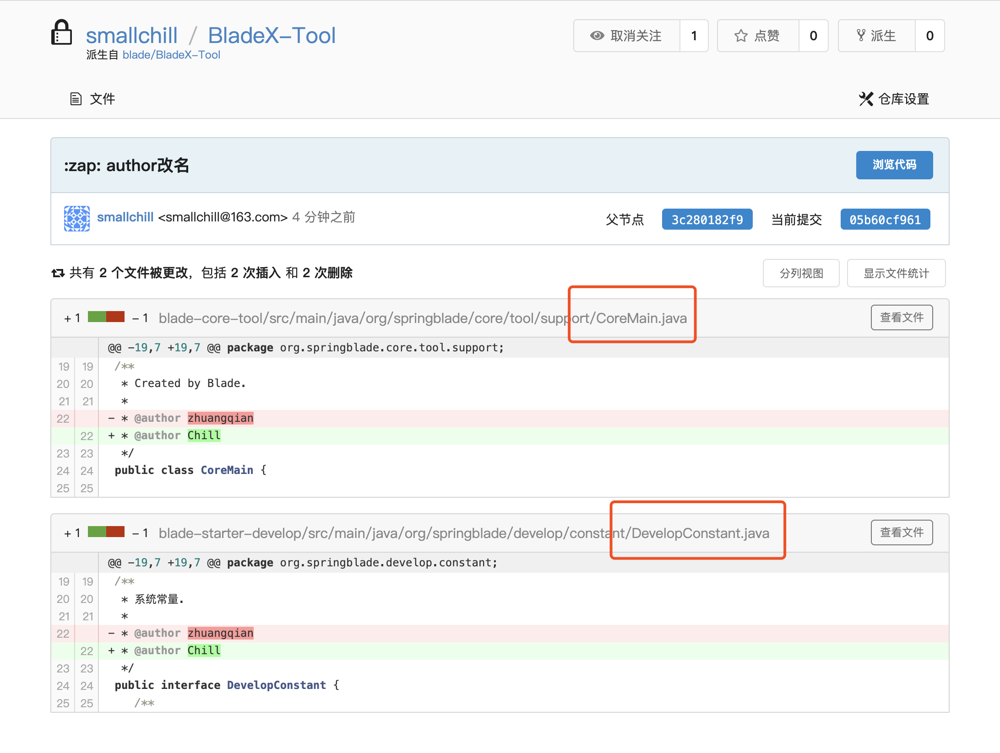

## 前言
* 大家在使用BladeX-Tool的时候，时常会加入diy的功能，奈何想与官方的主分支同步更新，碰到了种种问题
* 本章节来讲述如何在diy的同时可以远程合并官方的主分支进行同步更新
* 以下教程都必须在不改包名不改结构的情况下操作
* 建议大家先不改包名，等到项目上线前半个月再着手修改，否则同步更新会非常耗时
* 注意：截图中的[https://gitee.ltd]域名已经更换为[https://git.bladex.vip]，大家请自行更换

## 操作流程
1. 首先创建一个自己的项目，得到一个新的git项目，可以建在自己的git私服，另外请务必将新项目设置为私有

2. 复制地址，导入fork后的工程

3. 复制官方地址，打开Terminal，执行命令
`// 将官方项目的git地址，添加至本地的remote`
`git remote add upstream https://git.bladex.vip/blade/BladeX-Tool.git  `

4. 为保险起见，同步官方的dev分支，确认无误后再推送至master主分支
`// 本地创建dev分支`
` git checkout -b dev`

5. 同步官方分支
`// 拉取远程官方dev分支到本地dev分支`
`git pull upstream dev`

6. 打开idea，发现官方的远程分支已经出现在右下角

7. 作者推送commit至官方dev分支，模拟有新的更新
8. 打开本地fork工程，再次执行`git pull upstream dev`，发现远程文件已经更新

9. 执行` git push origin dev  `，发现已经推送成功

10. 打开web端dev分支的最新commit记录，发现显示的文件正好是刚刚控制台打印出来的文件

11. 到这里，我们就可以很轻松的与官方分支实时同步更新了，但是切记不要改包名或者结构！～
