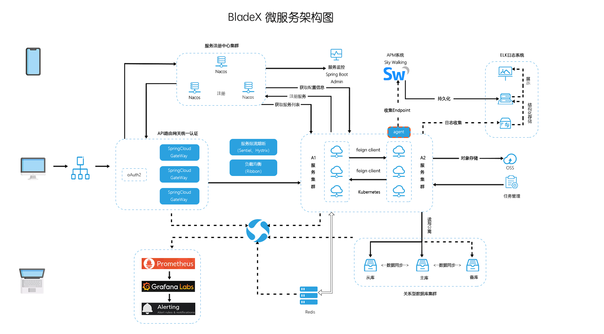

## 架构图

## 架构简介
* 基于SpringBoot2、SpringCloud Hoxton、Mybatis构建核心架构
* 采用Oauth2协议进行统一的Token下发与鉴权，保证系统安全性
* 使用Gateway进行网关的统一转发，生产环境采用Traefik代理
* 微服务统一注册至Nacos，Nacos担任注册中心与配置中心的角色
* 采用Feign进行远程调用，Ribbon进行负载，Hystrix进行熔断
* 采用Sentinel进行限流，保障系统整体的性能
* 集成Seata，为分布式事务保驾护航
* 具有日志收集与监控服务为一体的能力
* 支持FatJar、Docker、K8s、阿里云等多种部署方式
