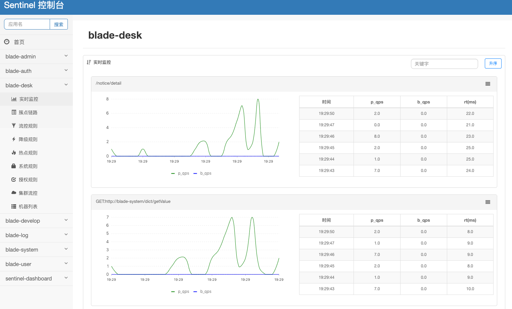

## 概念
Sentinel是面向分布式服务框架的轻量级流量控制框架,主要以流量为切入点,从流量控制,熔断降级,系统负载保护等多个维度来维护系统的稳定性.

## Sentinel安装

#### 1. jar安装：

* 参考官方文档：https://github.com/alibaba/Sentinel/wiki/%E6%8E%A7%E5%88%B6%E5%8F%B0
#### 2. docker安装（开发模式推荐）：

* 拉取镜像：`docker pull bladex/sentinel-dashboard`
* 运行镜像：`docker run --name sentinel -d -p 8858:8858 -d bladex/sentinel-dashboard`
#### 3. 访问地址

* dashboard 地址：http://localhost:8858 (默认端口为8080)
* 账号密码都为：sentinel

## Sentinel界面

 
