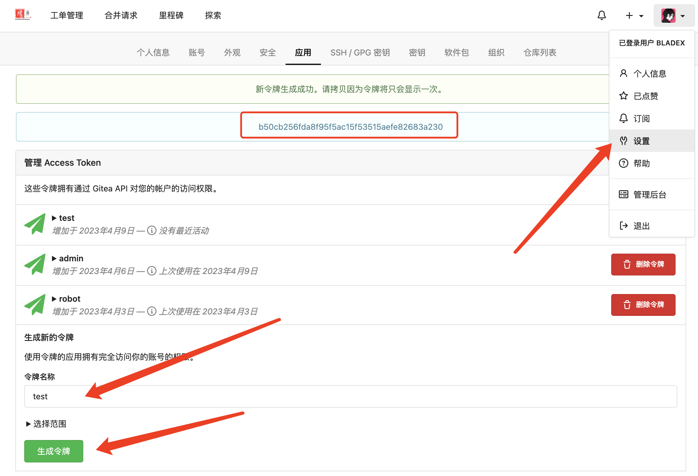
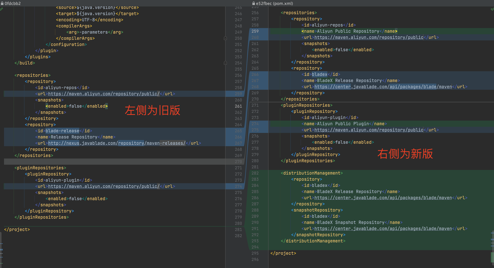
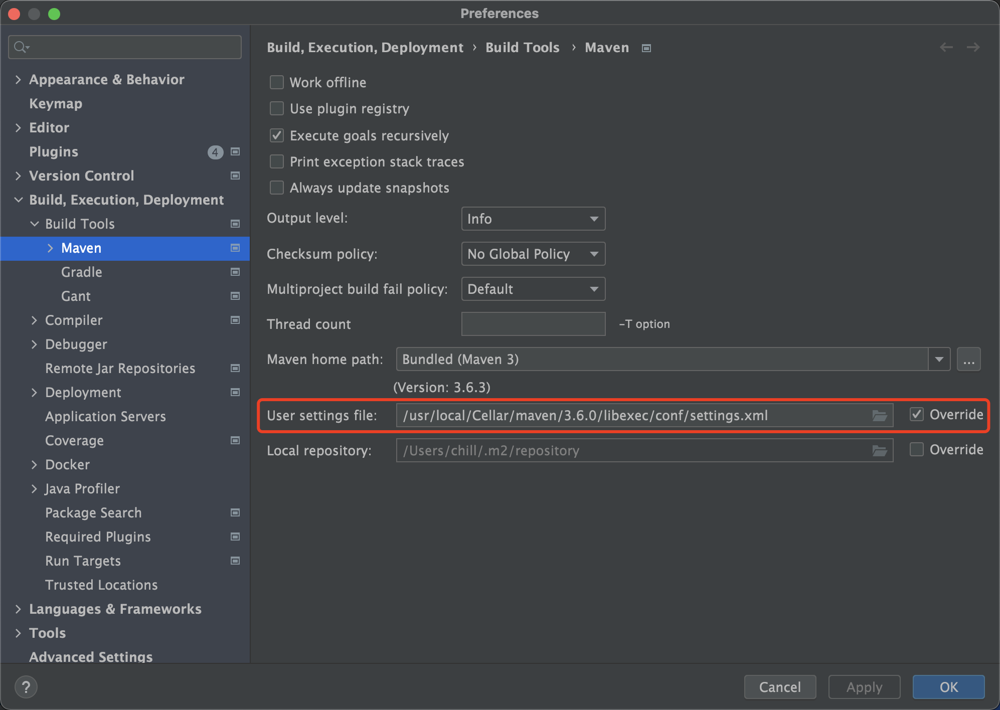
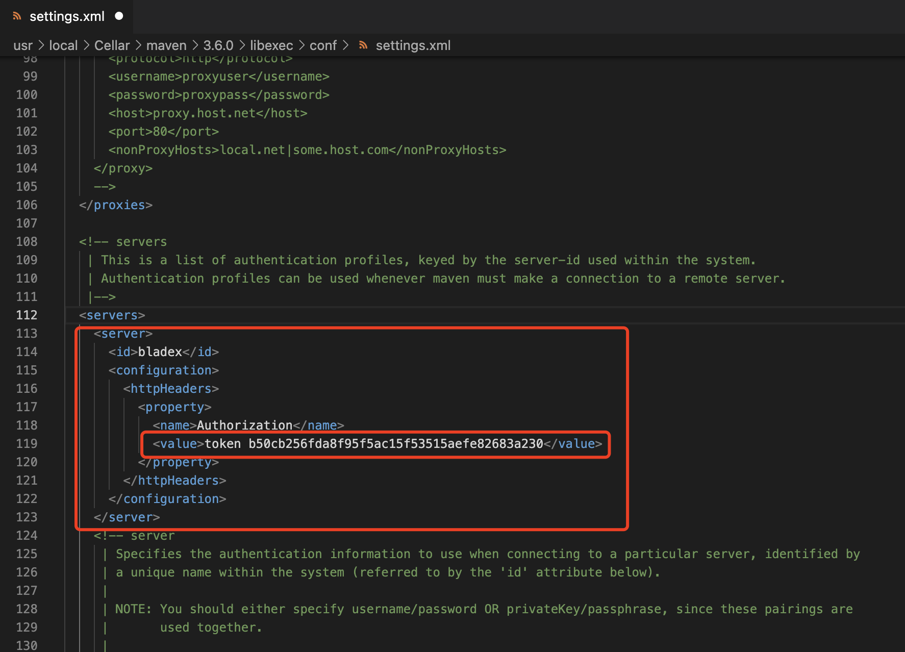
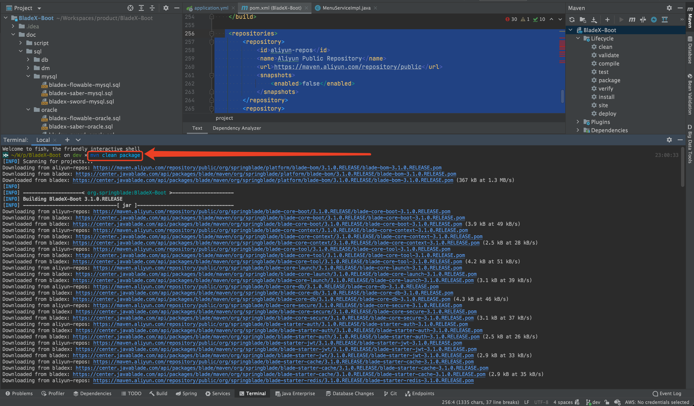
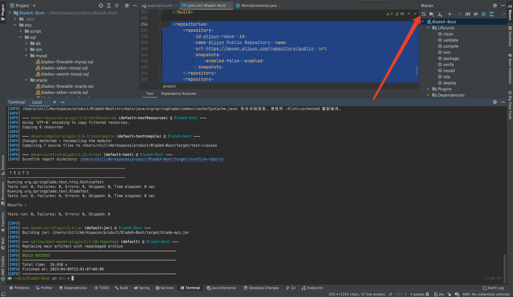
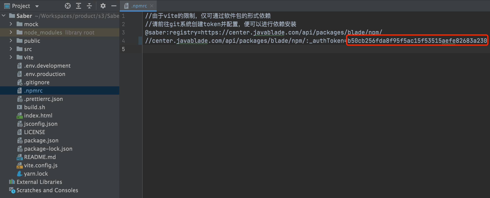
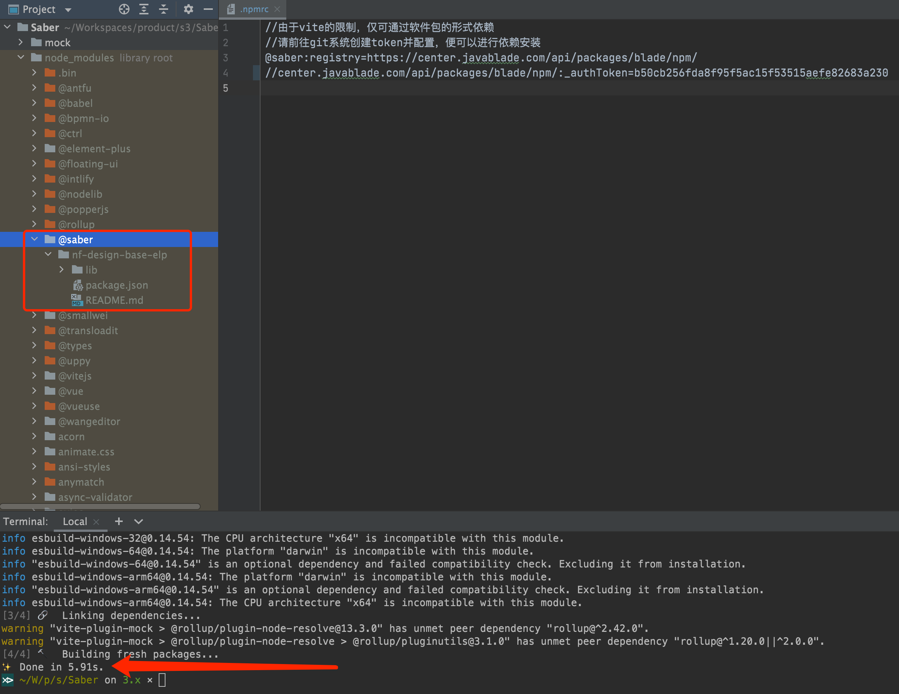
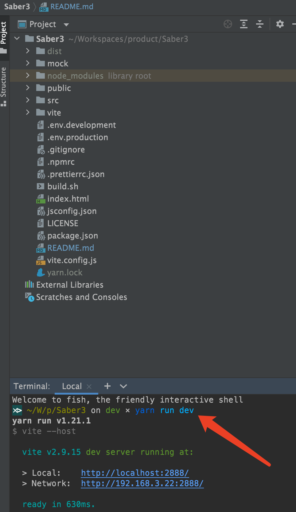

## 一、获取令牌

1. 登录中央仓库：https://center.javablade.com/

2. 若无法登陆，请用授权邮箱重置密码：https://center.javablade.com/user/forgot_password

3. 前往右上角设置->应用创建令牌并保存令牌key: `b50cb256fda8f95f5ac15f53515aefe82683a230`

   注意⚠️：**令牌只显示一次请保存好，每个账号的都不一样，若丢失再删除重新创建即可，文档令牌仅用于测试，实际已删除。**

   


## 二、后端配置令牌

1. BladeX、BladeX-Boot、BladeX-Biz、BladeX-Tool等工程将在马上到来的3.1.1版本采用最新的中央仓库（3.1.1的最新配置已经推送到dev分支，51节后将会发布），大家需要对代码仓库依赖重新配置

2. 具体对比请见下图

   

3. 新版具体完整配置请见下方

   ```xml
       <repositories>
           <repository>
               <id>aliyun-repos</id>
               <name>Aliyun Public Repository</name>
               <url>https://maven.aliyun.com/repository/public</url>
               <snapshots>
                   <enabled>false</enabled>
               </snapshots>
           </repository>
           <repository>
               <id>bladex</id>
               <name>BladeX Release Repository</name>
               <url>https://center.javablade.com/api/packages/blade/maven</url>
           </repository>
       </repositories>
       <pluginRepositories>
           <pluginRepository>
               <id>aliyun-plugin</id>
               <name>Aliyun Public Plugin</name>
               <url>https://maven.aliyun.com/repository/public</url>
               <snapshots>
                   <enabled>false</enabled>
               </snapshots>
           </pluginRepository>
       </pluginRepositories>
   
       <distributionManagement>
           <repository>
               <id>bladex</id>
               <name>BladeX Release Repository</name>
               <url>https://center.javablade.com/api/packages/blade/maven</url>
           </repository>
           <snapshotRepository>
               <id>bladex</id>
               <name>BladeX Snapshot Repository</name>
               <url>https://center.javablade.com/api/packages/blade/maven</url>
           </snapshotRepository>
       </distributionManagement>
   ```

4. 同时需要在maven的setting.xml增加id为bladex的配置，找到工程内设置好的文件

   

5. 打开后加入如下配置，加入刚刚拷贝的令牌key：`b50cb256fda8f95f5ac15f53515aefe82683a230`

   

   ```xml
     <servers>
       <server>
         <id>bladex</id>
         <configuration>
           <httpHeaders>
             <property>
               <name>Authorization</name>
               <value>token b50cb256fda8f95f5ac15f53515aefe82683a230</value>
             </property>
           </httpHeaders>
         </configuration>
       </server>
     </servers>
   ```

6. 打开工程（导入细节请看后续章节），执行`mvn clean package`自动下载依赖

   

7. 若下载报错，没有从bladex私服下载，而是从阿里云或者中央仓库下载，则需要继续前往`maven`的`setting.xml`添加如下两处配置

   注意⚠️：

   * 下面的配置两者选其一，如果跟着bladex配置走，就只需要配置aliyun即可，关键在于`!bladex`排除下载
   * 如果在pom.xml两个地址都配置了，则下方两个都需要配置
   * 需要确保mirror的url的地址和pom.xml配置的url地址一样，id也一样

   ```xml
   <mirrors>
       <mirror>
           <id>aliyun-repos</id>
           <name>Aliyun Public Repository</name>
           <url>https://maven.aliyun.com/repository/public</url>        
           <mirrorOf>*,!bladex</mirrorOf>
       </mirror>
   </mirrors>
   ```

   ```xml
   <mirrors>
       <mirror>
           <id>nexus</id>
           <name>nexus repositories</name>
           <url>https://repo1.maven.org/maven2</url>
           <mirrorOf>*,!bladex</mirrorOf>
       </mirror>
   </mirrors>
   ```

8. 依赖下载完毕，再点击刷新工程即可

   


## 三、前端配置令牌

1. 由于vite的限制，自定义组件需要以package的形式引入，无法再用lib包直接加载，所以saber3也需要做依赖配置

   注意⚠️：**此依赖下载的是工作流插件设计器编译版，原价`299元`，官方通过与作者的沟通后现已免费赠送此版本给商业用户使用**

2. 最开始获取的令牌也可以复用在saber3，打开saber3的`.npmrc`文件，配置好刚刚的令牌

   注意⚠️：`center`前面的`//`不要删掉

   

3. 配置好后删除`node_modules`文件夹再执行 `yarn install` 命令等待安装完成。

   注意尽量不要用`npm install`来安装工程依赖，这样会有很多额外的配置和错误的概率。

   若没有安装yarn，执行命令`npm install -g yarn` 之后再执行 `yarn install`安装工程即可。

   

4. 使用`yarn run dev`启动项目，由于加入了环境变量，可以`run dev` `run prod`，所以之前的`run serve`命令已不再适用

   
