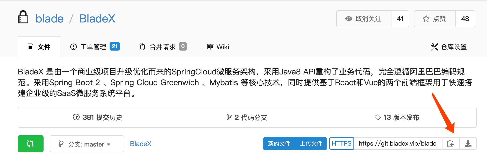
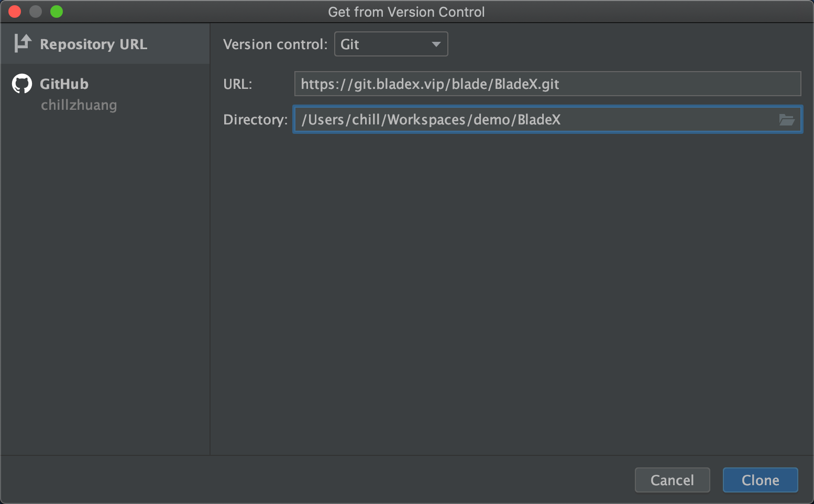
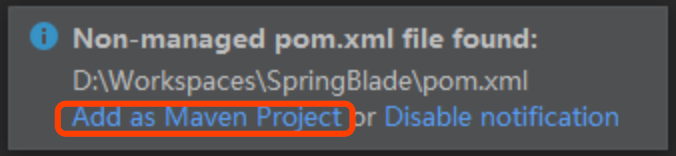
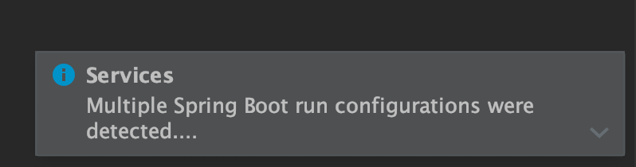
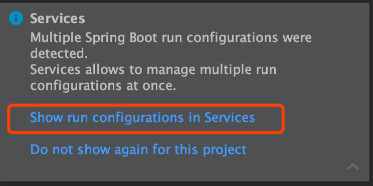
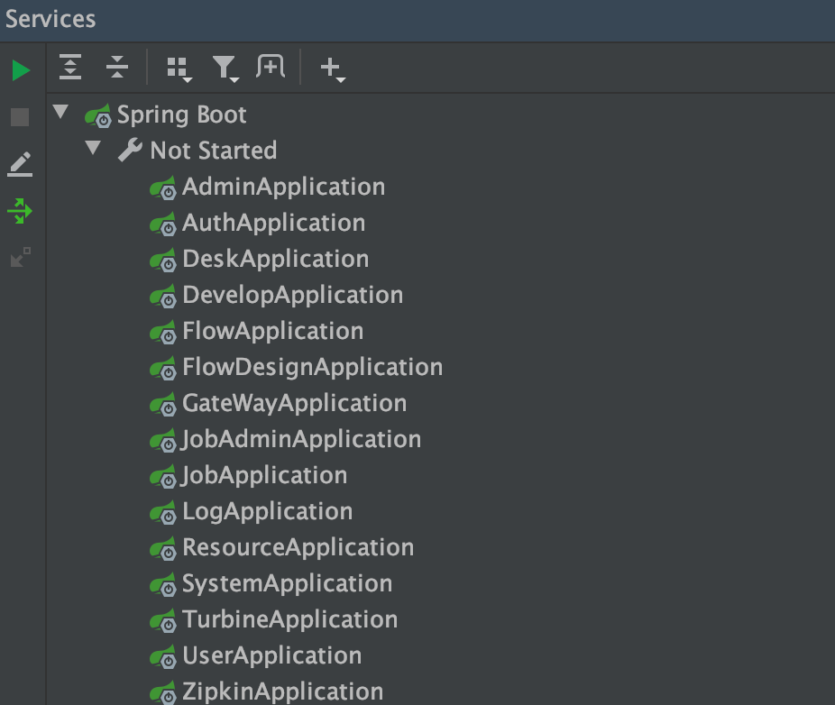
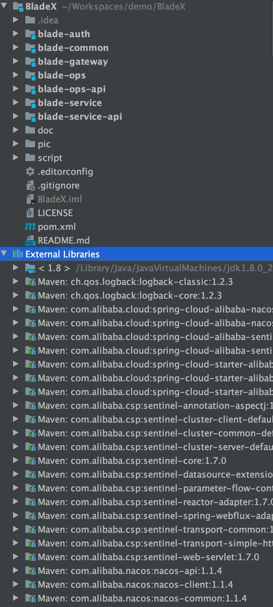
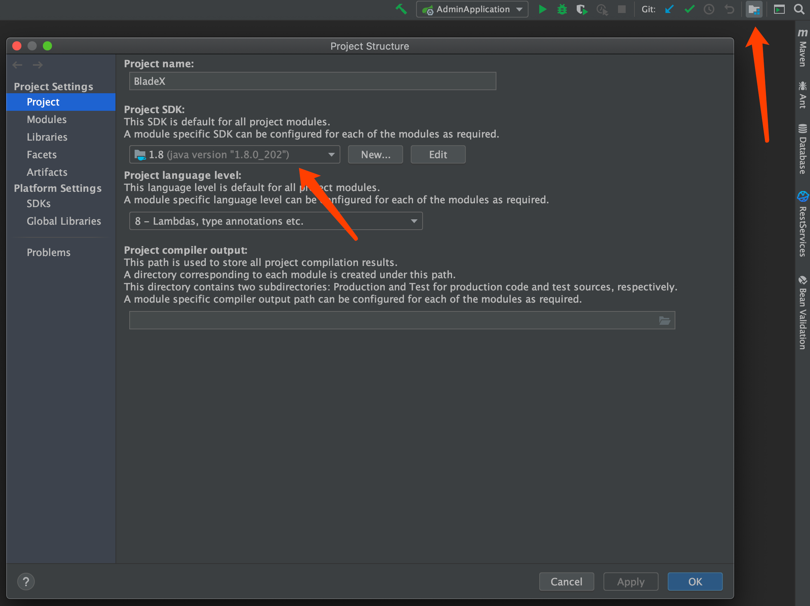
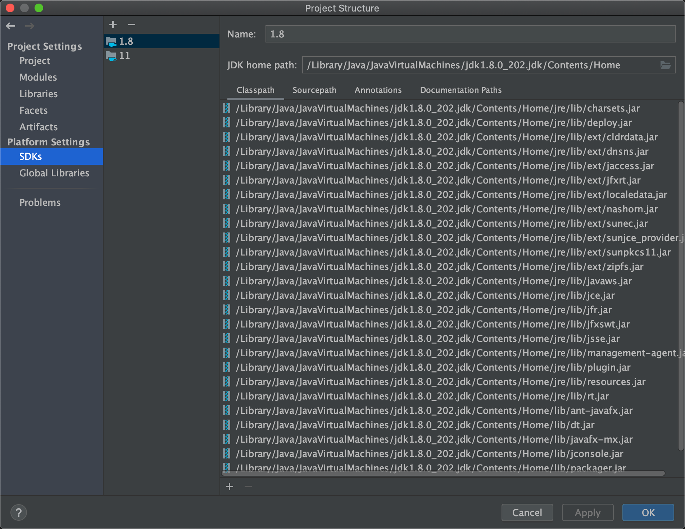
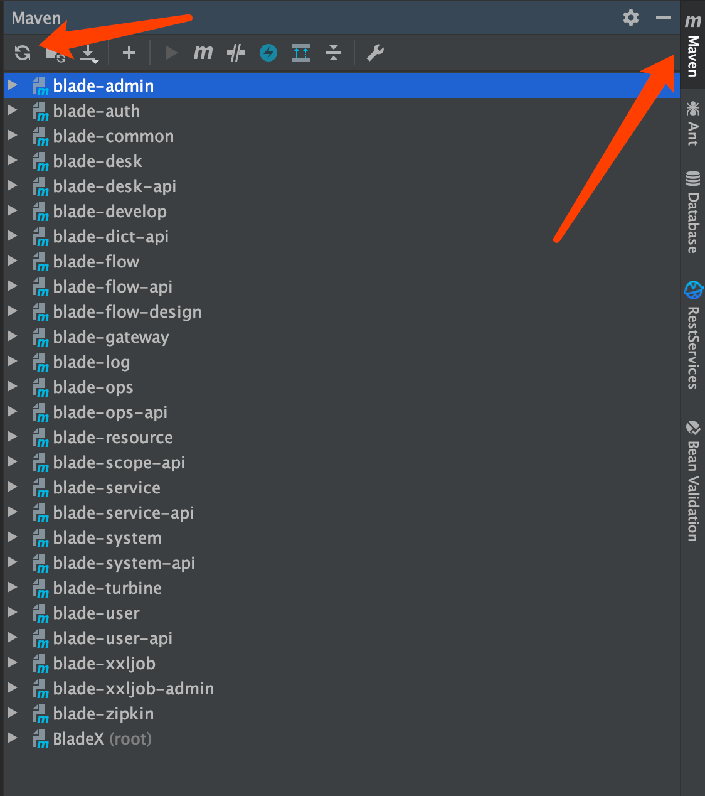

## 工程导入

1. 进入BladeX私服地址：[https://git.bladex.vip/blade/BladeX](https://git.bladex.vip/blade/BladeX)
2. 复制git链接

3. 打开idea，可以从如下两种方式选择导入

4. 选择自定的路径，进行clone

5. 若右下角弹出如下提示，则点击`Add as Maven Project`， 等待依赖jar包下载完毕

6. 等待导入以及maven依赖的下载，等下载完毕发现若右下角出现如下提示，记得点击开启，这功能在SpringCloud模式开发下能提供极大的便利

7. 开启后便可以一览所有的服务启动器

8. 若看到如下工程形态，说明启动成功

9. 若遇到问题，可以看一下工程jdk是否配置正确，maven进行刷新配置。

   若无法下载jar包，具体可以看这个帖子：https://sns.bladex.vip/q-762.html

   

   

1. 
  
