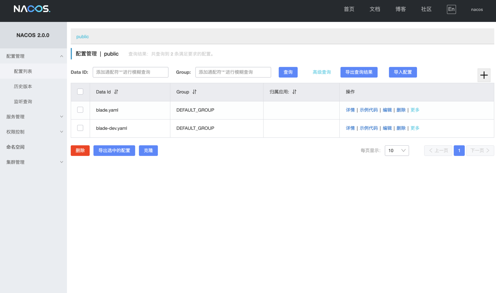
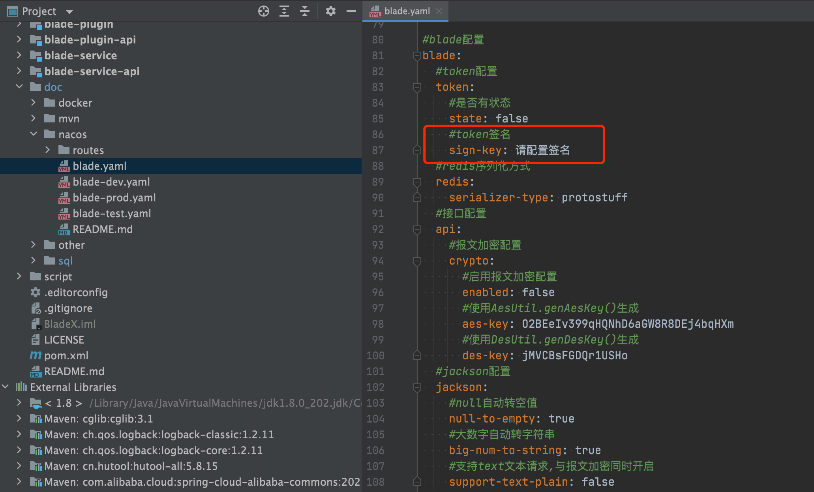
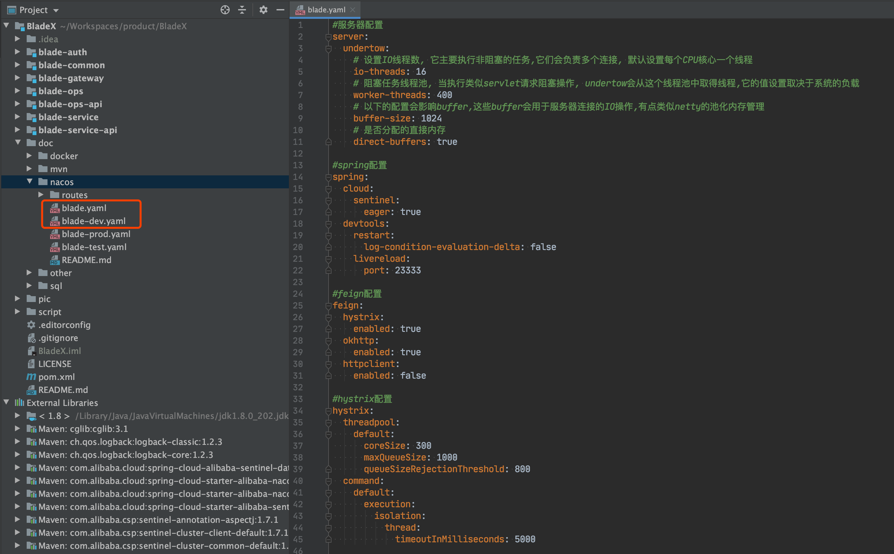
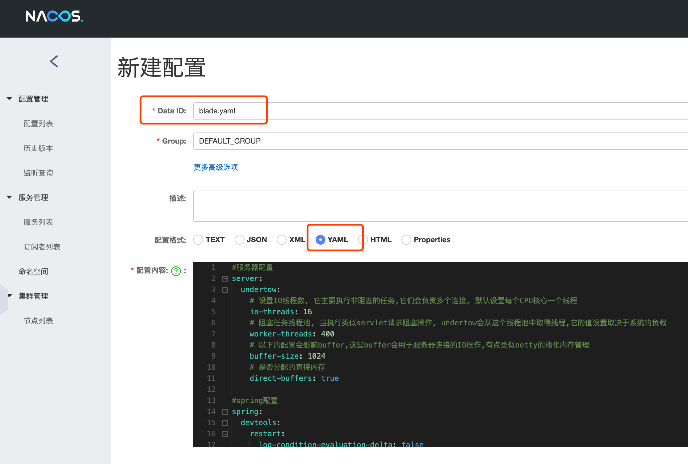
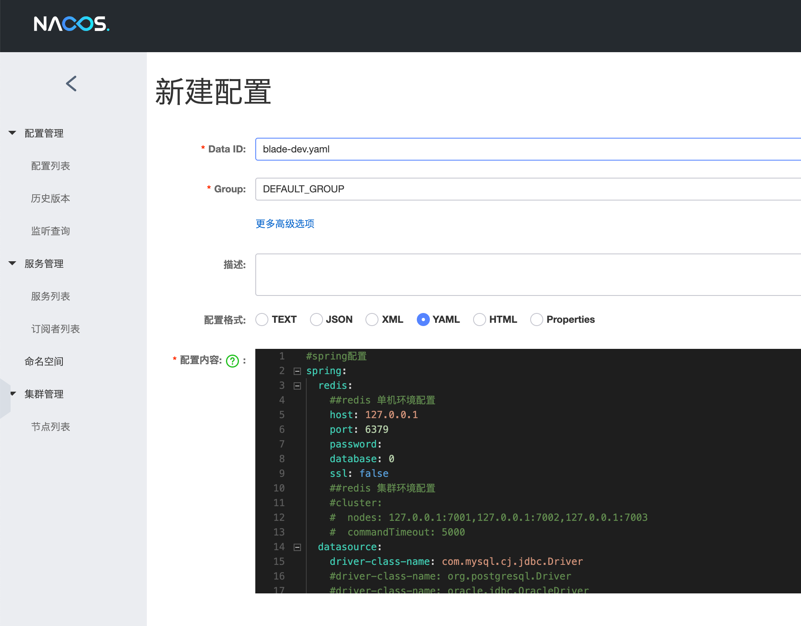
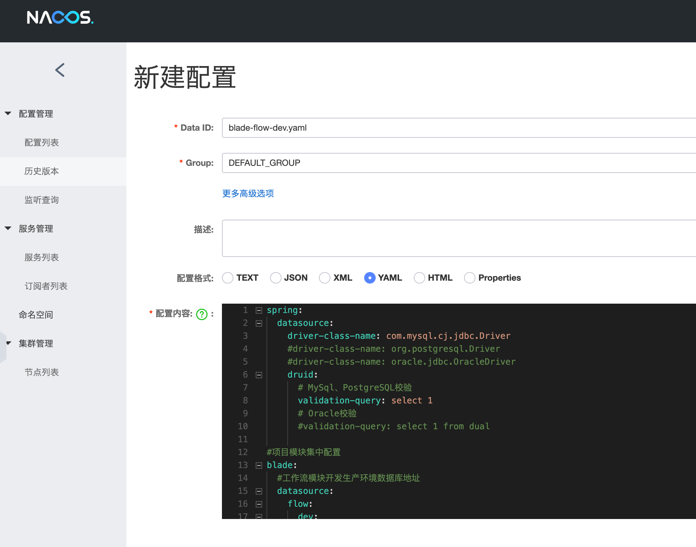
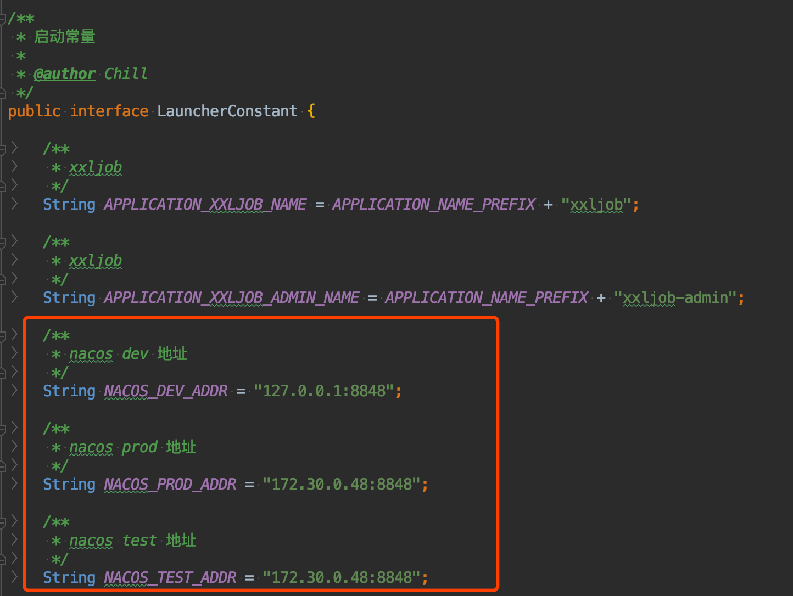

## Nacos增加配置
1. nacos地址：http://localhost:8848/nacos

2. 账号密码：nacos nacos

3. 点击新建配置，注意blade.yaml文件有一个blade.token.sign-key需要配置，否则认证服务无法启动。
    

4. 配置sign-key的值，为大小写与数字的随机组合，长度32位以上便可

5. 找到工程doc/nacos/blade.yaml文件，将内容复制到nacos中点发布(**如果是部署在windows服务器，请务必删掉中文注释或者进行unicode转码，以防乱码导致启动失败**)
    
    

6. 同理新增blade-dev.yaml、blade-flow-dev.yaml配置（主要是配置mysql与redis的地址）
    
    

7. flow的配置具体见章节 5.6.2

8. 若Nacos地址不是默认的localhost:8848，则需要单独配置（地址不能带http://）
    
    

