## 工程导入
1. 进入BladeX私服地址：[https://git.bladex.vip/blade/BladeX-Boot](https://git.bladex.vip/blade/BladeX-Boot)
2. 复制git链接
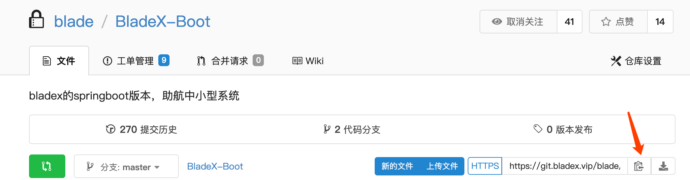
3. 打开idea，可以从如下两种方式选择导入
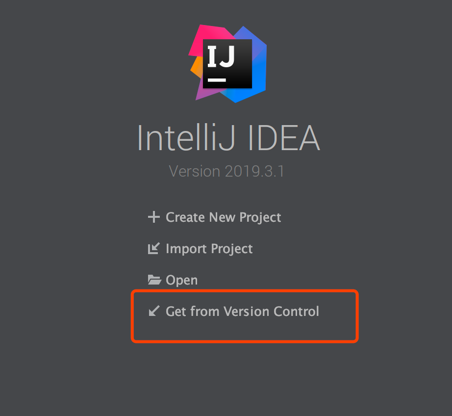
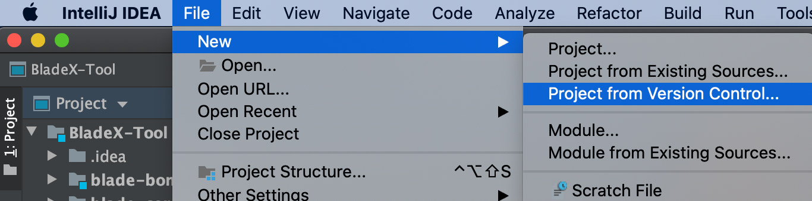
4. 选择自定的路径，进行clone
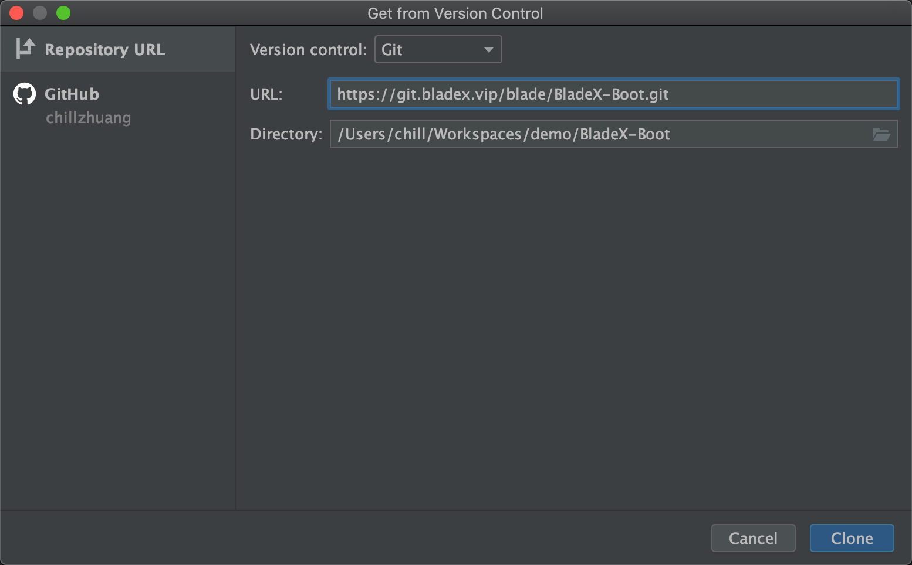
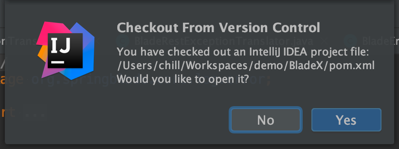
5. 若右下角弹出如下提示，则点击`Add as Maven Project`， 等待依赖jar包下载完毕
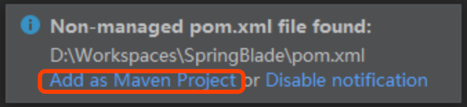
6. 若看到如下工程形态，说明启动成功
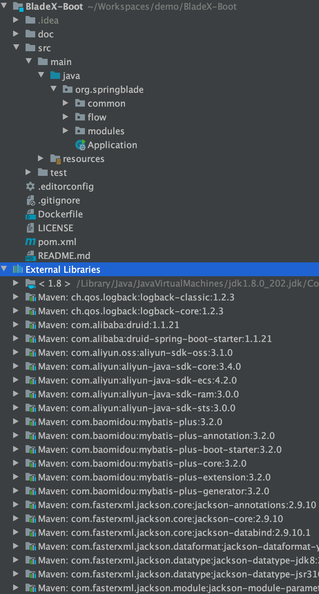
7. 若遇到问题，可以看一下工程jdk是否配置正确，maven进行刷新配置
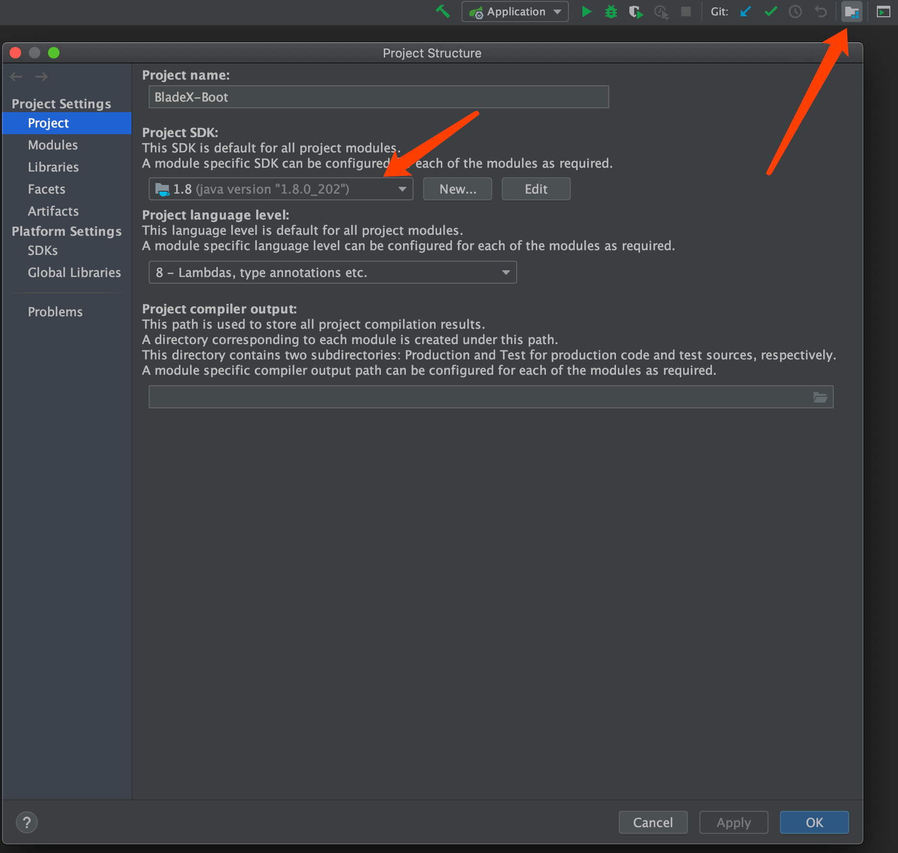
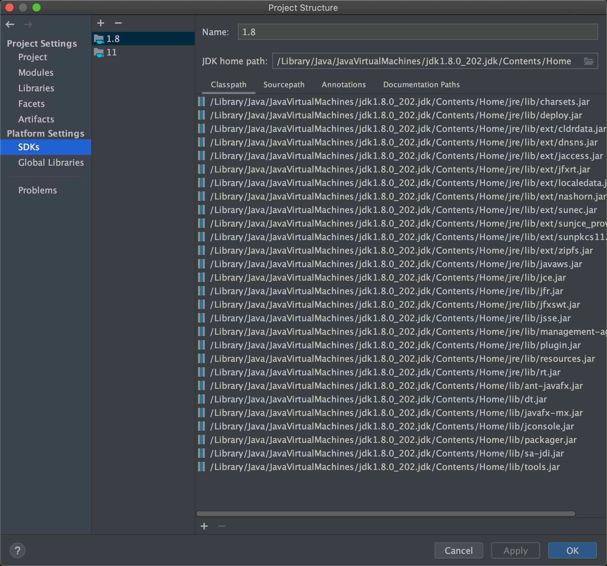
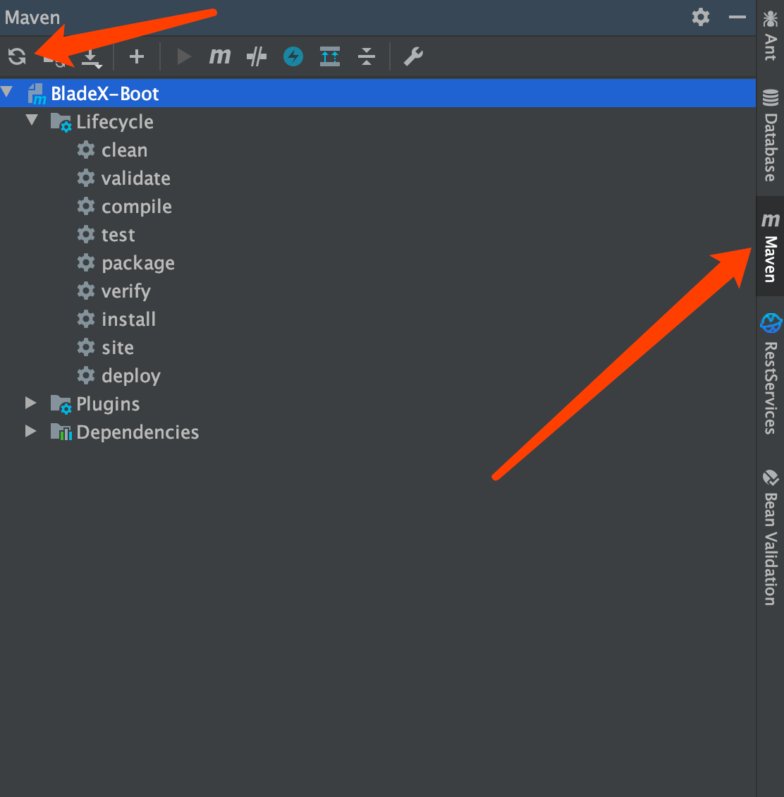

## 工程配置
1. 进入`application.yml`，进行token签名的配置，sign-key的值，为大小写与数字的随机组合，长度32位以上便可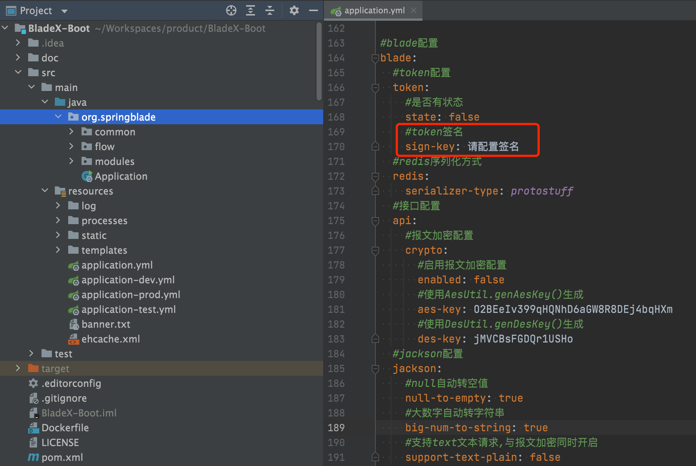

2. 进入`application.yml`，进行端口、数据库驱动类的配置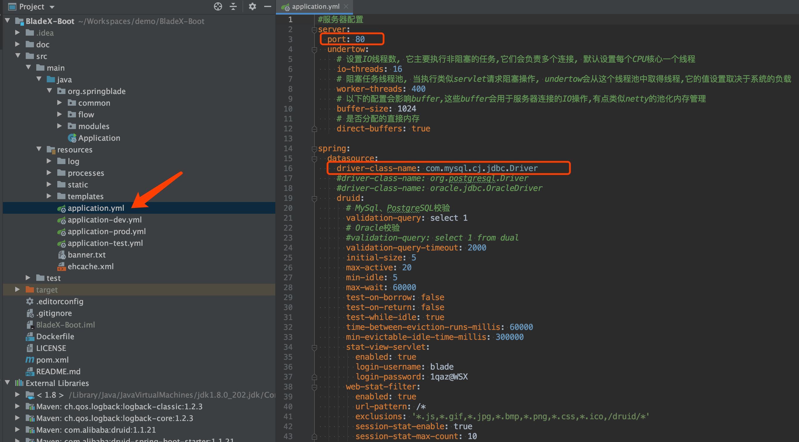

3. 进入`application-dev.yml`，进行redis、数据库的配置
    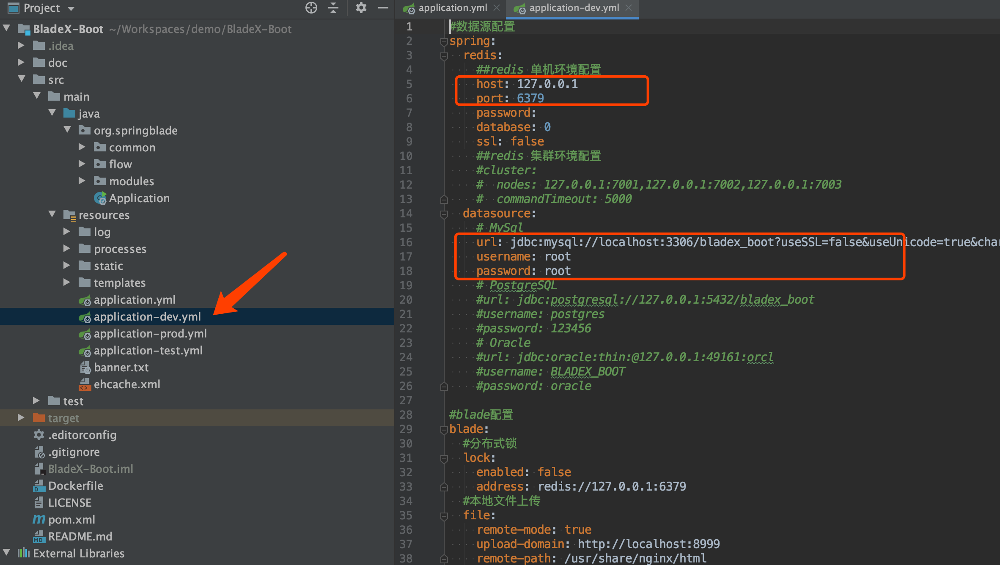
