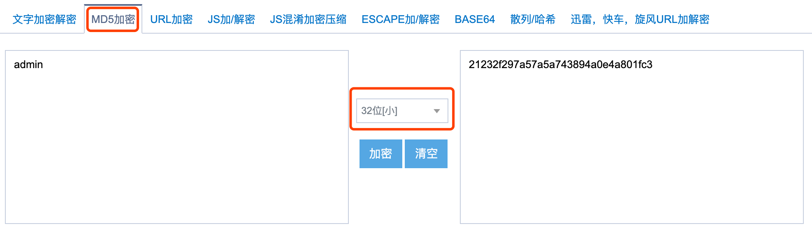

## 服务调用测试
1. 打开接口文档系统，并开启所有增强配置：[http://localhost/doc.html](http://localhost/doc.html)

  

  **注⚠️：目前knife4j版本刷新后会丢失增强配置，所以需要手动关闭tab，再重新打开文档页面才会生效**。

2. 点开Authorize
    

3. 给`Authorization`和`Tenant-Id`填入对应的值
    

4. 其中`Authorization`的值是`blade_client`表的`client_id`、`client_secret`字段组合后转换成的Base64编码
    
    

5. 找到对应的Token接口
    
    

6. 框架对密码进行了**二次加密**，由前端调用传参需要现将原密码进行**md5**加密后再进行传递，原密码是`admin`，所以md5加密后是`21232f297a57a5a743894a0e4a801fc3`，具体如下
    

7. 将原先默认的参数修改为下图,并点击发送，收到返还说明token获取成功
    

8. 点开`请求头部`，发现我们刚刚设置的两个请求头已经自动带上
    

## 服务鉴权测试
1. 为了测试相关代码，我们到左上角选中`系统模块`，打开对应的接口文档

2. 直接点击调用，发现是鉴权失败

## 服务鉴权配置
1. 切换回第一次进行接口调用的token接口，复制对应的两个参数

2. 将`token_type`与`access_token`两个值拼接，中间以**空格**隔开，配置到左上角的Authorize内（注意不同子系统切换后，都需要到Authorize模块内配置一下）

3. **刷新界面**，**关闭之前的窗口**，再次打开一开始的接口，发现调用成功

## 后记
* 至此，工程启动成功，api调用成功
* 下一步便是逐步理解整个项目从而可以进入快速开发的阶段
