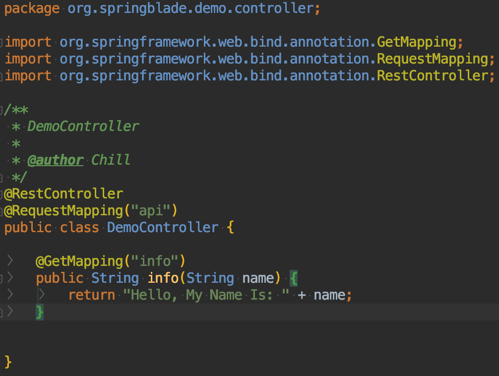

## 创建第一个API
1. 为了保证工程结构清晰，我们将不同用处的类归并到对应功能描述的`package`中。
2. 创建`API`用到的是`Controller`，所以我们新建一个`controller`的`package`并新建一个`DemoController`的类。

3. 新建一个最简单的`API`。

4.  `@RestController` 注解相当于`@ResponseBody` ＋ `@Controller`合在一起的作用。
5.  `@RequestMapping("api")`将当前`DemoController`下的方法增加一个前缀`api`，可以快速定位。
6. 以下代码定义了一个`info`方法，传入name参数，返回`"Hello, My Name Is: " + name`的字符串。
```
@GetMapping("info")
public String info(String name) {
   return "Hello, My Name Is: " + name;
}
```
7. 重启`DemoApplication`或者使用快捷键`Ctrl+F9`重载class，让我们新建的`API`生效 
8. 上一章我们以`9101`的端口启动了`blade-demo`，那么要访问这个`API`的话，则地址为：http://localhost:9101/api/info?name=Chill 或 http://localhost/blade-demo/api/info?name=Chill (推荐使用后一种，通过API 网关，采用负载均衡的算法动态调用名为`blade-demo`的服务)
9. 我们使用 [Postman](https://www.getpostman.com/) 或者其他api调试工具调用接口查看结果

10. 请求成功，但是返回的消息是：`缺失令牌,鉴权失败`，这是为何？
11. 因为任何一个API，都需要考虑安全性，不能让未授权的请求，调用到受保护的API，那么就需要一个安全框架来支撑。
## API安全框架
* Spring家族有著名的Spring Security，功能非常完善，但似乎有些笨重。所以BladeX借鉴其设计思想，设计了一个更简单易用的安全框架： `Secure`。
* 麻雀虽小五脏俱全，那么下面我们来学习下 API 的鉴权吧！
