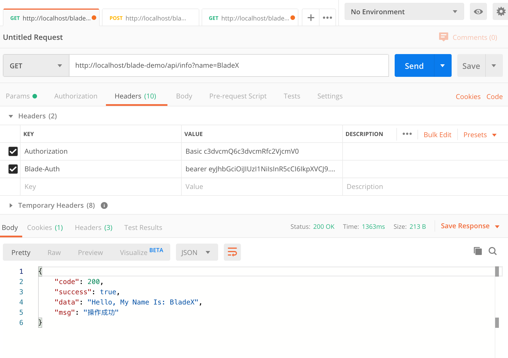

## 为什么要统一API响应结果
* 对于移动端和PC端开发而言，调用接口返回有统一的响应体，可以针对性的设计界面，代码结构更加清晰，层次也更加分明。
* 统一根据返回的状态码判断接口调用的具体情况，从而进行下一步操作
* 统一根据返回的的消息字段显示接口调用的具体状态
* 统一根据返回的数据承载进行数据的交互与展示

## API 响应类代码
~~~java
/**
 * 统一API响应结果封装
 *
 * @author Chill
 */
@Getter
@Setter
@ToString
@ApiModel(description = "返回信息")
@NoArgsConstructor(access = AccessLevel.PRIVATE)
public class R<T> implements Serializable {

   private static final long serialVersionUID = 1L;

   @ApiModelProperty(value = "状态码", required = true)
   private int code;
   @ApiModelProperty(value = "是否成功", required = true)
   private boolean success;
   @ApiModelProperty(value = "承载数据")
   private T data;
   @ApiModelProperty(value = "返回消息", required = true)
   private String msg;

   private R(IResultCode resultCode) {
      this(resultCode, null, resultCode.getMessage());
   }

   private R(IResultCode resultCode, String msg) {
      this(resultCode, null, msg);
   }

   private R(IResultCode resultCode, T data) {
      this(resultCode, data, resultCode.getMessage());
   }

   private R(IResultCode resultCode, T data, String msg) {
      this(resultCode.getCode(), data, msg);
   }

   private R(int code, T data, String msg) {
      this.code = code;
      this.data = data;
      this.msg = msg;
      this.success = ResultCode.SUCCESS.code == code;
   }

   /**
    * 判断返回是否为成功
    *
    * @param result Result
    * @return 是否成功
    */
   public static boolean isSuccess(@Nullable R<?> result) {
      return Optional.ofNullable(result)
         .map(x -> ObjectUtil.nullSafeEquals(ResultCode.SUCCESS.code, x.code))
         .orElse(Boolean.FALSE);
   }

   /**
    * 判断返回是否为成功
    *
    * @param result Result
    * @return 是否成功
    */
   public static boolean isNotSuccess(@Nullable R<?> result) {
      return !R.isSuccess(result);
   }

   /**
    * 返回R
    *
    * @param data 数据
    * @param <T>  T 泛型标记
    * @return R
    */
   public static <T> R<T> data(T data) {
      return data(data, BladeConstant.DEFAULT_SUCCESS_MESSAGE);
   }

   /**
    * 返回R
    *
    * @param data 数据
    * @param msg  消息
    * @param <T>  T 泛型标记
    * @return R
    */
   public static <T> R<T> data(T data, String msg) {
      return data(HttpServletResponse.SC_OK, data, msg);
   }

   /**
    * 返回R
    *
    * @param code 状态码
    * @param data 数据
    * @param msg  消息
    * @param <T>  T 泛型标记
    * @return R
    */
   public static <T> R<T> data(int code, T data, String msg) {
      return new R<>(code, data, data == null ? BladeConstant.DEFAULT_NULL_MESSAGE : msg);
   }

   /**
    * 返回R
    *
    * @param msg 消息
    * @param <T> T 泛型标记
    * @return R
    */
   public static <T> R<T> success(String msg) {
      return new R<>(ResultCode.SUCCESS, msg);
   }

   /**
    * 返回R
    *
    * @param resultCode 业务代码
    * @param <T>        T 泛型标记
    * @return R
    */
   public static <T> R<T> success(IResultCode resultCode) {
      return new R<>(resultCode);
   }

   /**
    * 返回R
    *
    * @param resultCode 业务代码
    * @param msg        消息
    * @param <T>        T 泛型标记
    * @return R
    */
   public static <T> R<T> success(IResultCode resultCode, String msg) {
      return new R<>(resultCode, msg);
   }

   /**
    * 返回R
    *
    * @param msg 消息
    * @param <T> T 泛型标记
    * @return R
    */
   public static <T> R<T> failure(String msg) {
      return new R<>(ResultCode.FAILURE, msg);
   }

   /**
    * 返回R
    *
    * @param code 状态码
    * @param msg  消息
    * @param <T>  T 泛型标记
    * @return R
    */
   public static <T> R<T> failure(int code, String msg) {
      return new R<>(code, null, msg);
   }

   /**
    * 返回R
    *
    * @param resultCode 业务代码
    * @param <T>        T 泛型标记
    * @return R
    */
   public static <T> R<T> failure(IResultCode resultCode) {
      return new R<>(resultCode);
   }

   /**
    * 返回R
    *
    * @param resultCode 业务代码
    * @param msg        消息
    * @param <T>        T 泛型标记
    * @return R
    */
   public static <T> R<T> failure(IResultCode resultCode, String msg) {
      return new R<>(resultCode, msg);
   }

   /**
    * 返回R
    *
    * @param flag 成功状态
    * @return R
    */
   public static R status(boolean flag) {
      return flag ? success(BladeConstant.DEFAULT_SUCCESS_MESSAGE) : failure(BladeConstant.DEFAULT_FAILURE_MESSAGE);
   }

}
~~~

## 如何使用
1. 撸起袖子来优化下上一章我们新建的 API
~~~java
@GetMapping("info")
@PreAuth("hasRole('administrator')")
public R<String> info(String name) {
   return R.data("Hello, My Name Is: " + name);
}

@GetMapping("count")
@PreAuth("permitAll()")
public R<Integer> count(Integer cnt) {
   return R.data(cnt * 10);
}
~~~
2. 调用 API 查看具体返回

3. 可以看到，返回接口变成了Json，并且字段清晰，分别代表 状态码、是否成功、数据承载、消息

## 注
* 每个 API 都需要规范，具有统一的响应结果，这样才更利于后续的开发
* 移动端、PC端对接的时候，也请根据`success`来判断接口是否成功而不是根据`code`来判断。
