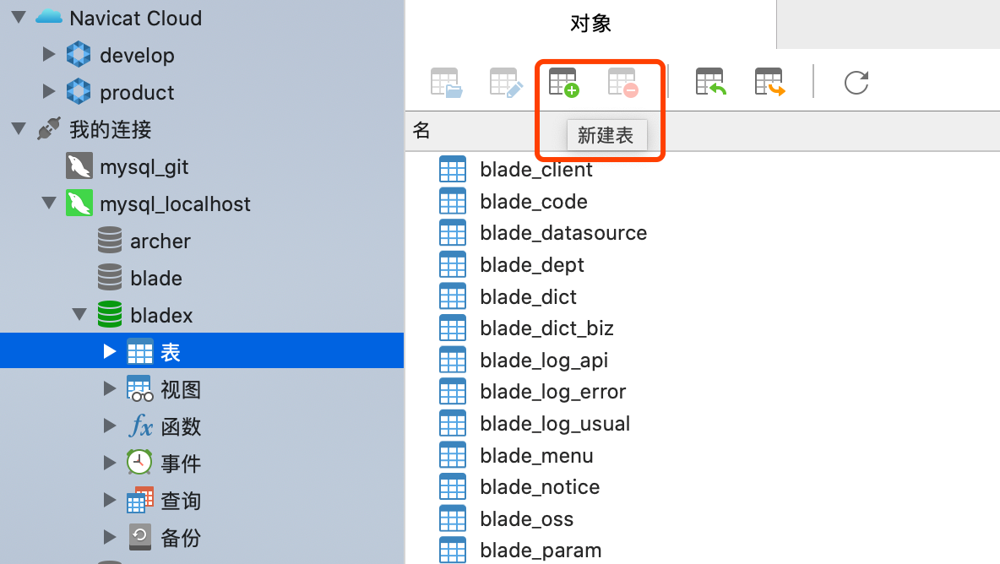
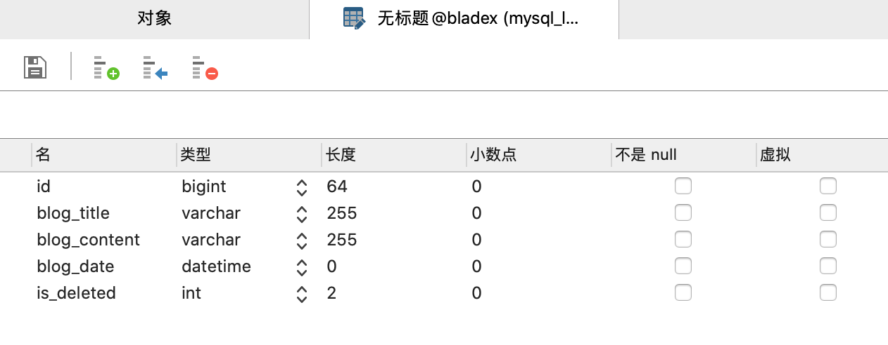
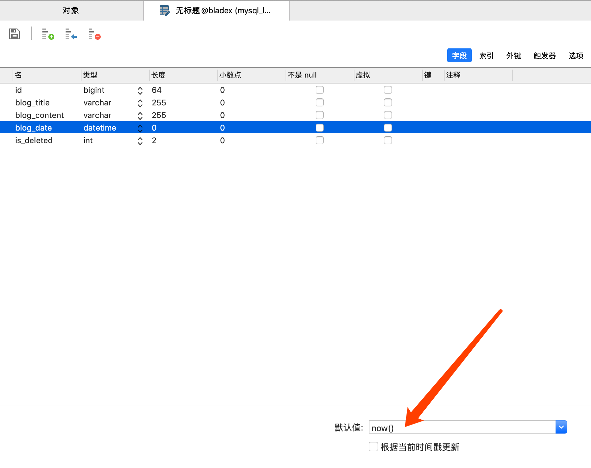
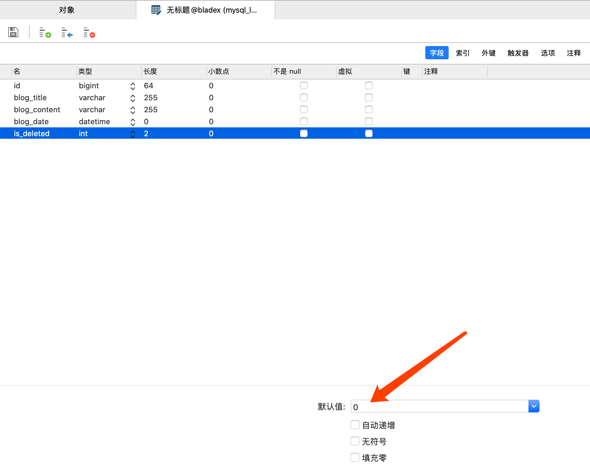
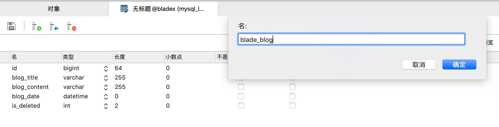
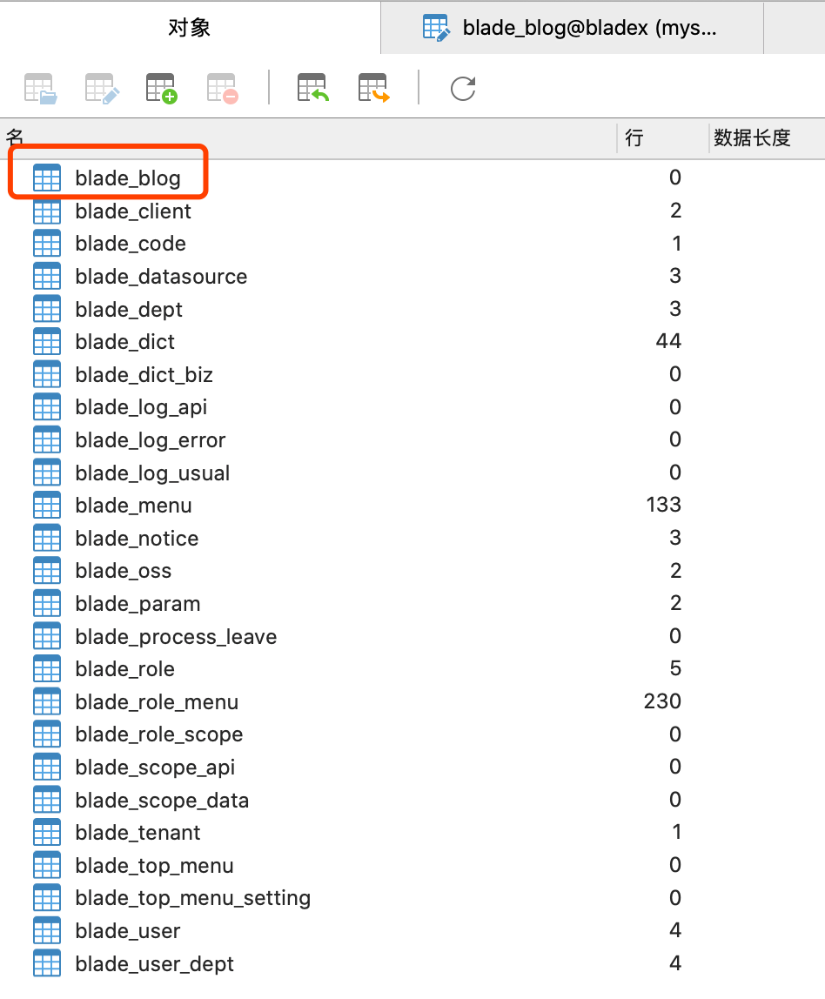

## 创建表 （Mysql）
1. 打开`Navicat`，点击`新建表`

2. 我们只需要最简单的几个字段

3. 字段名若有多个单词组成，推荐用下划线隔开，不推荐使用驼峰
4. BladeX默认采用了Long类型的主键，使用了snowflake算法，所以类型需要设置为bigint(64), 并且不需要设置为自增
5. `blog_date`字段默认只设置为当前时间

6. `is_deleted`字段默认值设置为0

7. 点击`保存`，将表命名为 `blade_blog`

8. 返回刷新，发现已经多出了`blade_blog`的表

