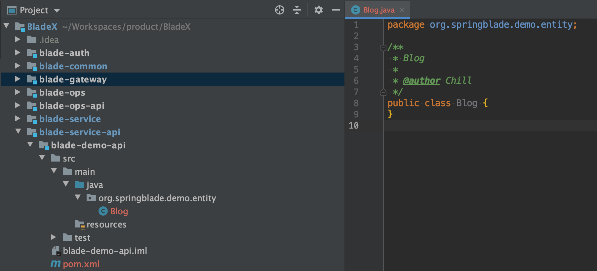

## 创建实体类
1. 因为`POJO / VO / DTO`等等是会被其他模块依赖引用的，所以我们需要把实体类建在`blade-demo-api`工程内。

2. 参照新建表的字段，我们给实体类增加如下字段。
~~~java
public class Blog {

   /**
    * 主键
    */
   private Long id;
   /**
    * 标题
    */
   private String blogTitle;
   /**
    * 内容
    */
   private String blogContent;
   /**
    * 时间
    */
   private Date blogDate;
   /**
    * 是否已删除
    */
   private Integer isDeleted;

}
~~~
### 注:
* 看到这里可能有小伙伴就有疑问了，为什么数据库中字段以下划线分割，到了实体类就变成了驼峰？
* 因为这么做更加优雅，也更加规范。
* 比如Mysql数据库字段命名为 blogTitle，乍一看没问题，但到了oracle就变成了 BLOGTITLE，到了postgresql就变成了blogtitle，可读性非常差。
* 比如实体类字段命名为blog_title，则get时变成了 getBlog_title()，也非常的不美观。
* 但这都是为了代码更加优雅才定的小规范，若觉得不妨碍整体美观度，数据库字段也可以变为驼峰，实体类也可以变为下划线分割。

## 实体类修饰
1. 可能会有小伙伴立马给他加上`get set`的方法，如下
~~~java
public class Blog {

   /**
    * 主键
    */
   private Long id;
   /**
    * 标题
    */
   private String blogTitle;
   /**
    * 内容
    */
   private String blogContent;
   /**
    * 时间
    */
   private Date blogDate;
   /**
    * 是否已删除
    */
   private Integer isDeleted;

   public Long getId() {
      return id;
   }

   public void setId(Long id) {
      this.id = id;
   }

   public String getBlogTitle() {
      return blogTitle;
   }

   public void setBlogTitle(String blogTitle) {
      this.blogTitle = blogTitle;
   }

   public String getBlogContent() {
      return blogContent;
   }

   public void setBlogContent(String blogContent) {
      this.blogContent = blogContent;
   }

   public Date getBlogDate() {
      return blogDate;
   }

   public void setBlogDate(Date blogDate) {
      this.blogDate = blogDate;
   }

   public Integer getIsDeleted() {
      return isDeleted;
   }

   public void setIsDeleted(Integer isDeleted) {
      this.isDeleted = isDeleted;
   }
}
~~~
2. 针对于这种情况，有了`Lombok`后，可以大大减少代码量了，只需一个 `@Data` 注解即可实现我们要的功能。
~~~java
@Data
public class Blog {

   /**
    * 主键
    */
   private Long id;
   /**
    * 标题
    */
   private String blogTitle;
   /**
    * 内容
    */
   private String blogContent;
   /**
    * 时间
    */
   private Date blogDate;
   /**
    * 是否已删除
    */
   private Integer isDeleted;

}
~~~
3. 一般实体类都需要用到缓存、序列化等等，所以要实现序列化接口
~~~java
public class Blog implements Serializable {

   private static final long serialVersionUID = 1L;

}
~~~
4. 加上`mybatis-plus`的注解，因为id不是自增，我们选择了snowflake，所以需要额外配置下。若id为自增，则不需要配置。最终版如下：
~~~java
@Data
@TableName("blade_blog")
public class Blog implements Serializable {

   private static final long serialVersionUID = 1L;

   /**
    * 主键
    */
   @TableId(value = "id", type = IdType.ASSIGN_ID)
   private Long id;
   /**
    * 标题
    */
   private String blogTitle;
   /**
    * 内容
    */
   private String blogContent;
   /**
    * 时间
    */
   private Date blogDate;
   /**
    * 是否已删除
    */
   private Integer isDeleted;

}
~~~
