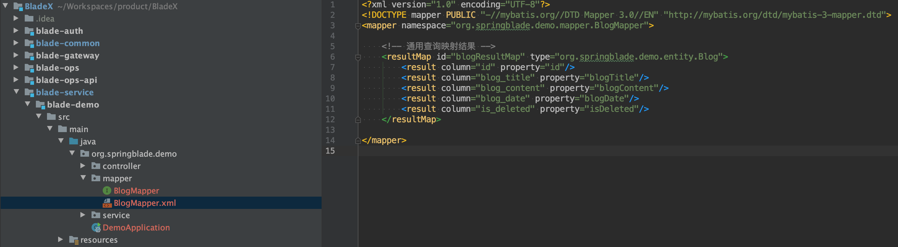

## 前言
* 实体类建好了，那么下面我们来建和数据库打交道的`Service`和`Mapper`类 。
* 因为这俩兄弟是为业务服务的，不需要被其他服务调用，所以会放到`blade-demo`这个业务工程内。
* 若其他服务需要调用本服务的一些API，则需要用到微服务远程调用，而不是直接引用`Service`和`Mapper`。
* 微服务远程调用将在下一章节讲解。
## 创建package
 在`blade-demo`中新建`service`和`mapper`两个package

## 创建Service
1. 创建名为`BlogService`的接口类

2. 创建名为`BlogServiceImpl`的接口实现类（放在service的imp包下）

## 创建Mapper
1. 创建名为`BlogMapper`的接口类

2. 创建名为`BlogMapper`的XML文件

3. `BlogMapper.xml`内容如下，`通用查询映射结果`则做到了实体类与数据库字段对应的关系
~~~xml
<?xml version="1.0" encoding="UTF-8"?>
<!DOCTYPE mapper PUBLIC "-//mybatis.org//DTD Mapper 3.0//EN" "http://mybatis.org/dtd/mybatis-3-mapper.dtd">
<mapper namespace="org.springblade.demo.mapper.BlogMapper">

    <!-- 通用查询映射结果 -->
    <resultMap id="blogResultMap" type="org.springblade.demo.entity.Blog">
        <result column="id" property="id"/>
        <result column="blog_title" property="blogTitle"/>
        <result column="blog_content" property="blogContent"/>
        <result column="blog_date" property="blogDate"/>
        <result column="is_deleted" property="isDeleted"/>
    </resultMap>

</mapper>

~~~

4. 注意`BlogMapper.xml`的`namespace`和`resultMap` 的`type`要指向正确的地址
5.  `namespace`指向对应的`BlogMapper.java`接口类 ，`type`指向对应的`Blog.java`实体类

## 增加配置
1. `BlogMapper`增加mybatis-plus的配置
~~~java
package org.springbalde.demo.mapper;

import com.baomidou.mybatisplus.core.mapper.BaseMapper;
import org.springblade.demo.entity.Blog;

public interface BlogMapper extends BaseMapper<Blog> {

}
~~~
2. `BlogService`增加mybatis-plus的配置
~~~java
package org.springbalde.demo.service;

import com.baomidou.mybatisplus.extension.service.IService;
import org.springblade.demo.entity.Blog;

public interface BlogService extends IService<Blog> {

}
~~~
3. `BlogServiceImpl`增加mybatis-plus的配置
~~~java
package org.springbalde.demo.service.impl;

import com.baomidou.mybatisplus.extension.service.impl.ServiceImpl;
import org.springbalde.demo.mapper.BlogMapper;
import org.springbalde.demo.service.BlogService;
import org.springblade.demo.entity.Blog;
import org.springframework.stereotype.Service;

@Service
public class BlogServiceImpl extends ServiceImpl<BlogMapper, Blog> implements BlogService{

}

~~~

## 注意
BladeX默认的mybatis扫描包名为`org.springblade`，不在此目录下的bean无法被mybatis扫描到，但大家作为各自的项目，新的服务肯定会使用其他的包名，这种情况需要自己额外定义一个配置类，配置包扫描的路径，以及mybatis-plus扫描bean-alias的配置。

## 结束
好了，与mybatis-plus的集成已经结束，那么下面我们开始与数据库交互的第一步，增删改查的基本做法吧！

