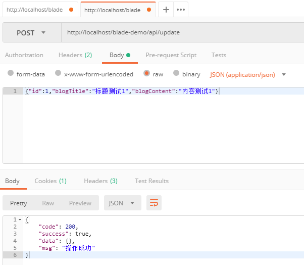
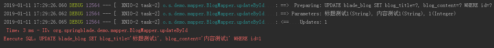
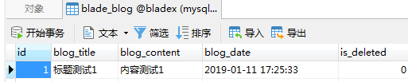

## 步骤

1. 新建一个修改接口
~~~java
/**
 * 修改
 */
@PostMapping("/update")
public R update(@RequestBody Blog blog) {
   return R.status(service.updateById(blog));
}
~~~
2. 使用Posman调用API，查看接口

3. 查看控制台，打印出了相关sql

4. 查看数据库，相关字段已经更新成功

