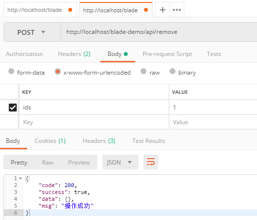
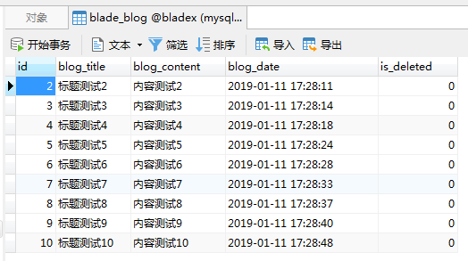
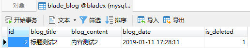

## 步骤

1. 新建一个删除接口
~~~java
/**
 * 删除
 */
@PostMapping("/remove")
public R remove(@RequestParam String ids) {
   return R.status(service.removeByIds(Func.toLongList(ids)));
}
~~~
2. 使用Posman调用API，接口返回操作成功

3. 查询数据库发现数据被物理删除了，`id`为`1`的数据已然不在

4. 这并不是我们想要的，我们需要的是逻辑删除，把`is_deleted`字段改为1，代表已删除。
5. 实现起来很方便，mybatis-plus官方提供了`@TableLogic`注解，只需加在逻辑字段上，其他的方法都无需变更。
~~~java
@Data
@TableName("blade_blog")
public class Blog implements Serializable {

   private static final long serialVersionUID = 1L;

   /**
    * 主键
    */
   private Integer id;
   /**
    * 标题
    */
   private String blogTitle;
   /**
    * 内容
    */
   private String blogContent;
   /**
    * 时间
    */
   private Date blogDate;
   /**
    * 是否已删除
    */
   @TableLogic
   private Integer isDeleted;

}
~~~
6. 下面我们再删除`id`为`2`的数据查看下结果如何

7. 可以看到，`is_deleted`字段，从`0`变成了`1`，逻辑删除成功
