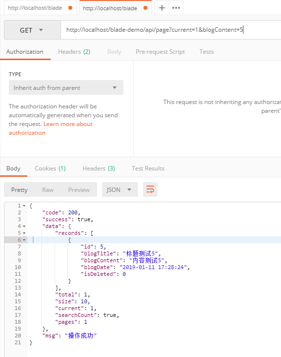

## 步骤
1. 新建一个分页接口
~~~java
/**
 * 分页
 */
@GetMapping("/page")
public R<IPage<Blog>> page(@ApiIgnore @RequestParam Map<String, Object> blog, Query query) {
   IPage<Blog> pages = service.page(Condition.getPage(query), Condition.getQueryWrapper(blog, Blog.class));
   return R.data(pages);
}
~~~
2. 我来看一下`Query`的主要组成
~~~java
@Data
@Accessors(chain = true)
@ApiModel(description = "查询条件")
public class Query {

   /**
    * 当前页
    */
   @ApiModelProperty(value = "当前页")
   private Integer current;

   /**
    * 每页的数量
    */
   @ApiModelProperty(value = "每页的数量")
   private Integer size;

   /**
    * 排序的字段名
    */
   @ApiModelProperty(hidden = true)
   private String ascs;

   /**
    * 排序方式
    */
   @ApiModelProperty(hidden = true)
   private String descs;

}
~~~
3. 我们可以看到`Query`有四个字段，分别代表`当前页`，`每页的数量`，`排序的字段名`，`排序方式`
4. 很明确了，如果我们需要查第`2`页，并且每页数量为`2`条，那么我们就传`/api/page?current=2&size=2`即可
5. 使用Posman调用API，查询返回结果

6. 增加查询条件，查询第`1`页并且内容包含`5`，发现模糊查询成功，摈弃分页信息也正确

## 结束语
* 经过本章的学习，我们终于将CRUD整个流程都走了一遍，大家掌握它不会花太多功夫。
* 后续所需要的就是多查看Mybatis的文档，多多学习高级用法，并且提高sql的能力。
* 如此一来，我相信大家可以完成绝大部分后端业务开发！
