## 生成树表

1. 这回我们生成一个有父子关系的机构表

   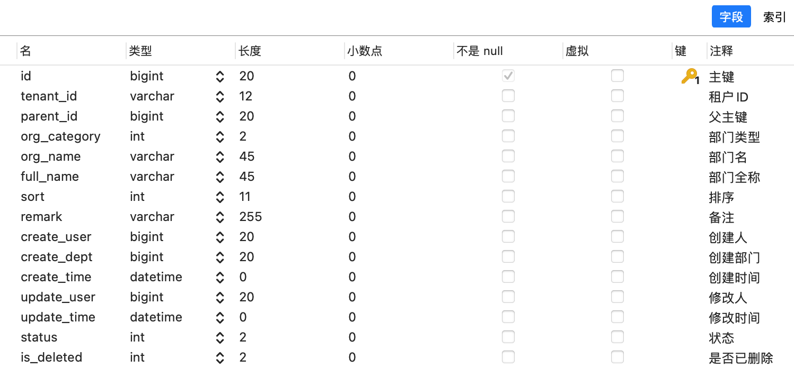

   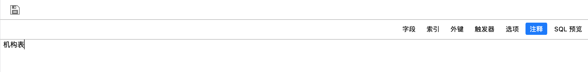

   

2. 模型设计选择tb_org

   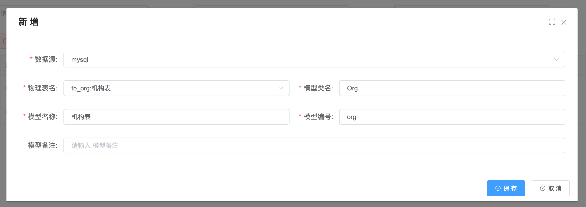

3. 模型配置相关字段并保存，注意：如果选择树表，parent_id可以不用配置组件类型，模版会自动判断

   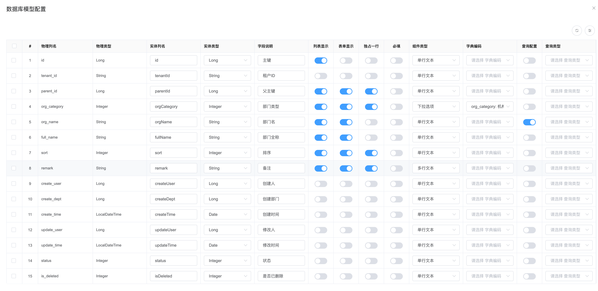

4. 进行代码生成配置并生成代码

   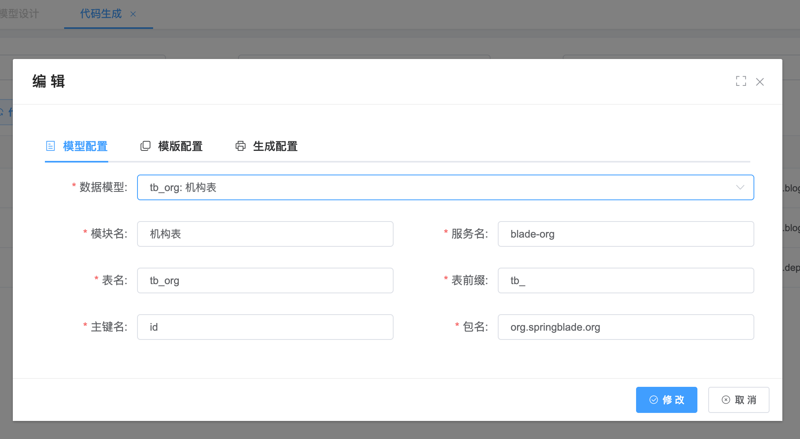

   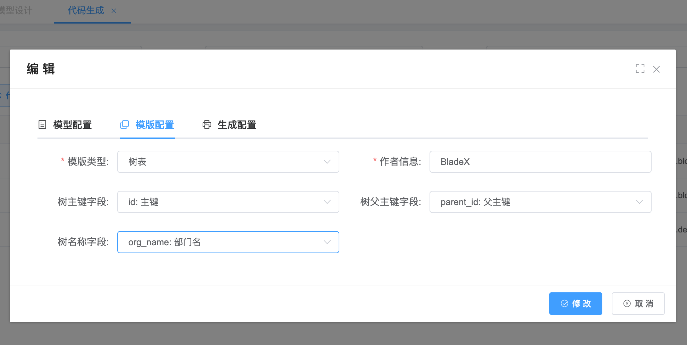

   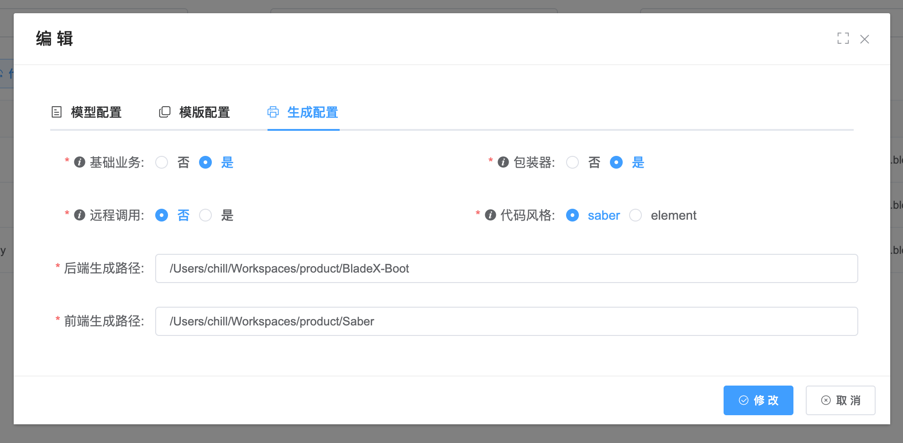

   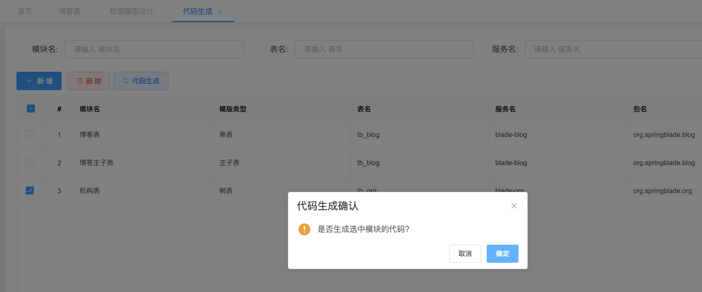

5. 查看生成的前后端代码

   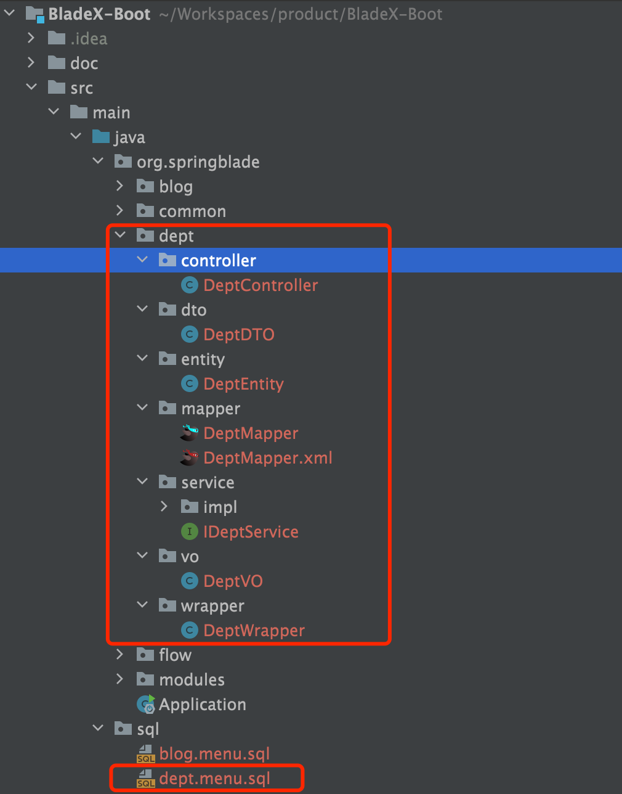

   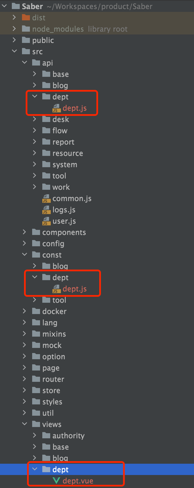

6. 执行菜单sql并重启前后端工程

   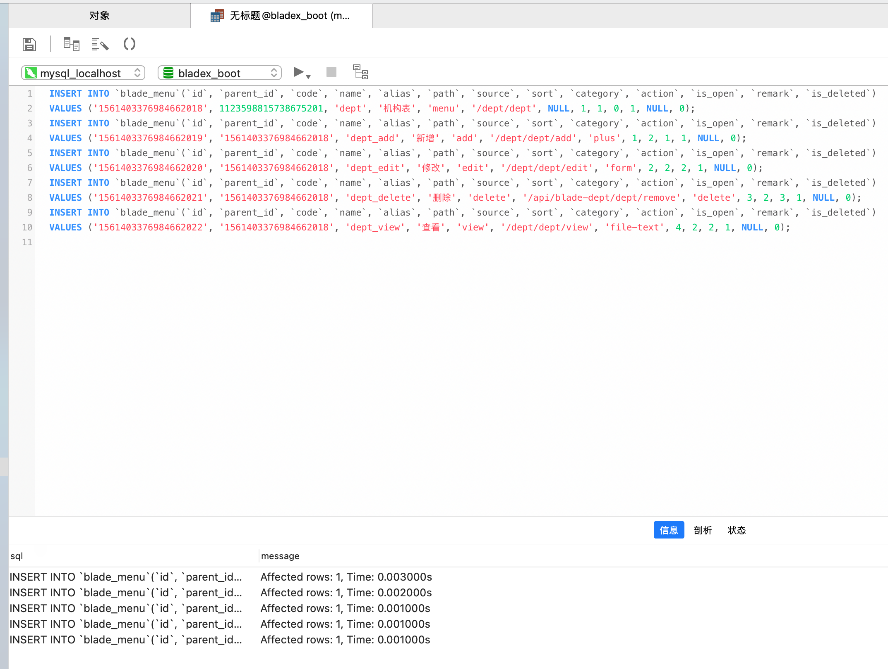

7. 测试功能可正常运行

   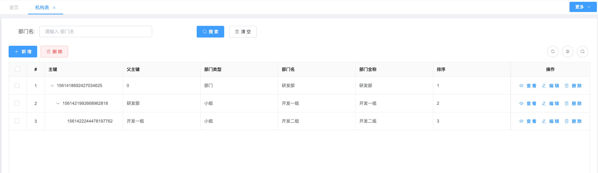

   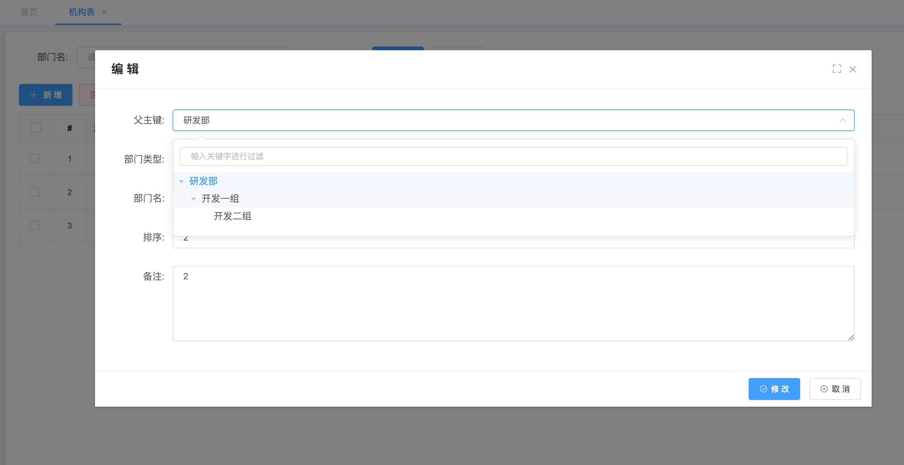