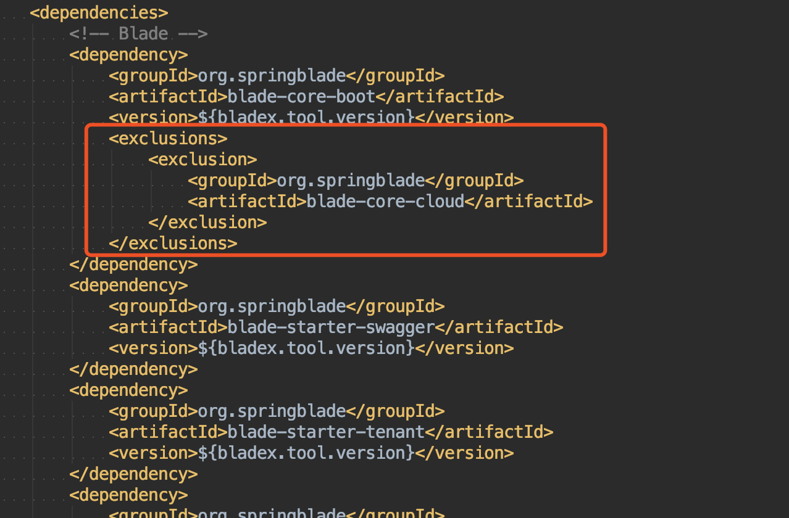
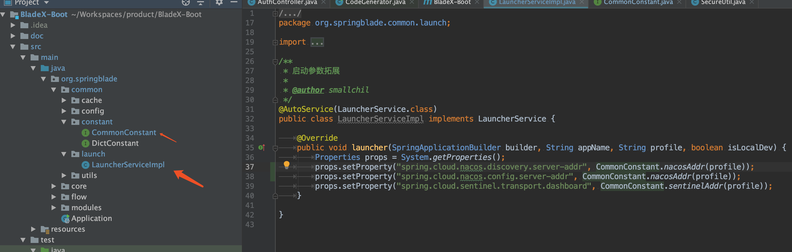
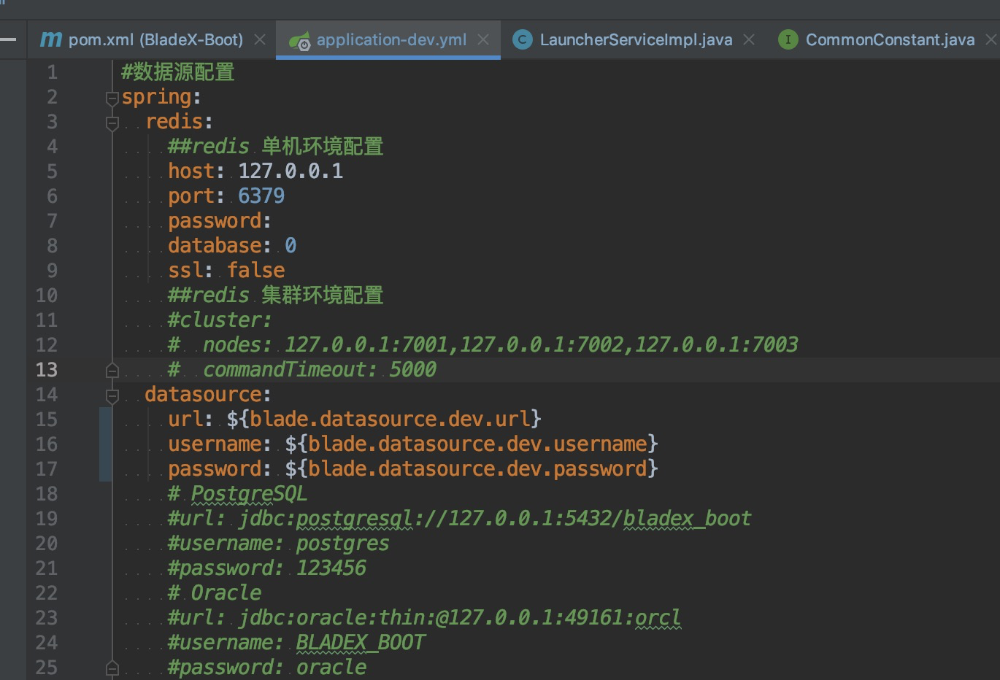
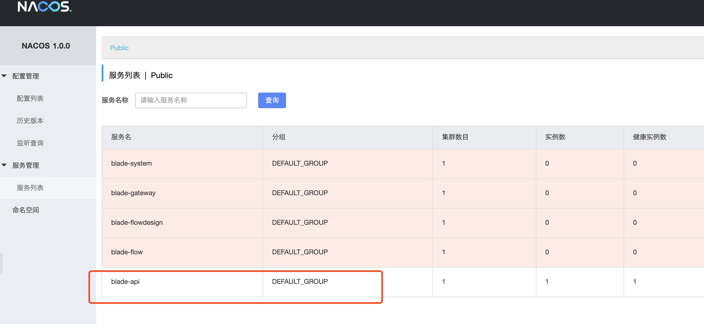
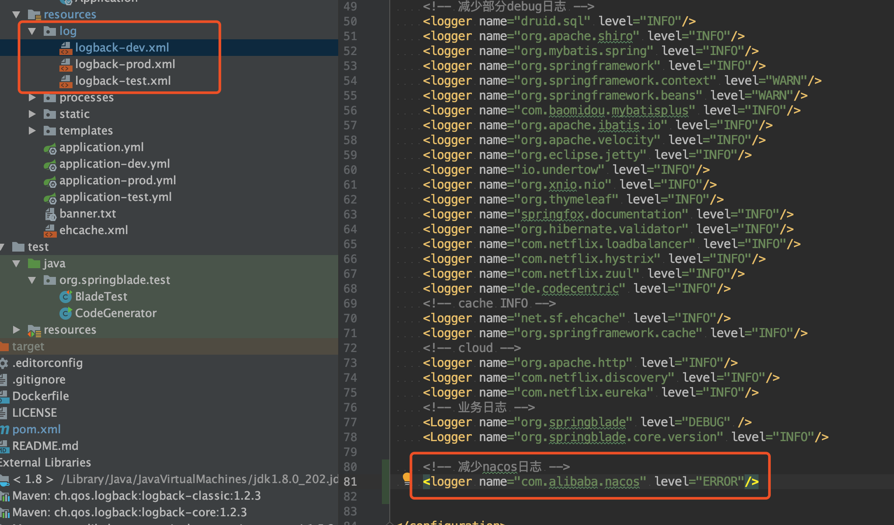

## 说明
* BladeX-Boot设计初衷便是考虑到了未来业务扩张，需要接入Cloud平台的情况
* 提前设计好，为未来做好轻松迁移的准备

## 如何切换
1. 去掉红框内的配置，加入cloud自动装配

2. 从cloud版本拷贝blade-common下对应的配置

3. 修改application-dev.yml中的配置，直接从nacos获取

4. 启动工程，查看nacos，已经注册成成功

5. 若不需要nacos打印的心跳日志，前往log文件夹参考进行配置接口

