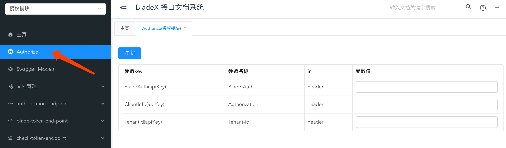

## 前言
* Swagger作为接口文档工具接入springboot工程很方便，只需一个starter，一个configuration就可集成完毕
* 但是对于有较多微服务的系统来说，一个服务一个文档地址，便会觉得比较麻烦。有没有什么好的办法可以都把他们集中起来？
* 这时候聚合文档的解决方案出现了，将所有的微服务地址以swagger分组的形式展现，切换分组的时候就相当于直接切换了整个微服务。
* BladeX对聚合文档做了优化，提供了更简单、配置更方便的解决方案，那么下面我们来看看具体如何操作。

## 如何配置
* 打开`blade-swagger`工程的配置文件`application-xx.yml`
* 配置需要出现在网关的服务地址，以及显示的服务名，其中`uri`为网关地址，`location`是对应服务名的swagger-api地址

* 对应服务工程引入 blade-starter-swagger 依赖即可

## 文档地址
1. 我们不妨先打开下聚合文档的地址，开启所有增强配置： http://localhost:18000/doc.html

  **注⚠️：**

  - **新版本开始把swagger网关单独抽离到了`blade-swagger`服务，请单独启动并访问**

  - **虽然swagger服务已经独立，但仍然需要开启网关进行服务转发才可以正常访问**

  

2. 点击左上角的下拉框，我们可以看到已经配置好了3个不同的微服务文档。
  

## 多包名扫描
bladex提供了多包扫描的配置，具体如下：

## API润色
1. swagger增强插件knife4j有不少好用的功能，我们下面来简单介绍一下，当然详细说明请查阅官方文档：[https://doc.xiaominfo.com/guide/useful.html](https://doc.xiaominfo.com/guide/useful.html)

2. 首先把个性化配置都打开，**目前knife4j版本刷新后会丢失增强配置，所以需要手动关闭tab，再重新打开文档页面才会生效**。

  

3. 其次加上请求头的Token值（可以直接从授权模块获取），获取后将Token设置到请求头中
  
  

4. 接着我们在`blade-swagger`的配置文件加上演示模块并重启服务，这样在左上角便可以看到对应选项了
  

5. 若大家想实时修改聚合文档的信息，可以把`blade-swagger`的聚合文档配置删掉，然后到nacos进行新增即可

6. 接着打开演示模块，以排在第二个的`/blade-demo/api/info`接口为例，我想把他排在第一个，并且以中文形态来描述他的api
  

7. 找到对应API，加上如下配置，`@ApiOperationSupport`中的`order`就是用来设置排序的，值越小，排序越靠前。

~~~java
@Slf4j
@RestController
@RequestMapping("api")
@Api(value = "演示接口", tags = "演示接口")
public class DemoController {

   @GetMapping("info")
   @ApiOperation(value = "查看信息", notes = "传入名称")
   @ApiOperationSupport(order = 1)
   public R<String> info(String name) {
      return R.data("Hello, My Name Is: " + name);
   }

}
~~~

6. 重启服务查看聚合文档，可以看到，排序、中文生效，一个常规的API形态诞生了。

7. 调用下API，返回成功，这样的文档就可以放心的交给对接的团队啦！

8. 如果有些API我们不想显示在文档上，可以使用@ApiIgnore注解，例如我们加在`BlogClientImpl`上
~~~java
@ApiIgnore
@RestController
@AllArgsConstructor
public class BlogClientImpl implements BlogClient {

   private BlogService service;

   @Override
   @GetMapping(API_PREFIX + "/detail")
   public R<Blog> detail(Integer id) {
      return R.data(service.getById(id));
   }

}
~~~
9. 重启服务，查看文档界面已经没有这个API描述了。

## 注意点

* **目前knife4j版本刷新后会丢失增强配置，所以需要手动关闭tab，再重新打开文档页面才会生效**。
* swagger默认在生产环境`prod`下关闭无法使用，因为在生产环境暴露接口会非常危险
* 若需要开启，可以到对应文件删掉配置

## 结束语
本文讲述了聚合文档的实现以及Swagger接口描述的润色，想知道更多用法，还需查看官方文档。
* swagger文档直达：https://swagger.io/
* swagger-bootstrap-ui文档直达：http://www.xiaominfo.com/swagger-bootstrap-ui/
