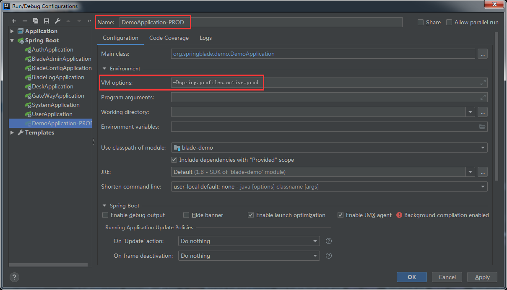

## Spring启动器
* SpringBoot工程可以在main方法中执行SpringApplication.run()这种方式来启动。
```
@SpringBootApplication 
public class Application {

    public static void main(String[] args) {
        SpringApplication.run(Application.class, args);
    }

}
```
* 如果我们需要在SpringBoot启动过程中添加一些定制代码（如定制启动Banner，设置自定义监听器等，设置启动拓展，设置启动环境变量），这种方式就无法满足我们的要求了。
* 比如我们现在要定制启动Banner，那么有如下两种方式。
```
@SpringBootApplication
public class Application {
    public static void main(String[] args) {
        SpringApplication application = new SpringApplication(Application.class);
        application.setBannerMode(Banner.Mode.OFF);
        application.run(args);
    }
}
```
```
@SpringBootApplication
public class Application {
    public static void main(String[] args) {
        new SpringApplicationBuilder()
                .sources(Application.class)
                .bannerMode(Banner.Mode.OFF)
                .run(args);
    }
}
```
* 只是定制一个banner，代码就得如此，并不是很优雅，倘若我们有很多个微服务，那每个微服务都这么写，代码必定会显得很冗余。
* 所以我们需要有一个优雅的解决方案，使得每个微服务都调用自定义的启动器，这样最终呈现效果就能如原生一样简洁优雅。


## 自定义启动器
* 核心思路是采用`SpringApplicationBuilder`，将其封装进一个核心类中进行拓展，以便于微服务启动之用。
* 启动器核心代码如下
~~~java
/**
 * 项目启动器，搞定环境变量问题
 *
 * @author Chill
 */
public class BladeApplication {

	/**
	 * Create an application context
	 * java -jar app.jar --spring.profiles.active=prod --server.port=2333
	 *
	 * @param appName application name
	 * @param source  The sources
	 * @return an application context created from the current state
	 */
	public static ConfigurableApplicationContext run(String appName, Class source, String... args) {
		SpringApplicationBuilder builder = createSpringApplicationBuilder(appName, source, args);
		return builder.run(args);
	}

	public static SpringApplicationBuilder createSpringApplicationBuilder(String appName, Class source, String... args) {
		Assert.hasText(appName, "[appName]服务名不能为空");
		// 读取环境变量，使用spring boot的规则
		ConfigurableEnvironment environment = new StandardEnvironment();
		MutablePropertySources propertySources = environment.getPropertySources();
		propertySources.addFirst(new SimpleCommandLinePropertySource(args));
		propertySources.addLast(new MapPropertySource(StandardEnvironment.SYSTEM_PROPERTIES_PROPERTY_SOURCE_NAME, environment.getSystemProperties()));
		propertySources.addLast(new SystemEnvironmentPropertySource(StandardEnvironment.SYSTEM_ENVIRONMENT_PROPERTY_SOURCE_NAME, environment.getSystemEnvironment()));
		// 获取配置的环境变量
		String[] activeProfiles = environment.getActiveProfiles();
		// 判断环境:dev、test、prod
		List<String> profiles = Arrays.asList(activeProfiles);
		// 预设的环境
		List<String> presetProfiles = new ArrayList<>(Arrays.asList(AppConstant.DEV_CODE, AppConstant.TEST_CODE, AppConstant.PROD_CODE));
		// 交集
		presetProfiles.retainAll(profiles);
		// 当前使用
		List<String> activeProfileList = new ArrayList<>(profiles);
		Function<Object[], String> joinFun = StringUtils::arrayToCommaDelimitedString;
		SpringApplicationBuilder builder = new SpringApplicationBuilder(source);
		String profile;
		if (activeProfileList.isEmpty()) {
			// 默认dev开发
			profile = AppConstant.DEV_CODE;
			activeProfileList.add(profile);
			builder.profiles(profile);
		} else if (activeProfileList.size() == 1) {
			profile = activeProfileList.get(0);
		} else {
			// 同时存在dev、test、prod环境时
			throw new RuntimeException("同时存在环境变量:[" + StringUtils.arrayToCommaDelimitedString(activeProfiles) + "]");
		}
		String startJarPath = BladeApplication.class.getResource("/").getPath().split("!")[0];
		String activePros = joinFun.apply(activeProfileList.toArray());
		System.out.printf("----启动中，读取到的环境变量:[%s]，jar地址:[%s]----%n", activePros, startJarPath);
		Properties props = System.getProperties();
		props.setProperty("spring.application.name", appName);
		props.setProperty("spring.profiles.active", profile);
		props.setProperty("info.version", AppConstant.APPLICATION_VERSION);
		props.setProperty("info.desc", appName);
		props.setProperty("file.encoding", StandardCharsets.UTF_8.name());
		props.setProperty("blade.env", profile);
		props.setProperty("blade.name", appName);
		props.setProperty("blade.is-local", String.valueOf(isLocalDev()));
		props.setProperty("blade.dev-mode", profile.equals(AppConstant.PROD_CODE) ? "false" : "true");
		props.setProperty("blade.service.version", AppConstant.APPLICATION_VERSION);
		Properties defaultProperties = new Properties();
		defaultProperties.setProperty("spring.main.allow-bean-definition-overriding", "true");
		defaultProperties.setProperty("spring.sleuth.sampler.percentage", "1.0");
		defaultProperties.setProperty("spring.cloud.alibaba.seata.tx-service-group", appName.concat(NacosConstant.NACOS_GROUP_SUFFIX));
		defaultProperties.setProperty("spring.cloud.nacos.config.file-extension", NacosConstant.NACOS_CONFIG_FORMAT);
		defaultProperties.setProperty("spring.cloud.nacos.config.shared-configs[0].data-id", NacosConstant.sharedDataId());
		defaultProperties.setProperty("spring.cloud.nacos.config.shared-configs[0].group", NacosConstant.NACOS_CONFIG_GROUP);
		defaultProperties.setProperty("spring.cloud.nacos.config.shared-configs[0].refresh", NacosConstant.NACOS_CONFIG_REFRESH);
		defaultProperties.setProperty("spring.cloud.nacos.config.shared-configs[1].data-id", NacosConstant.sharedDataId(profile));
		defaultProperties.setProperty("spring.cloud.nacos.config.shared-configs[1].group", NacosConstant.NACOS_CONFIG_GROUP);
		defaultProperties.setProperty("spring.cloud.nacos.config.shared-configs[1].refresh", NacosConstant.NACOS_CONFIG_REFRESH);
		builder.properties(defaultProperties);
		// 加载自定义组件
		List<LauncherService> launcherList = new ArrayList<>();
		ServiceLoader.load(LauncherService.class).forEach(launcherList::add);
		launcherList.stream().sorted(Comparator.comparing(LauncherService::getOrder)).collect(Collectors.toList())
			.forEach(launcherService -> launcherService.launcher(builder, appName, profile, isLocalDev()));
		return builder;
	}

	/**
	 * 判断是否为本地开发环境
	 *
	 * @return boolean
	 */
	public static boolean isLocalDev() {
		String osName = System.getProperty("os.name");
		return StringUtils.hasText(osName) && !(AppConstant.OS_NAME_LINUX.equalsIgnoreCase(osName));
	}

}
~~~


## 如何使用
* 以我们之前做的 `blade-demo`模块启动为例，看下代码
~~~java
/**
 * Demo启动器
 *
 * @author Chill
 */
@SpringCloudApplication
@EnableFeignClients(AppConstant.BASE_PACKAGES)
public class DemoApplication {

   public static void main(String[] args) {
      BladeApplication.run(CommonConstant.APPLICATION_DEMO_NAME, DemoApplication.class, args);
   }

}

~~~
* 可以看到非常简约，与原生并没有太多变化，只是多了一个appName的参数，此参数正是做为服务名注册到注册中心，用于和其他服务分类。


## 注意点
* 自定义启动器已经将环境变量也设置好，无需再到`application.yml`中配置`spring.profiles.active`再打包。
* 打包后的app启动时，若不设置`spring.profiles.active`，则默认为`dev`，如需设置只需在启动的命令行加上即可。
  `java -jar app.jar --spring.profiles.active=prod --server.port=2333`
* 无论是打包了fat-jar，还是打包了docker，都只需要打包一次，搭配上注册中心就可以运行在任何设定好的环境中，这样一来就实现了`一次打包，处处运行`的理念。
* 开发中，如果要修改为非`DEV`环境，可参考如下配置。

