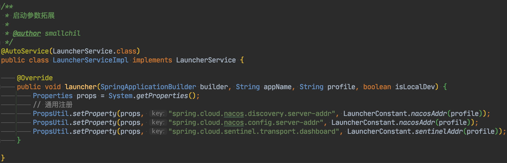

## 简介
上一章我们介绍了自定义启动器，这一章我们介绍下自定义启动器的拓展，如何使用，令工程配置更简单

## 主要说明
1. 新建一个工程，模仿blade-common，建立launcher包，并新建LauncherServiceImpl

2. 这些参数一般用于启动级别的参数（系统还没启动完毕连接上nacos就需要用到）和通用性特别强的参数（几乎每个微服务都需要用到）
3. 可能到这会有小伙伴提问，为什么不把这些放到工程的yml配置类？
4. 我想大多数人都会有这种想法，Blade使用LauncherService的大前提可以看一下第二点
5. 若把启动级别的参数放到yml，带来的问题同样是每次修改都要打包，和放到LauncherService没有差别
6. 若写到yml也无法公用，若想公用配置必须新建一个starter，并且占用bootstrap.yml，这是不可取的
7. 而LauncherService写在公用依赖包里之后，其他模块引入便自动配置好了，无需再操心，只用改一处，全工程所有服务都能生效

## 工程启动参数自定义配置
1. 看到这里，可能大家也会有疑问，启动参数、公共参数写到LauncherService里，这相当于是写死了，那我如果要修改，还得全部重新打包，这岂不是很不方便？
2. Blade的理念就是一次打包，处处运行，所以这些问题都能轻松解决
3. 若是直接命令行运行，我们可以通过命令行的形式这么覆盖配置
~~~java
java -jar app.jar --spring.profiles.active=prod --server.port=2333
~~~
4. 若是通过docker-compose启动容器，那么我们可以这么覆盖配置
~~~yaml
 bladex-admin:
    image: "${REGISTER}/bladex-admin:${TAG}"
    ports:
      - 7002:7002
      - ${ADMIN_SENTINEL_PORT}:${ADMIN_SENTINEL_PORT}
    privileged: true
    restart: always
    command:
      - --spring.profiles.active=${PROFILE}
      - --spring.cloud.nacos.discovery.ip=${ADMIN_IP}
      - --spring.cloud.nacos.discovery.port=${ADMIN_PORT}
      - --spring.cloud.sentinel.transport.port=${ADMIN_SENTINEL_PORT}
      - --spring.cloud.nacos.discovery.namespace=${NACOS_NAMESPACE}
      - --spring.cloud.nacos.config.namespace=${NACOS_NAMESPACE}
      - --spring.cloud.nacos.config.group=${NACOS_GROUP}
      - --spring.cloud.nacos.config.server-addr=${NACOS_SERVER_ADDR}
      - --spring.cloud.nacos.discovery.server-addr=${NACOS_SERVER_ADDR}
      - --spring.cloud.sentinel.transport.dashboard=${SENTINEL_DASHBOARD_ADDR}
      - --sentinel.heartbeat.client.ip=${ADMIN_IP}
    networks:
      - bladex_net
~~~
5. 如此一来，相信能排除大家心中的疑惑，通过自定义启动器搭配自定义服务登陆配置，打造更简洁的工程配置模式
