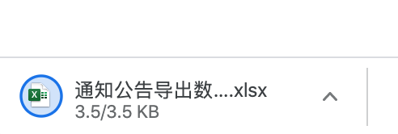
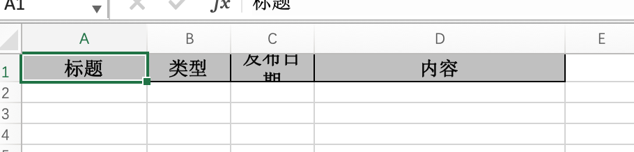
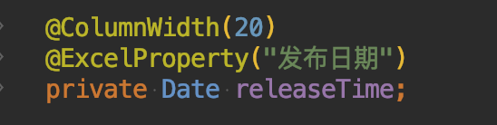
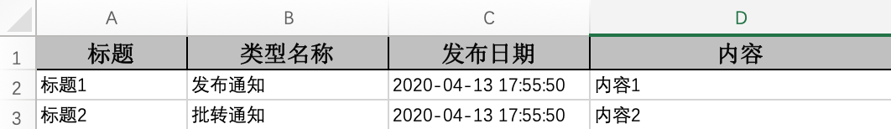

## Excel导出
### 一、初次尝试
1. 在`NoticeController`下新建接口 `exportNotice`
~~~java
@GetMapping("export-notice")
public void exportNotice(HttpServletResponse response) {
   List<NoticeExcel> list = new ArrayList<>();
   ExcelUtil.export(response, "通知公告导出数据", "通知公告数据表", list, NoticeExcel.class);
}
~~~
2. 浏览器访问：[http://localhost/blade-desk/notice/export-notice](http://localhost/blade-desk/notice/export-notice)，查看下载结果

3. 发现`发布日期`换行了，我们调整bean的@ColumnWidth配置

4. 再次导出发现正常

### 二、数据导出
1. 改造 `exportNotice` 我们进行数据填充
~~~java
@GetMapping("export-notice")
public void exportNotice(HttpServletResponse response) {
   List<NoticeExcel> list = new ArrayList<>();

   NoticeExcel ne1 = new NoticeExcel();
   ne1.setTitle("标题1");
   ne1.setCategoryName("发布通知");
   ne1.setReleaseTime(DateUtil.now());
   ne1.setContent("内容1");

   NoticeExcel ne2 = new NoticeExcel();
   ne2.setTitle("标题2");
   ne2.setCategoryName("批转通知");
   ne2.setReleaseTime(DateUtil.now());
   ne2.setContent("内容2");
   
   list.add(ne1);
   list.add(ne2);

   ExcelUtil.export(response, "通知公告导出数据", "通知公告数据表", list, NoticeExcel.class);
}

~~~
2. 浏览器访问：[http://localhost/blade-desk/notice/export-notice](http://localhost/blade-desk/notice/export-notice)，查看下载结果，可以看到数据填充成功

3. 后续若需要对接至数据库数据，则只需要编写mapper，返回对应的`List<NoticeExcel>`类型即可
