## Excel导入
### 一、普通导入
1. 在读取接口的基础上增加逻辑，代码如下
~~~java
@PostMapping("write-notice")
public R<Boolean> writeNotice(MultipartFile file) {
   List<Notice> noticeList = new ArrayList<>();
   List<NoticeExcel> list = ExcelUtil.read(file, NoticeExcel.class);
   list.forEach(noticeExcel -> {
      String category = DictCache.getKey("notice", noticeExcel.getCategoryName());
      noticeExcel.setCategory(Func.toInt(category));
      Notice notice = BeanUtil.copy(noticeExcel, Notice.class);
      noticeList.add(notice);
   });
   return R.data(noticeService.saveBatch(noticeList));
}
~~~
2. 主要核心为这几行代码，其中使用了`BeanUtil`把`NoticeExcel`转换成了`Notice`，性能层面可以放心，它与new完再set相差无几，要注意的就是两个bean的字段需要保持一致，才可以转换成功。
* `  List<Notice> noticeList = new ArrayList<>();`
* `Notice notice = BeanUtil.copy(noticeExcel, Notice.class);`
* `noticeList.add(notice);`
* `noticeService.saveBatch(noticeList)`
3. 重启服务，使用postman调用对应接口,可以看到返回成功
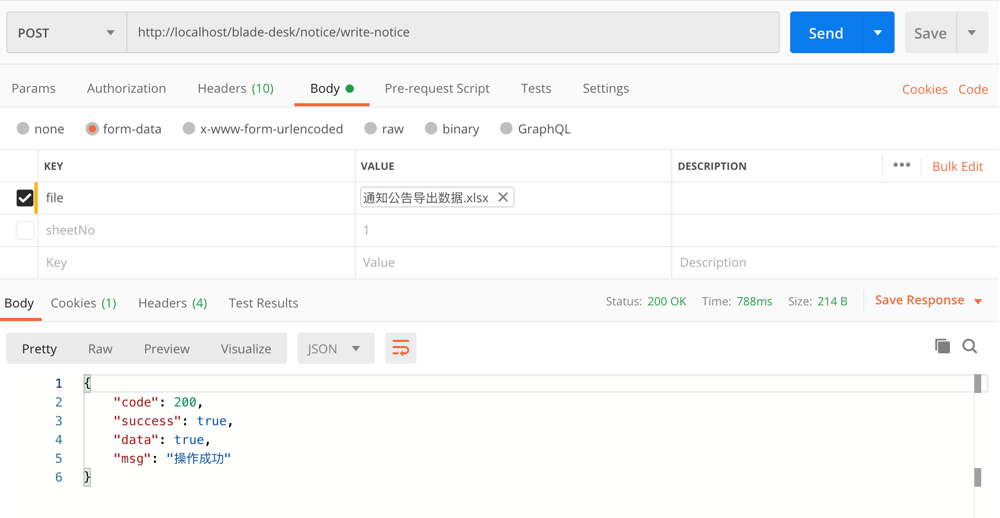
4. 刷新下数据库，可以看到5条数据已经入库成功
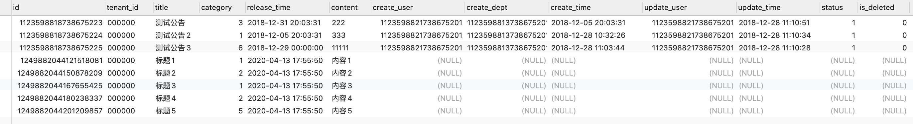
5. 以上为普通导入，仅作为一种demo方式快速实现功能，不推荐大家使用到实际业务。因为很多时候需要导入的Excel会非常大，java的List容量是有限的，若数据量太大将会导致OOM，所以这种方式不推荐，那么下面就来实操下针对实际业务场景的excel导入方案。

### 二、进阶导入
1. 在开动之前，我们先看一下官方文档，找到监听器的例子
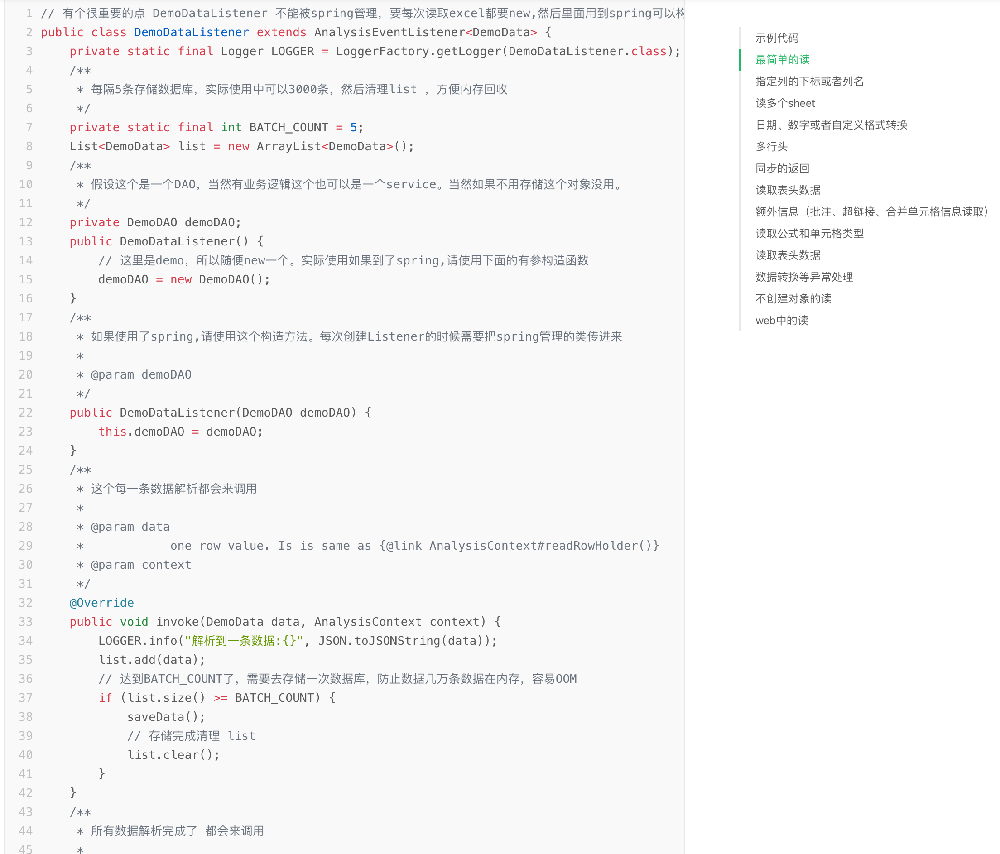
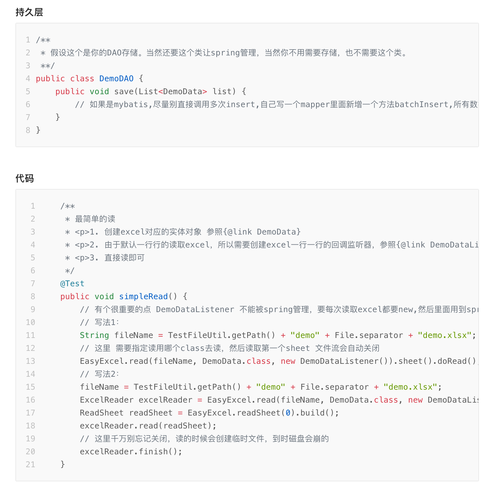
2. 从例子可以看出，针对每一个Bean，都需要新建一个Listener，继承`AnalysisEventListener`，指定类型。这样调用API读取的时候，就会将数据写入监听器从而实现我们的业务逻辑
3. ExcelUtil对其进行了封装，抽出了通用的Listener，这样不需要每个Bean都实现`AnalysisEventListener`，只需要编写最简的导入逻辑便可
4. 实现主要逻辑代码如下，为了防止大数据量OOM，设定了每3000条便会执行一次入库操作。
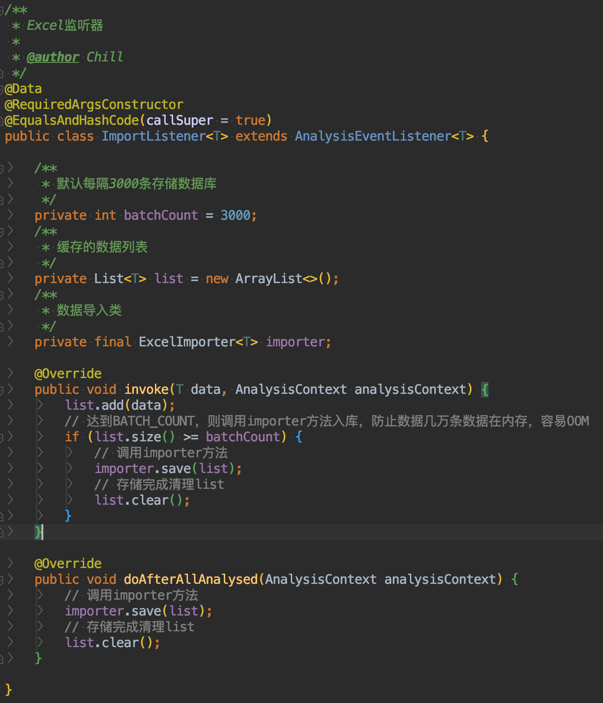
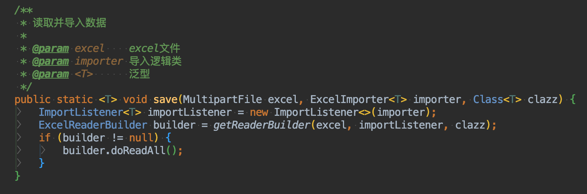
5. 新建`NoticeImporter`，并迁移上一节相关代码
~~~java
/**
 * 用户数据导入类
 *
 * @author Chill
 */
@RequiredArgsConstructor
public class NoticeImporter implements ExcelImporter<NoticeExcel> {

   private final INoticeService service;

   @Override
   public void save(List<NoticeExcel> data) {
      data.forEach(noticeExcel -> {
         String category = DictCache.getKey("notice", noticeExcel.getCategoryName());
         noticeExcel.setCategory(Func.toInt(category));
         Notice notice = BeanUtil.copy(noticeExcel, Notice.class);
         service.save(notice);
      });
   }
}
~~~
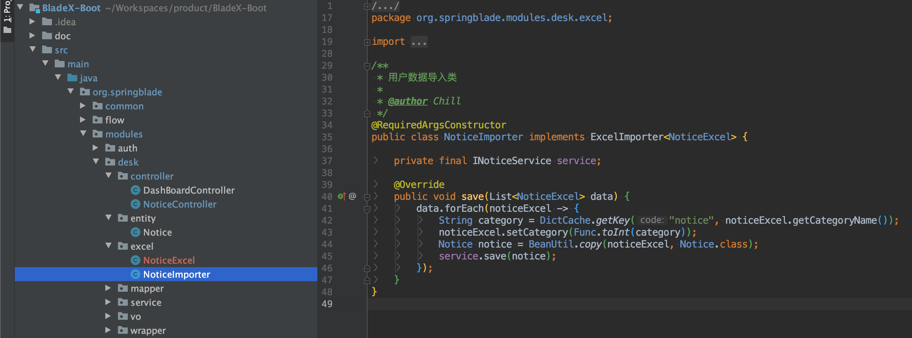
6. 改造`readNotice`方法，传入`NoticeImporter`
~~~java
@PostMapping("write-notice")
public R<Boolean> writeNotice(MultipartFile file) {
   NoticeImporter importer = new NoticeImporter(noticeService);
   ExcelUtil.save(file, importer, NoticeExcel.class);
   return R.success("操作成功");
}
~~~
7. 重启服务，调用postman查看结果，发现数据导入成功，业务也完全解耦
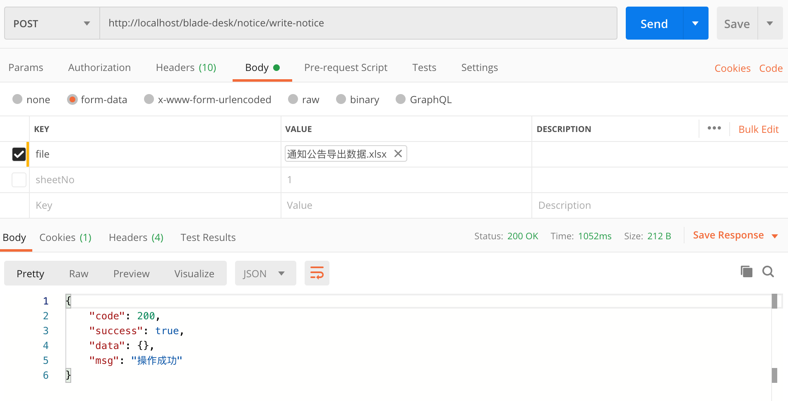
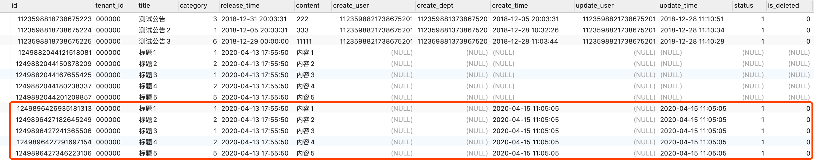
8. 在导入的数据中，发现create_user、create_dept、update_user三个字段为空，是因为我们一开始对其进行了接口放行，没有传递token，所以未获取到。现在加上token再次调用接口查看返回结果，发现正确无误
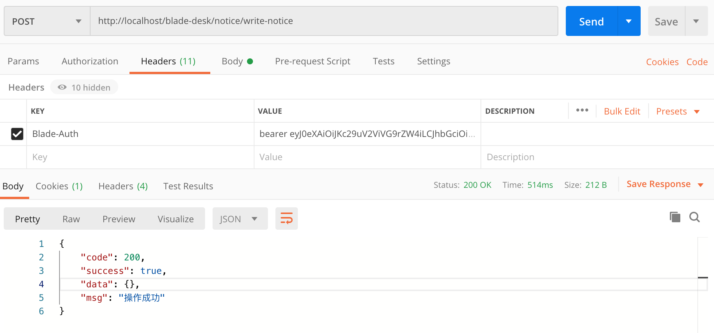
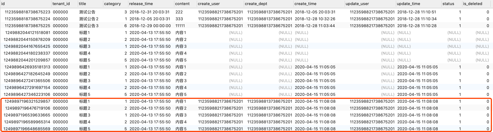
