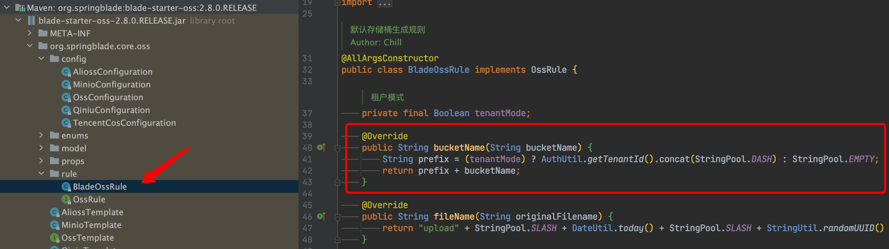
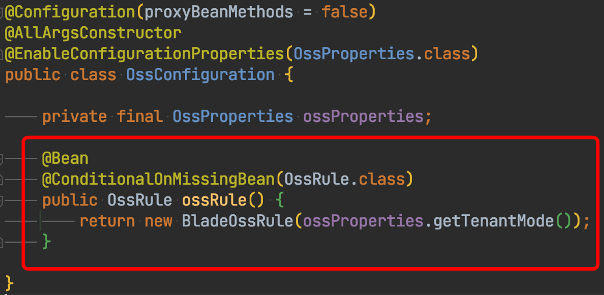
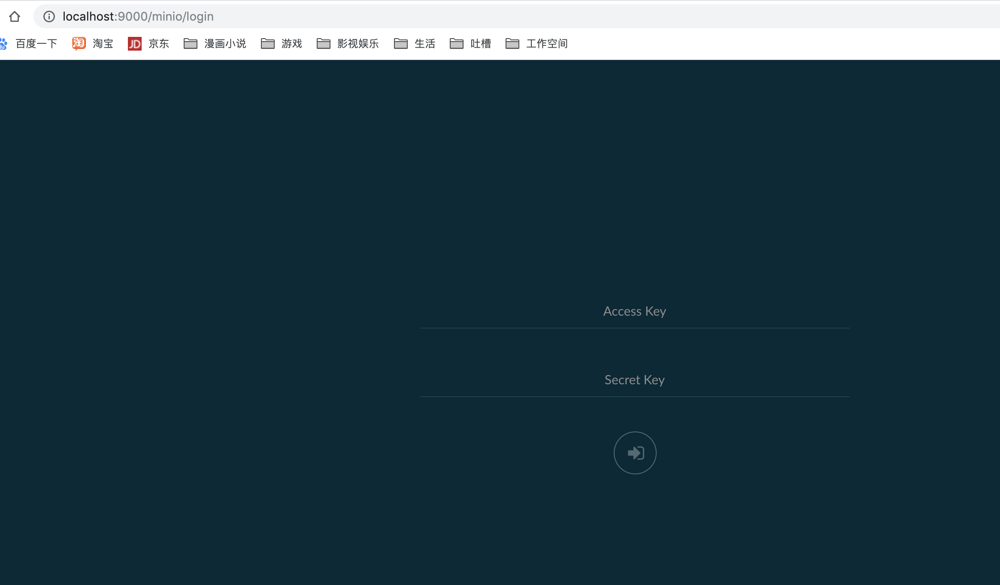
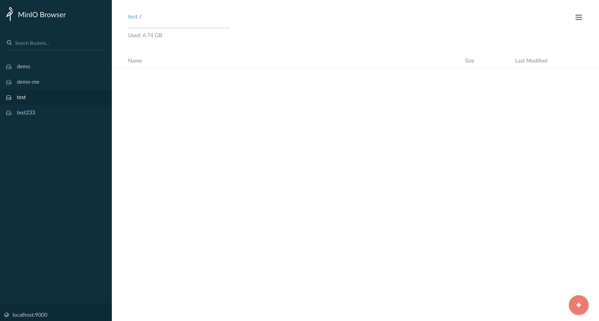
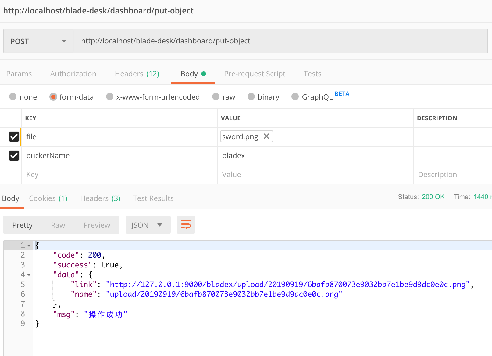
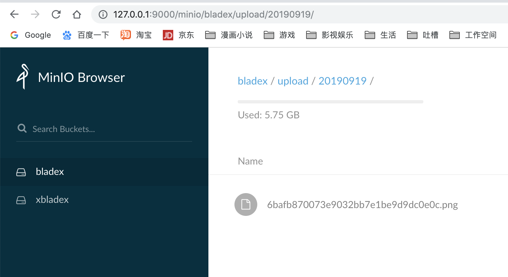
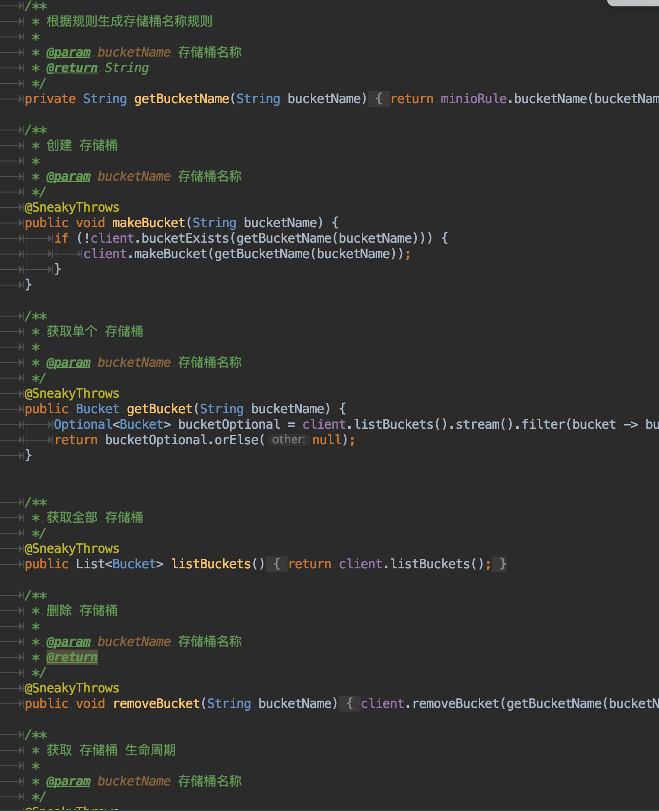

## OSS概念

- 对象存储服务（Object Storage Service）

  对象存储是一种稳定、安全、高效、易用的云存储服务，具备标准Restful API接口，可存储任意数量和形式的非结构化数据。

- 存储空间（Bucket）

  存储空间是用于存储对象（Object）的容器，所有的对象都必须隶属于某个存储空间。存储空间具有各种配置属性，包括地域、访问权限、存储类型等。可以根据实际需求，创建不同类型的存储空间来存储不同的数据。

- 对象（Object）

  对象是OSS存储数据的基本单元，也被称为OSS的文件。对象由元信息（Object Meta）、用户数据（Data）和文件名（Key）组成。对象由存储空间内部唯一的Key来标识。对象元信息是一组键值对，表示了对象的一些属性，例如最后修改时间、大小等信息，同时您也可以在元信息中存储一些自定义的信息。

- 地域（Region）

  地域表示OSS的数据中心所在物理位置。可以根据费用、请求来源等选择合适的地域创建Bucket。

- 访问域名（Endpoint）

  Endpoint表示OSS对外服务的访问域名。OSS以HTTP RESTful API的形式对外提供服务，当访问不同地域的时候，需要不同的域名。通过内网和外网访问同一个地域所需要的域名也是不同的。

- 访问密钥（AccessKey）

  AccessKey简称AK，指的是访问身份验证中用到的AccessKey ID和AccessKey Secret。OSS通过使用AccessKey ID和AccessKey Secret对称加密的方法来验证某个请求的发送者身份。AccessKey ID用于标识用户；AccessKey Secret是用户用于加密签名字符串和OSS用来验证签名字符串的密钥，必须保密。关于获取AccessKey的方法


## 引入依赖

* 目前BladeX提供的blade-starter-oss集成了四种oss，分别为：minio、阿里云oss、七牛oss、腾讯oss

* blade-starter-oss开放了统一接口，大家可以依葫芦画瓢模仿集成其他所需要的oss

* 引入格式为blade-starter-oss与对应的oss依赖，若用不到其他的oss可以不引入防止产生冗余的依赖

* 引入minio依赖

  ~~~xml
  <!--Oss-->
  <dependency>
    <groupId>org.springblade</groupId>
    <artifactId>blade-starter-oss</artifactId>
  </dependency>
  <!--MinIO-->
  <dependency>
    <groupId>io.minio</groupId>
    <artifactId>minio</artifactId>
  </dependency>
  ~~~

* 引入阿里云oss依赖

  ~~~xml
  <!--Oss-->
  <dependency>
    <groupId>org.springblade</groupId>
    <artifactId>blade-starter-oss</artifactId>
  </dependency>
  <!--Alioss-->
  <dependency>
    <groupId>com.aliyun.oss</groupId>
    <artifactId>aliyun-sdk-oss</artifactId>
  </dependency>
  ~~~

* 引入七牛oss依赖

  ~~~xml
  <!--Oss-->
  <dependency>
    <groupId>org.springblade</groupId>
    <artifactId>blade-starter-oss</artifactId>
  </dependency>
  <!--QiNiu-->
  <dependency>
    <groupId>com.qiniu</groupId>
    <artifactId>qiniu-java-sdk</artifactId>
  </dependency>
  ~~~

* 引入腾讯oss依赖

  ~~~xml
  <!--Oss-->
  <dependency>
    <groupId>org.springblade</groupId>
    <artifactId>blade-starter-oss</artifactId>
  </dependency>
  <!--腾讯COS-->
  <dependency>
    <groupId>com.qcloud</groupId>
    <artifactId>cos_api</artifactId>
  </dependency>
  ~~~


## 配置OSS

* 引入好依赖后，还需要到application-xx.yml或者到nacos对应的yaml配置文件加入以下配置

  ~~~yaml
  oss:
    enabled: true
    name: minio
    tenant-mode: true
    endpoint: http://127.0.0.1:9000
    access-key: xxxxxxx
    secret-key: xxxxxxx
    bucket-name: bladex
  ~~~

* `enabled`：是否开启oss配置

* `name`：具体开启的oss类型，minio为`minio`，阿里云oss为`alioss`，七牛oss为`qiniu`，腾讯oss为`tencentcos`

* `tenant-mode`：是否开启租户模式，若开启，则会自动匹配将配置的bucket自动加上租户ID

* `endpoint`：oss对外开放的地址

* `access-key`：oss提供的accesskey

* `secret-key`：oss提供的secretkey

* `bucket-name`：存储桶名，有些oss服务需要手动先创建，有些可以自动创建


## 自定义存储桶

* 自定义桶名规则见下图，可以自定义实例化实现了`OssRule`接口的bean来覆盖默认的`BladeOssRule`

  


# 实战

## MinIo简介

* MinIO 是一个基于Apache License v2.0开源协议的对象存储服务。它兼容亚马逊S3云存储服务接口，非常适合于存储大容量非结构化的数据，例如图片、视频、日志文件、备份数据和容器/虚拟机镜像等，而一个对象文件可以是任意大小，从几kb到最大5T不等。
* MinIO是一个非常轻量的服务,可以很简单的和其他应用的结合，类似 NodeJS, Redis 或者 MySQL。

## 如何启动
* 参考地址如下：[https://docs.min.io/cn/](https://docs.min.io/cn/)

* 推荐使用前将官方文档简单过一遍，有个大概印象

* docker启动参考如下，新版本minio需要定义两个端口，9000为api端口，9090为控制台端口，网页访问9000会自动跳转至9090

* ```shell
  [root@JD ~]# docker run -d -p 9000:9000 -p 9090:9090 --name minio -e "MINIO_ROOT_USER=自定义用户名" -e "MINIO_ROOT_PASSWORD=自定义密码" minio/minio server /data --address '0.0.0.0:9000' --console-address '0.0.0.0:9090'
  ```


## 访问地址
* 访问 [http://localhost:9000](http://localhost:9000/) 登陆

* 根据自定义的用户名与密码登陆，出现如下界面则说明部署成功


## 如何使用
1. 需要文件上传的服务引入依赖

  ~~~xml
  <!--Oss-->
  <dependency>
    <groupId>org.springblade</groupId>
    <artifactId>blade-starter-oss</artifactId>
  </dependency>
  <!--MinIO-->
  <dependency>
    <groupId>io.minio</groupId>
    <artifactId>minio</artifactId>
  </dependency>
  ~~~

2. 在配置文件或者nacos进行配置（具体access-key和secret-key获取可以参考上一章官方文档）

  ~~~yaml
  oss:
    enabled: true
    name: minio
    tenant-mode: true
    endpoint: http://127.0.0.1:9000
    access-key: xxxxxx
    secret-key: xxxxxx
    bucket-name: bladex
  ~~~

3. 创建一个Controller，注入`MinioTemplate`（如果后续会更换oss，推荐注入`OssTemplate`，这样后续修改实现也不需要再修改代码）
    

4. 使用postman进行调用测试，调用成功
    

5. 打开minio控制台也发现了我们上传的文件
    

6. BladeX对minio进行了定制，可以使用MinioTemplate非常方便地进行minio文件操作

## MinioTemplate
1. 如何使用，大家可以前往 `org.springblade.core.minio.MinioTemplate` 进行查看
2. 高频使用的api都有封装以及详细注释，大家可以前往阅读相关代码

