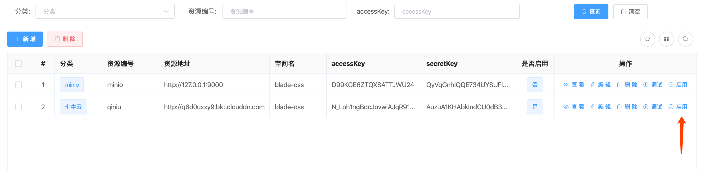
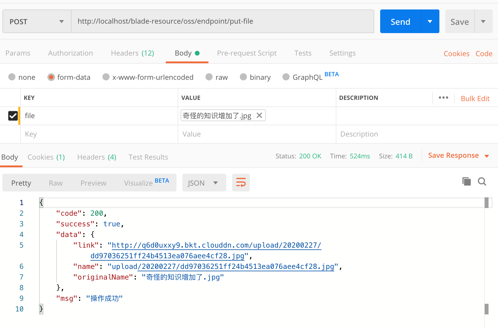
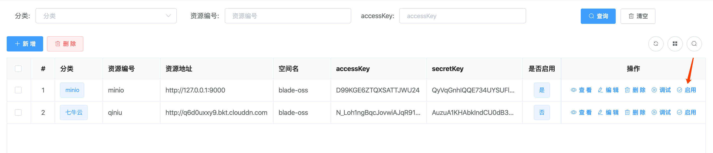
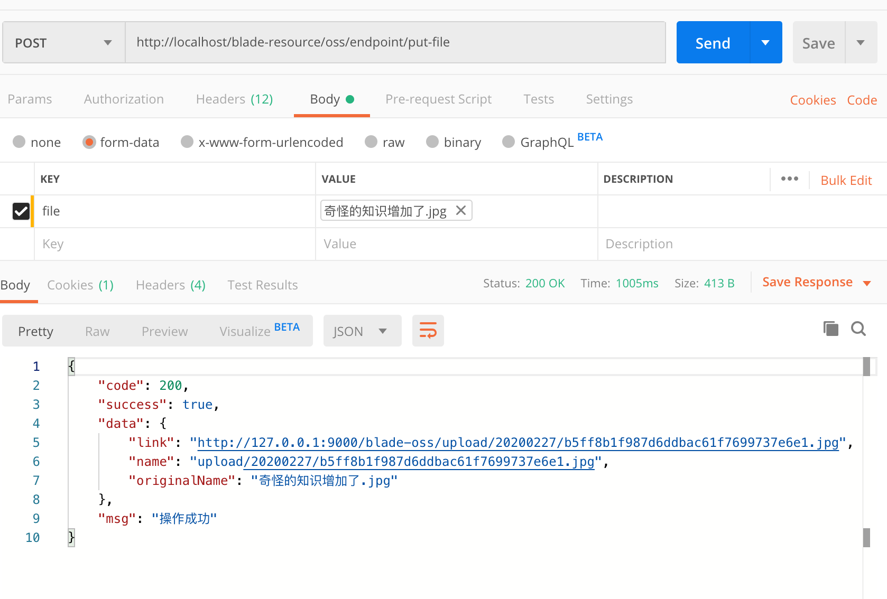
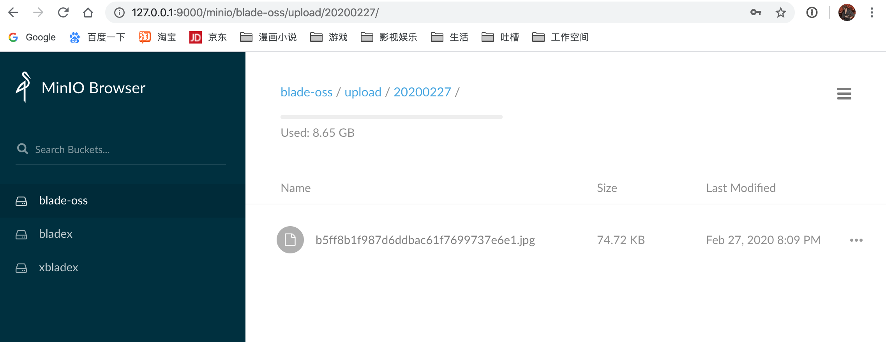
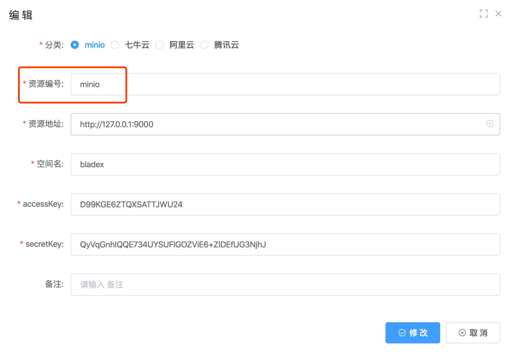
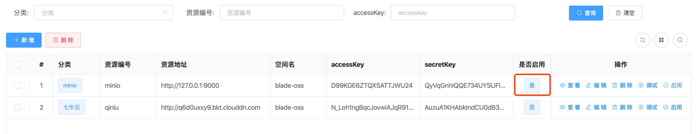
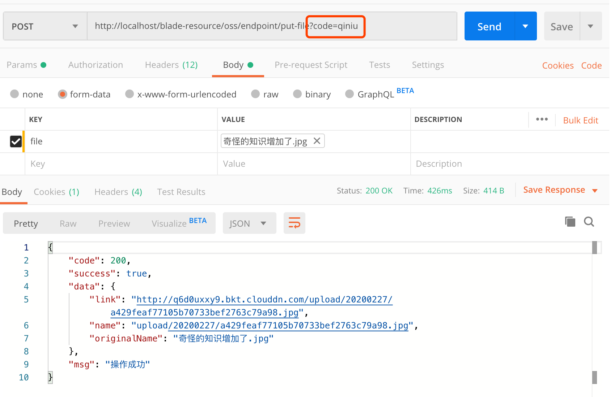
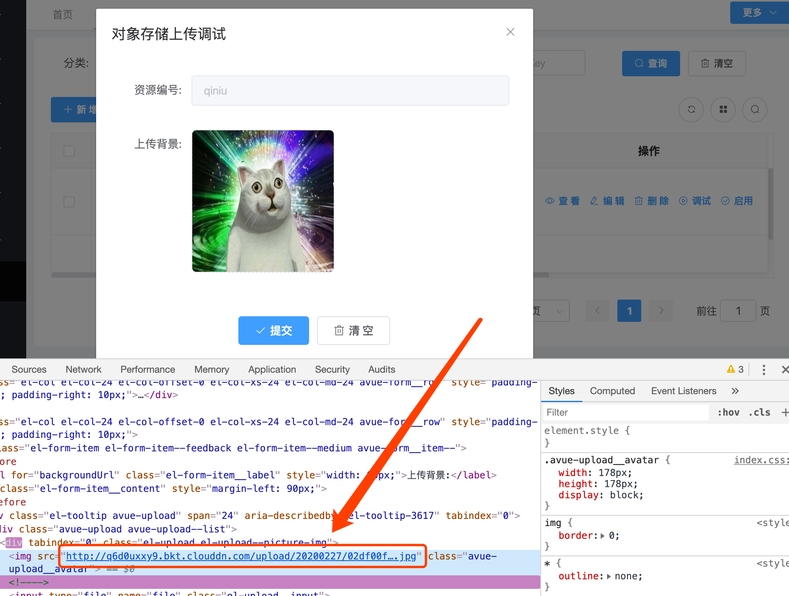

## 简介
* 多租户对象存储系统整合了不同的第三方oss服务，并统一成一个抽象接口
* 默认情况下，在SaaS系统中，每个租户上传的文件都会分配到不同的空间从而隔离
* 除此之外，用户也可以自定义配置属于自己的oss，这样上传的所有文件都会到私有oss中
* 以上两种策略，大大的提高了每个租户文件的安全性，对于敏感文件，用户可以指向自定义的私有oss，大大降低了安全风险，提高了整个SaaS系统的灵活性。

## 如何使用
1. 进入`资源管理->对象存储`,新建oss对应的配置
2. 选择某一条数据进行`启用` 

3. 调用接口进行测试，(需要获取token，并设置Blade-Auth请求头，可以在上几章看到教程)

4. 复制link字段的地址，访问浏览器查看，图片正确显示

5. 这时启用minio的配置

6. 再次调用接口进行测试，发现地址已经变更为minio的格式

7. 打开minio的主页，发现文件存在，说明切换成功

## 资源编号
1. Oss配置的`资源编号`字段，主要是为了可以在多个配置的情况下，不受`启用`状态影响，可以自由指定对应的配置来实现接口上传
 
2. `启用` 可以看作是默认的oss上传配置，如果系统有多处地方要用到不同的配置，那么只需要在接口上多加一个参数`code`即可
3. 比如现在启用的是minio的配置

4. 现在修改接口，多传一个参数`code`为七牛的资源编号，可以看到返回的就是七牛的资源信息了

5. 由此一来，系统配置了多套oss后，在不同的场景就可以很自由地选择需要调用的oss配置从而上传到不同的对象存储系统了

## 上传调试
1. 为了方便让大家快速测试配置的参数是否正确，bladex贴心地提供了针对配置的调试功能
2. 我们只需要在需要调试的那行配置，点击`调试按钮`即可
3. 选择七牛调试上传，可以看到图片上传成功，返回的也是七牛的地址

## 统一入口
1. 多租户对象存储系统将单独起来，独立成一个服务，对外提供rest api进行调用
2. 对外提供服务的类路径如下：`org.springblade.resource.endpoint.OssEndpoint`
3. 若有复杂场景需求，大家可以自行拓展增强相关功能
