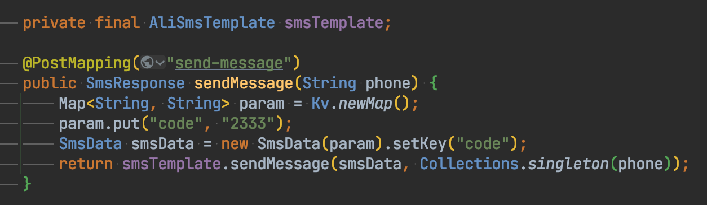
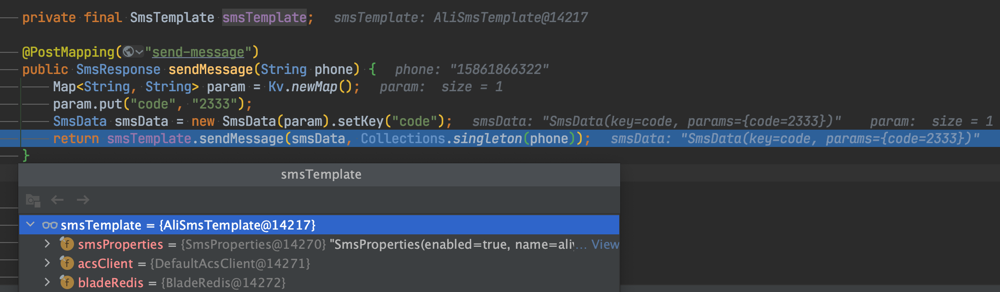
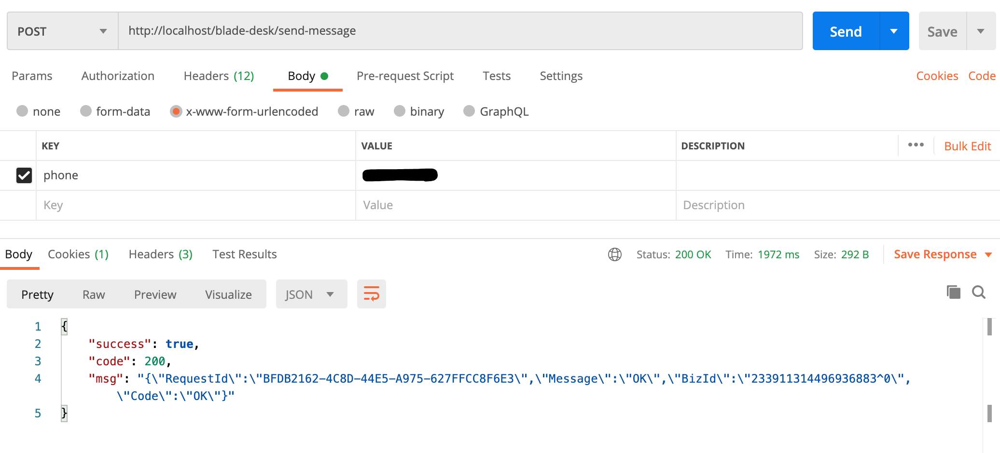
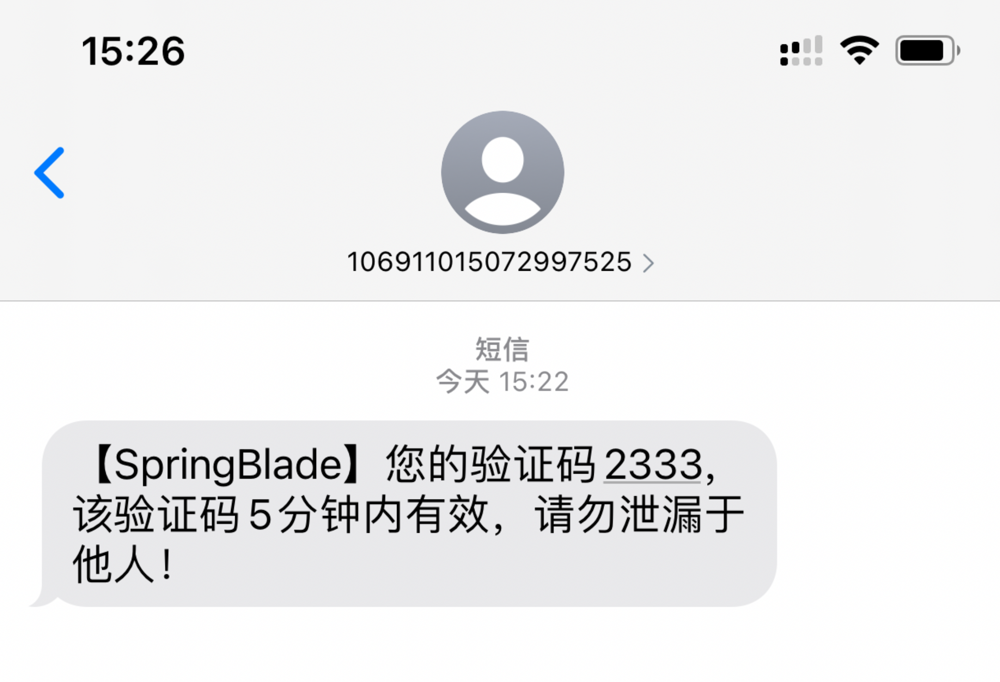

## SMS概念

- 短信服务（Short Message Service）

  短信服务是广大企业客户快速触达手机用户所优选使用的通信能力。调用API或用群发助手，即可发送验证码、通知类和营销类短信。

- 短信模版（TemplateId）

  使用短信服务首先都需要创建短信模板提交审核，这样可以防止不法分子通过云服务商提供的短信服务实施短信诈骗。

- 短信签名（SignName）

  短信末尾会附上签名以识别此条短信是由谁发送，这样可以令用户对短信来源有一个明确的印象。

- 地域（RegionId）

  地域表示SMS的数据中心所在物理位置。可以根据费用、请求来源等选择合适的地域，一般是阿里云短信配置。

- 访问密钥（AccessKey）

  AccessKey简称AK，指的是访问身份验证中用到的AccessKey ID和AccessKey Secret。SMS通过使用AccessKey ID和AccessKey Secret对称加密的方法来验证某个请求的发送者身份。AccessKey ID用于标识用户；AccessKey Secret是用户用于加密签名字符串和SMS用来验证签名字符串的密钥，必须保密。关于获取AccessKey的方法

## 引入依赖

* 目前BladeX提供的blade-starter-sms集成了四种sms，分别为：云片sms、阿里云sms、七牛sms、腾讯sms

* blade-starter-sms开放了统一接口，大家可以依葫芦画瓢模仿集成其他所需要的sms

* 引入格式为blade-starter-sms与对应的sms依赖，若用不到其他的sms可以不引入防止产生冗余的依赖

* 引入云片sms依赖

  ~~~xml
  <!--Sms-->
  <dependency>
    <groupId>org.springblade</groupId>
    <artifactId>blade-starter-sms</artifactId>
  </dependency>
  <!--YunPian-->
  <dependency>
    <groupId>com.yunpian.sdk</groupId>
    <artifactId>yunpian-java-sdk</artifactId>
  </dependency>
  ~~~

* 引入阿里云sms依赖

  ~~~xml
  <!--Sms-->
  <dependency>
    <groupId>org.springblade</groupId>
    <artifactId>blade-starter-sms</artifactId>
  </dependency>
  <!--AliSms-->
  <dependency>
    <groupId>com.aliyun</groupId>
    <artifactId>aliyun-java-sdk-core</artifactId>
  </dependency>
  ~~~

* 引入七牛sms依赖

  ~~~xml
  <!--Sms-->
  <dependency>
    <groupId>org.springblade</groupId>
    <artifactId>blade-starter-sms</artifactId>
  </dependency>
  <!--QiNiu-->
  <dependency>
    <groupId>com.qiniu</groupId>
    <artifactId>qiniu-java-sdk</artifactId>
  </dependency>
  ~~~

* 引入腾讯sms依赖

  ~~~xml
  <!--Sms-->
  <dependency>
    <groupId>org.springblade</groupId>
    <artifactId>blade-starter-sms</artifactId>
  </dependency>
  <!--腾讯SMS-->
  <dependency>
    <groupId>com.github.qcloudsms</groupId>
    <artifactId>qcloudsms</artifactId>
  </dependency>
  ~~~

## 配置SMS

* 引入好依赖后，还需要到application-xx.yml或者到nacos对应的yaml配置文件加入以下配置

  ~~~yaml
  sms:
    enabled: true
    name: aliyun
    template-id: SMS_xxxx
    sign-name: BladeX
    access-key: xxxxxxx
    secret-key: xxxxxxx
    region-id: cn-hangzhou
  ~~~

* `enabled`：是否开启sms配置

* `name`：具体开启的sms类型，云片sms为`yunpian`，阿里云sms为`aliyun`，七牛sms为`qiniu`，腾讯sms为`tencent`

* `template-id`：sms审核通过的短信模板

* `sign-name`：sms审核通过的短信签名

* `access-key`：sms提供的accesskey

* `secret-key`：sms提供的secretkey

* `region-id`：地域，主要由阿里云配置

* **注意⚠️：例如腾讯的密钥名为appId和appKey，这俩配置对应上access-key和secret-key即可，若其他服务只有一个access-key，则secret-key留空便可**

## 如何使用

1. 需要自定义短信的服务引入依赖

   ~~~xml
   <!--Sms-->
   <dependency>
     <groupId>org.springblade</groupId>
     <artifactId>blade-starter-sms</artifactId>
   </dependency>
   <!--AliSms-->
   <dependency>
     <groupId>com.aliyun</groupId>
     <artifactId>aliyun-java-sdk-core</artifactId>
   </dependency>
   ~~~

2. 在配置文件或者nacos进行配置（具体access-key和secret-key获取可以参考上一章官方文档）

   ~~~yaml
   sms:
     enabled: true
     name: aliyun
     template-id: SMS_xxxx
     sign-name: BladeX
     access-key: xxxxxxx
     secret-key: xxxxxxx
     region-id: cn-hangzhou
   ~~~

3. 创建一个Controller，注入`AliSmsTemplate`

   ~~~java
   @RestController
   @AllArgsConstructor
   public class SmsController {
   	private final AliSmsTemplate smsTemplate;
   	//private final SmsTemplate smsTemplate;
   
   	@PostMapping("send-message")
   	public SmsResponse sendMessage(String phone) {
   		Map<String, String> param = Kv.newMap();
   		param.put("code", "2333");
   		SmsData smsData = new SmsData(param).setKey("code");
   		return smsTemplate.sendMessage(smsData, Collections.singleton(phone));
   	}
   }
   ~~~

   

   **注意⚠️：如果后续会更换sms，推荐注入`SmsTemplate`，这样后续修改实现也不需要再修改代码**

   

   

   