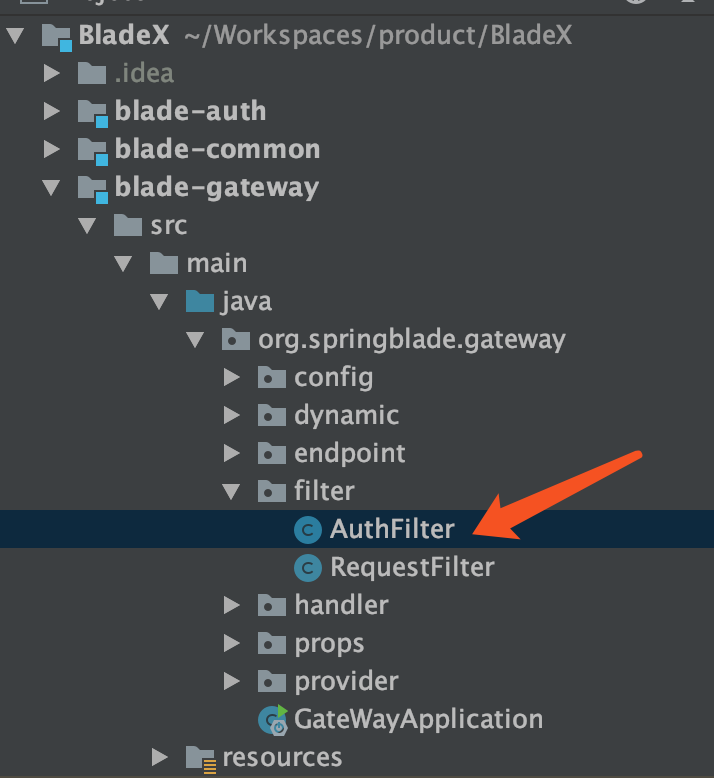
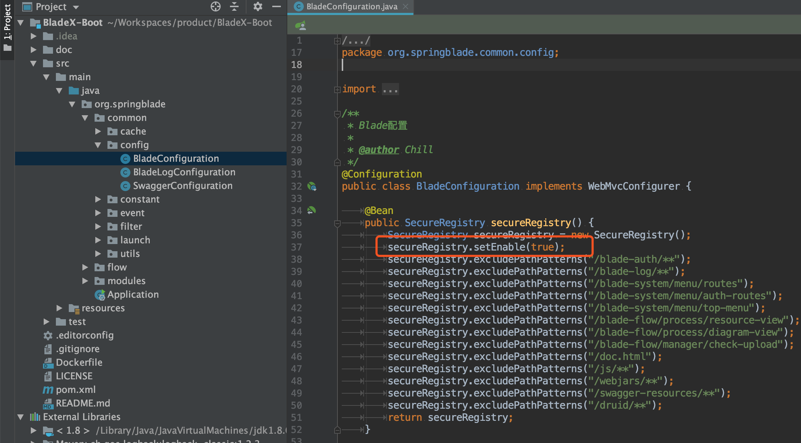

## 前言
* BladeX目前已经支持基于Nacos的动态网关鉴权功能
* SpringBoot版本，仍然沿用之前版本的Secure模块鉴权
* cloud与boot版本两者鉴权可公用同一个配置

## Cloud版鉴权放行配置
* 由于cloud版将鉴权放在了gateway，所以不再需要启用各个工程内secure模块的鉴权功能。
* secure模块的鉴权功能已经改成默认关闭状态
* 鉴权配置可以放在nacos，并且支持动态刷新
* **注：cloud版本的`blade-desk`这一类前缀，是网关转发的key，不是controller的地址，所以不需要加上。而boot版本为了保持和cloud接口地址一致，才会在controller顶层加上`blade-desk`这一类前缀**
* 配置写法如下：
~~~yaml
blade:
  secure:
    skip-url:
      - /test/**
      - /demo/**
~~~
* 网关鉴权逻辑代码位置如下：

## Boot版鉴权放行配置
* boot版与cloud版公用同一个配置
* **注：cloud版本的`blade-desk`这一类前缀，是网关转发的key，不是controller的地址，所以不需要加上。而boot版本为了保持和cloud接口地址一致，才会在controller顶层加上`blade-desk`这一类前缀**
* 配置写法如下：
~~~yaml
blade:
  secure:
    skip-url:
      - /blade-desk/test/**
      - /blade-demo/demo/**
~~~
* 由于secure模块已经默认关闭，所以boot版需要进行开启
* 开启所在代码如下：

