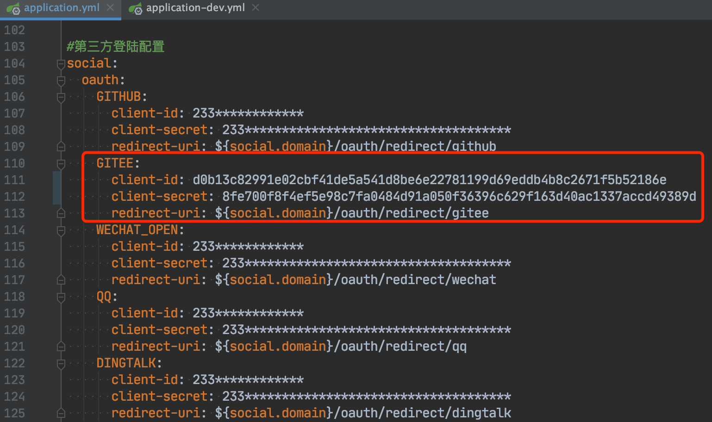
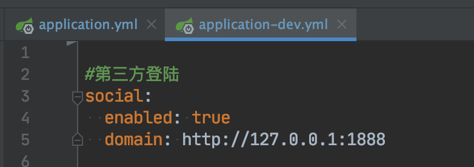
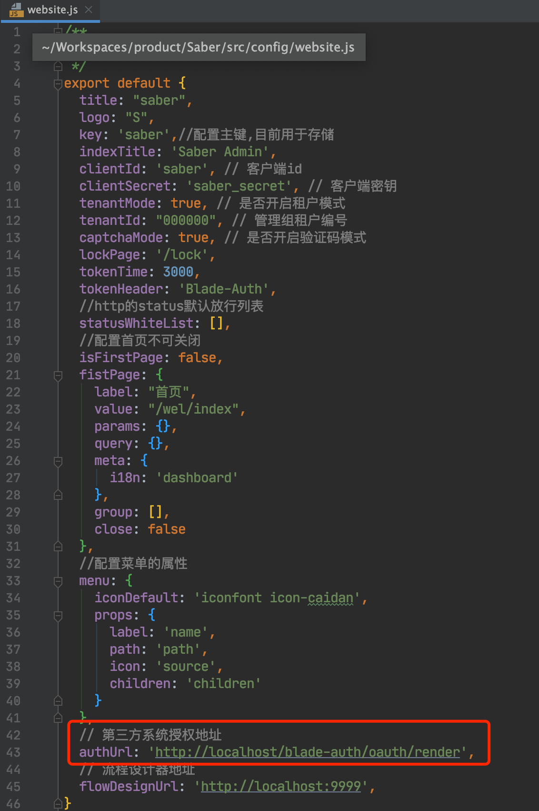
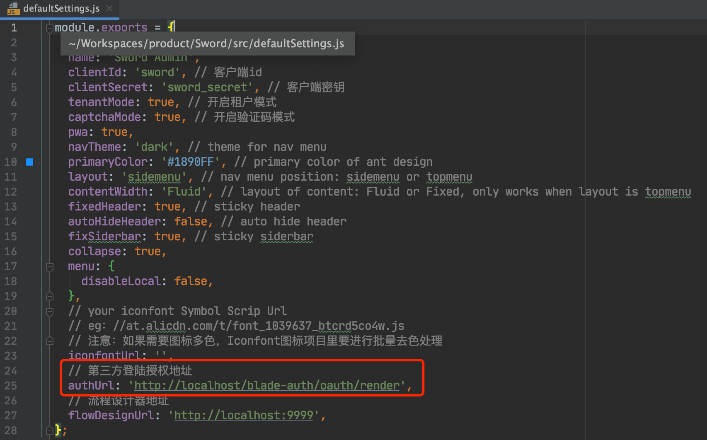

## 将应用的Key配置到系统
1. BladeX配置文件在`blade-auth`的`application.yml`与`application-xx.yml`内
2. BladeX-Boot配置文件在`resources`目录的`application.yml`与`application-xx.yml`内
3. 这里我们以BladeX-Boot配置为例，配置上一节获取到的密钥，注意`redirect-url`需要与刚刚在应用配置的`应用回调地址`一致

4. Saber配置如下，对应的是后端开放的API

5. Sword配置如下

