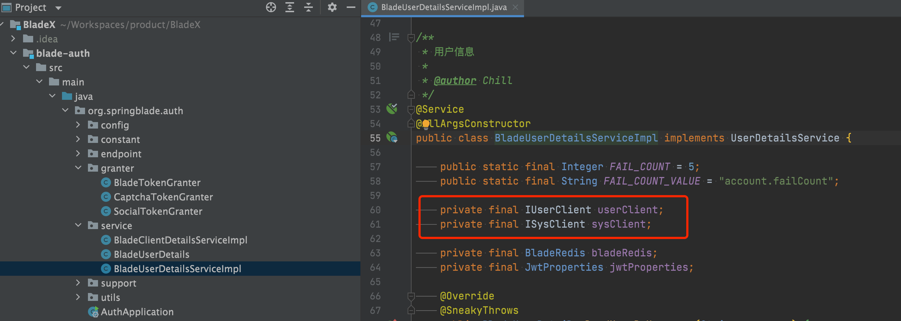

## Boot版本使用单点登录

* 目前单点登录基于Oauth2实现，需要用到SpringCloud，直接集成到Boot工程，会显得非常臃肿

* 所以我们推荐单独给blade-auth服务打包部署使用，Saber和Sword配置部署的地址便可

* 但有一点需要注意的是blade-auth采用了feign调用，如果单独跑是肯定不行，所以需要做些许改造

* 将内的两个feign调用都改成HttpUtil，调用Boot服务的地址，再修改返回数据的格式就可以了

* PS：后期会在Boot工程基础上直接拓展一个伪Oauth2单点登录出来，这样就不需要分开部署了

  