## 简介

* Skywalking 是一个优秀的APM(application performance monitor)应用性能监控系统，针对微服务场景设计，可以方便的实现Spring cloud等微服务场景下的性能监控、链路追踪等。
* 官网：https://skywalking.apache.org/
* 下载：https://skywalking.apache.org/downloads/
* 文档：https://skywalking.apache.org/docs/
* 中文版文档：https://skyapm.github.io/document-cn-translation-of-skywalking/


## 部署Skywalking

1. 部署方式有很多种，本次以docker-compose一键部署脚本为例，若需要其他部署方式，可以参考skywalking官方文档

2. 拷贝BladeX目录下的docker-compose脚本至开发机或服务器

   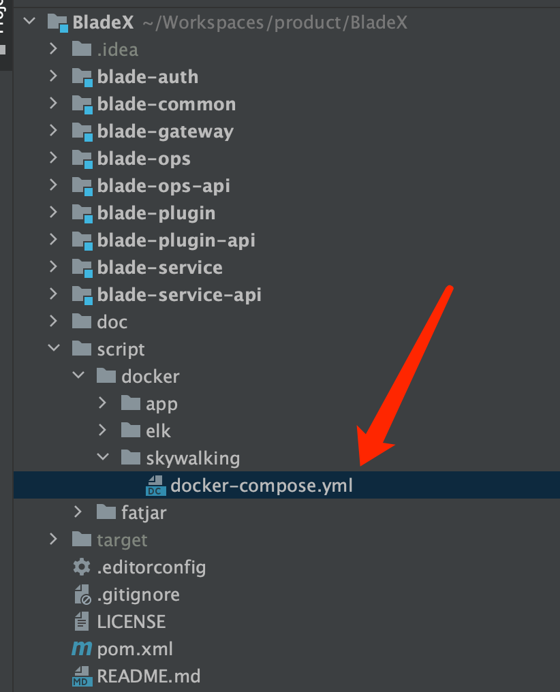

3. 进入对应目录，执行 `docker-compose up -d`，等待下载镜像并启动完毕，一般等待一分钟后便可以进行访问

   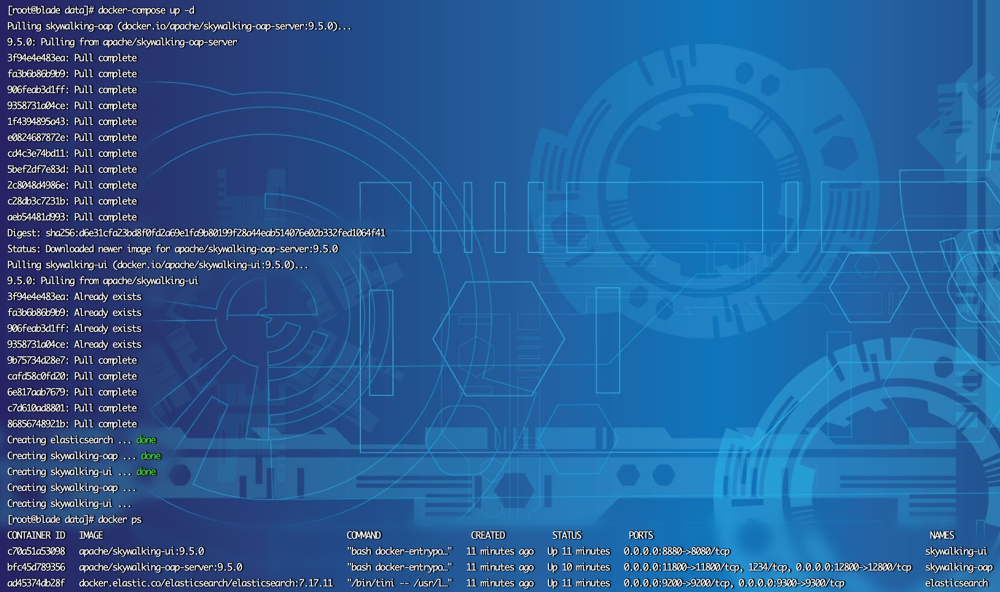

4. skywalking前端默认端口为8080，为了防止冲突，我们将其到宿主机的端口映射为8880，大家注意开通好端口策略

5. 访问http://服务地址:8880，若看到下图则说明部署成功

   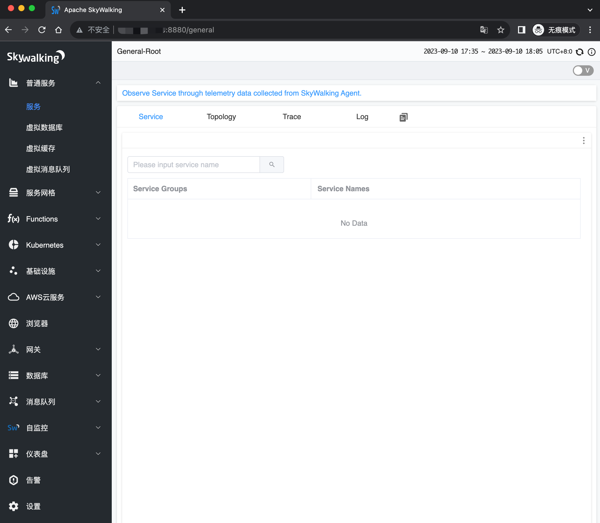


## 下载Agent

1. 前往官网下载9.x版本的Agent

   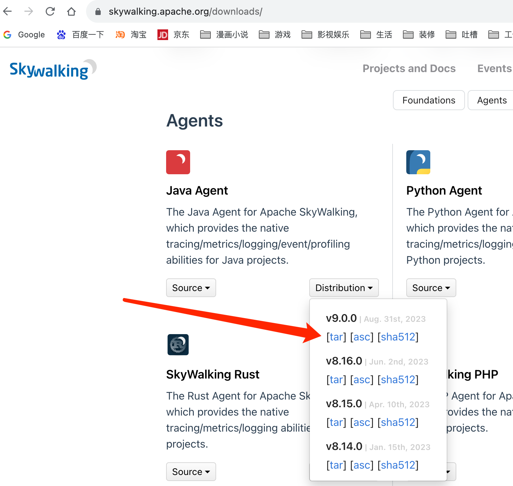

2. 放到开发机或服务器提前准备好的目录，并记下地址，以macos的开发机为例

   地址为: **/users/bladex/skywalking/skywalking-agent/skywalking-agent.jar **

   


## 依赖说明

在需要进行对接的服务，加上 blade-starter-trace 依赖

```xml
<dependency>
    <groupId>org.springblade</groupId>
    <artifactId>blade-starter-trace</artifactId>
</dependency>
```


## 配置说明

1. 核心配置如下

   ```shell
   -javaagent:/users/bladex/skywalking/skywalking-agent/skywalking-agent.jar
   -Dskywalking.agent.service_name=blade-gateway
   -Dskywalking.collector.backend_service=127.0.0.1:11800
   ```

2. `-javaagent:` 需要配置为刚刚下载 skywalking-agent 的具体jar包地址

3. `-Dskywalking.agent.service_name=`注册到skywalking的服务名称

4. `-Dskywalking.collector.backend_service=`skywalking部署的地址+服务端口号

5. 服务启动命令如下

   ```shell
   java -jar app.jar -javaagent:/users/bladex/skywalking/skywalking-agent/skywalking-agent.jar -Dskywalking.agent.service_name=blade-gateway -Dskywalking.collector.backend_service=127.0.0.1:11800
   ```

   


## 开始对接

1. 以开发模式下的idea为例，打开启动器配置，并加上skywalking所需的配置，注意各个服务的配置不同，主要需要修改注册的服务名

   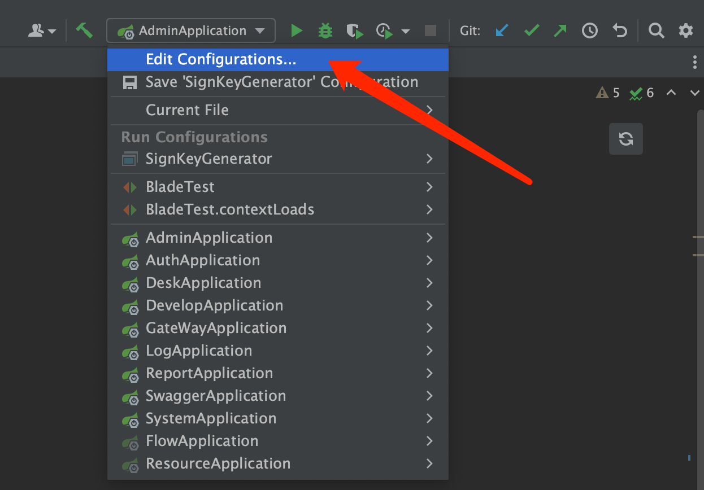

   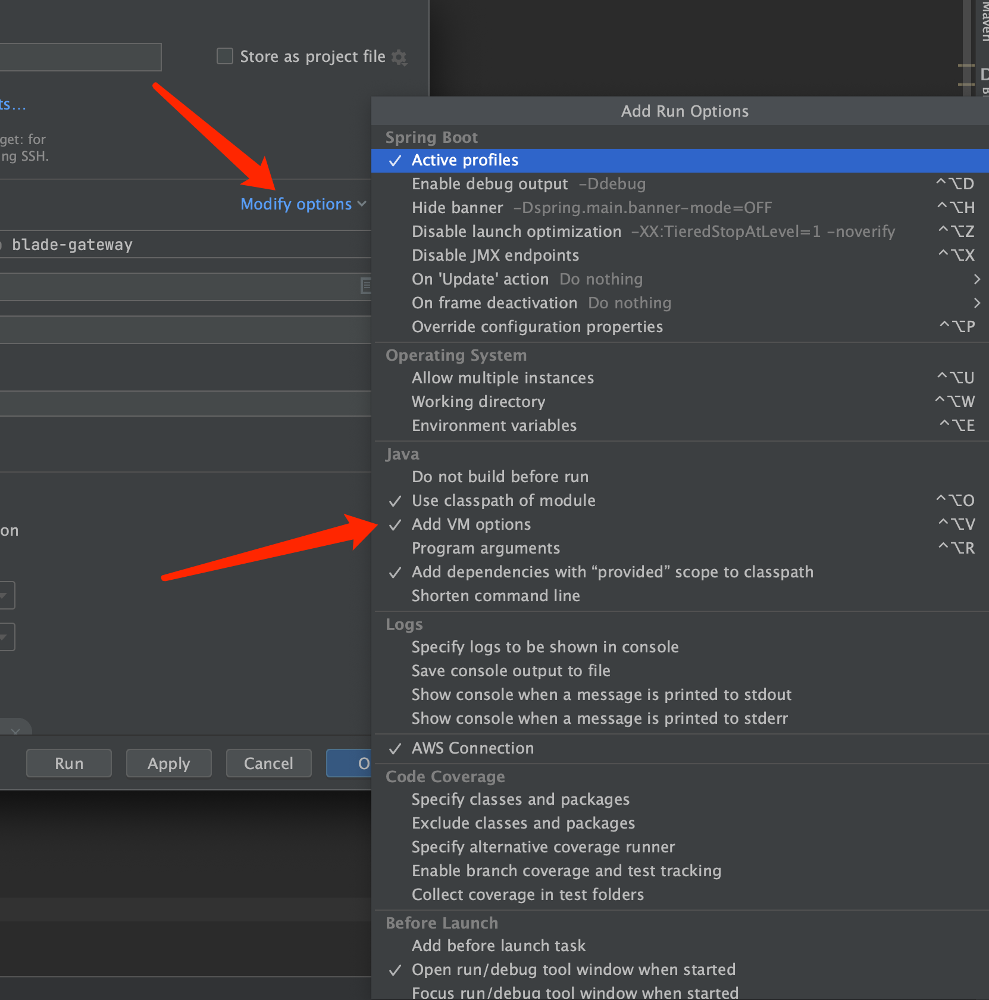

   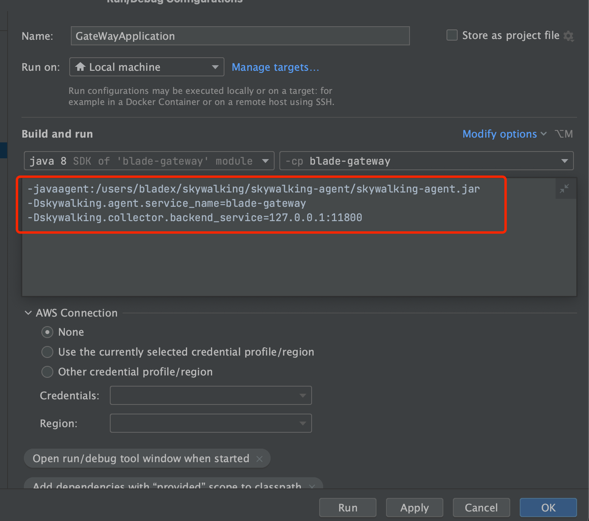

   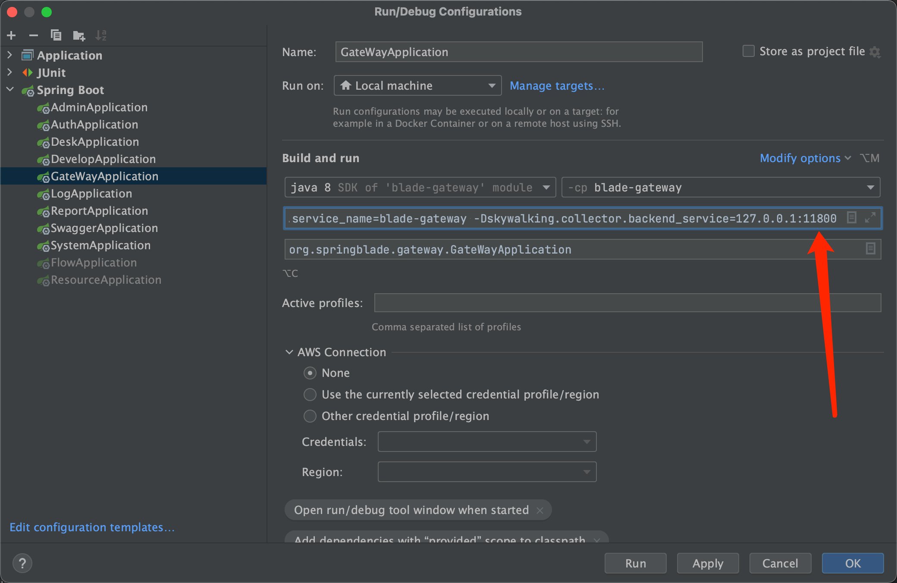

2. 启动配置的GateWayApplication，等待启动完毕

   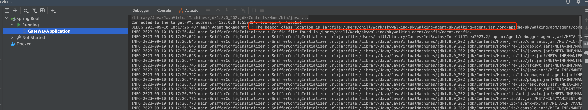

   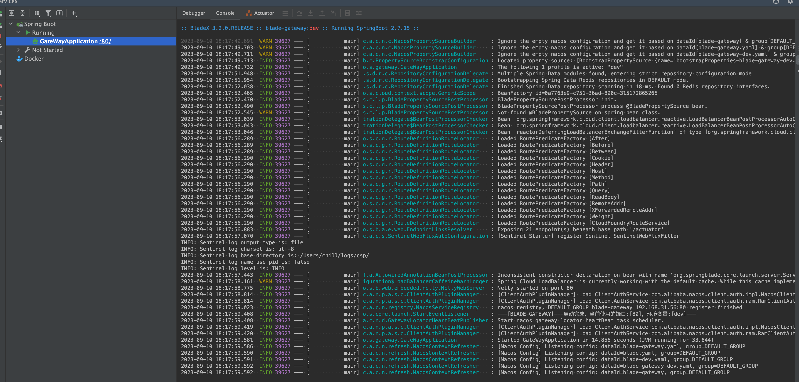

3. 一个服务成功后，说明之前的部署与配置均无问题，之后我们将需要监控的服务，都加上对应的配置并且启动完毕

4. 打开skywalking前端，查看服务已经注册成功，并且可以看到自动将调用关系以图像的形式展现出来了，链路追踪也一并处理完毕

   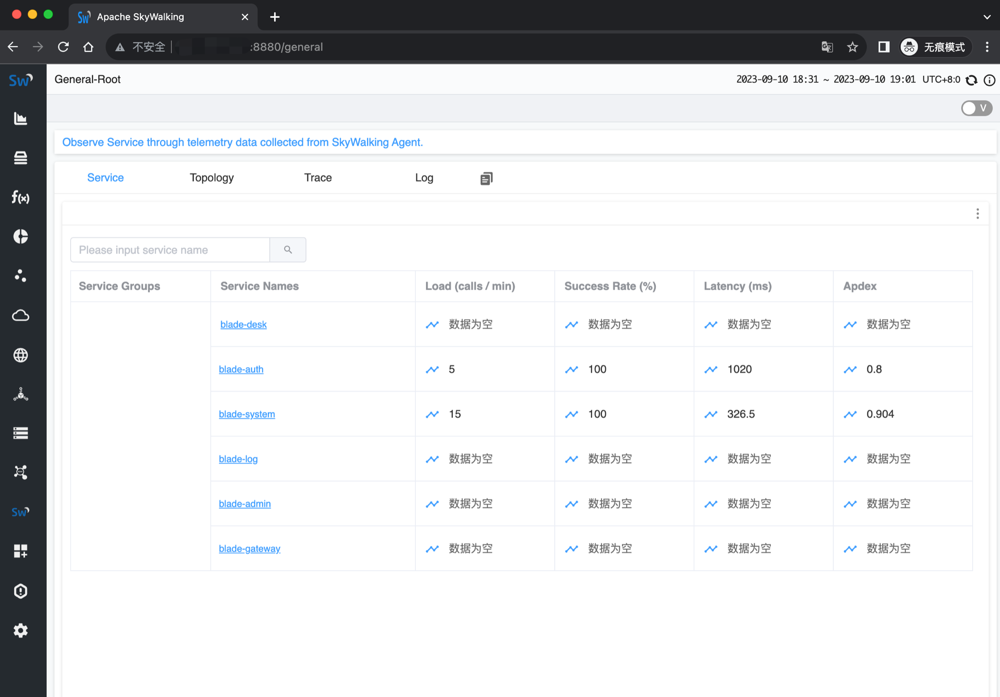

   

   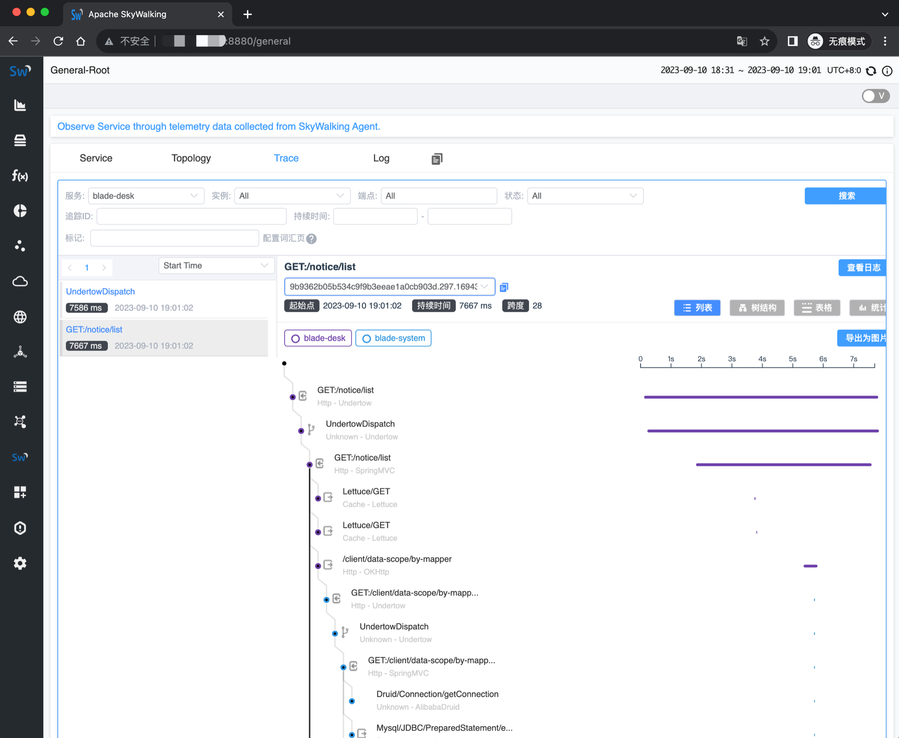

   


## 日志配置

* skywalking支持log4j、log4j2、logback三种日志，若需要将日志推送到skywalking，仅需要在对应配置文件加上官方的配置即可，无需二次开发

* 引入 blade-starter-trace 依赖

  ```xml
  <dependency>
      <groupId>org.springblade</groupId>
      <artifactId>blade-starter-trace</artifactId>
  </dependency>
  ```

* 以logback为例，加入如下配置便可，主要是通过 `%tid` 来定义

  ```xml
     <appender name="STDOUT" class="ch.qos.logback.core.ConsoleAppender">
          <encoder class="ch.qos.logback.core.encoder.LayoutWrappingEncoder">
              <layout class="org.apache.skywalking.apm.toolkit.log.logback.v1.x.TraceIdPatternLogbackLayout">
                  <Pattern>%d{yyyy-MM-dd HH:mm:ss.SSS} [%tid] [%thread] %-5level %logger{36} -%msg%n</Pattern>
              </layout>
          </encoder>
      </appender>
  ```

* 如果使用MDC，则通过 `%X{tid}` 来定义

  ```xml
      <appender name="STDOUT" class="ch.qos.logback.core.ConsoleAppender">
          <encoder class="ch.qos.logback.core.encoder.LayoutWrappingEncoder">
              <layout class="org.apache.skywalking.apm.toolkit.log.logback.v1.x.mdc.TraceIdMDCPatternLogbackLayout">
                  <Pattern>%d{yyyy-MM-dd HH:mm:ss.SSS} [%X{tid}] [%thread] %-5level %logger{36} -%msg%n</Pattern>
              </layout>
          </encoder>
      </appender>
  ```

* 更多具体完整配置请见官方文档：https://skywalking.apache.org/docs/skywalking-java/next/en/setup/service-agent/java-agent/application-toolkit-logback-1.x/

