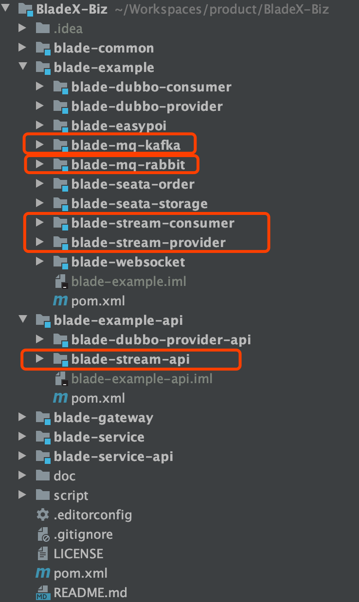
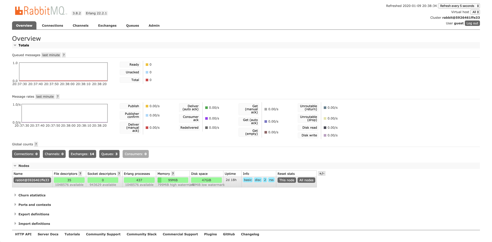
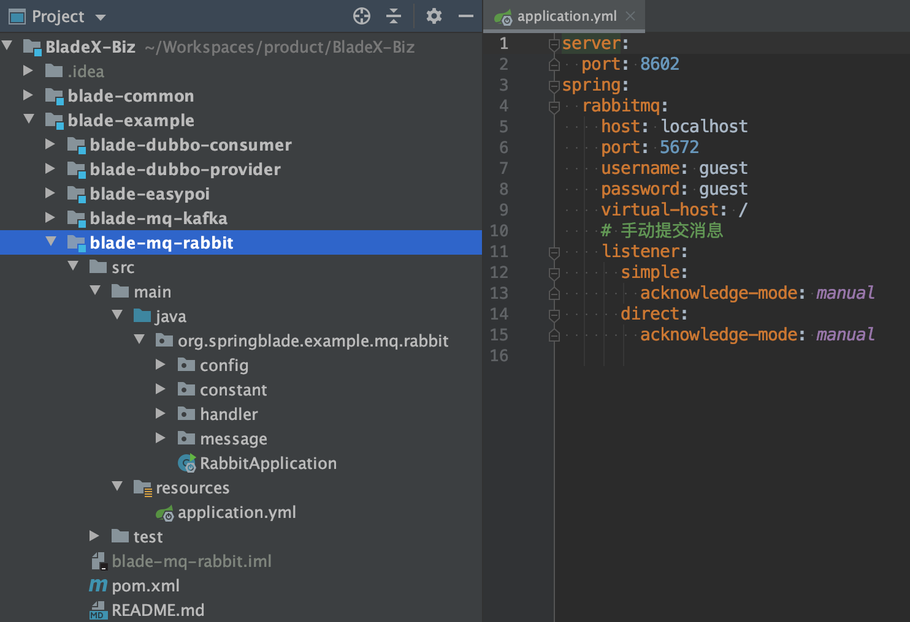
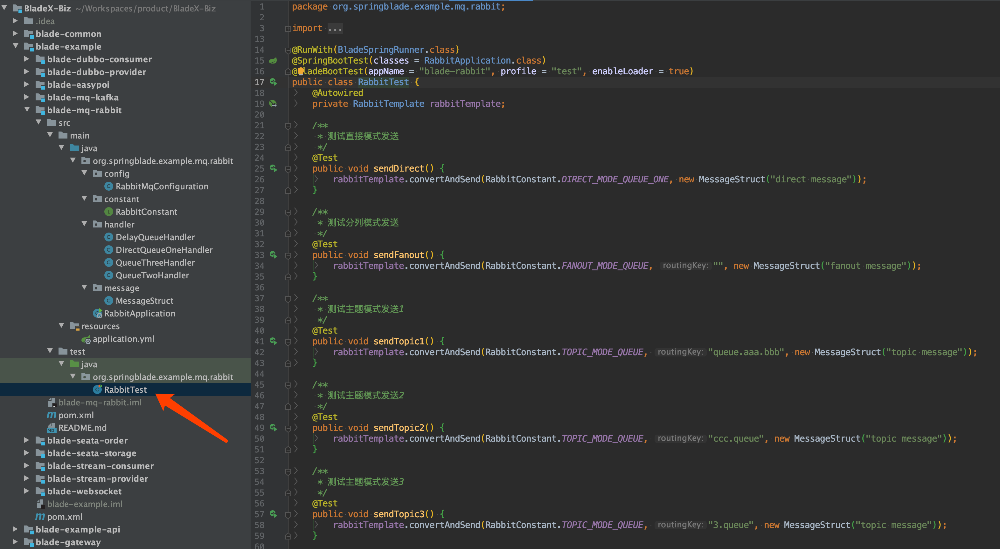
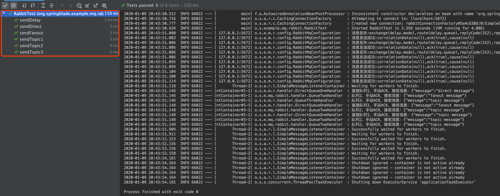
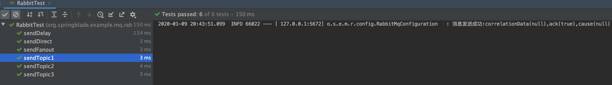

## 简介
消息队列（Message Queue），是分布式系统中重要的组件，其通用的使用场景可以简单地描述为：
> 当不需要立即获得结果，但是并发量又需要进行控制的时候，差不多就是需要使用消息队列的时候。

消息队列主要解决了应用耦合、异步处理、流量削锋等问题。
当前使用较多的消息队列有RabbitMQ、RocketMQ、ActiveMQ、Kafka、ZeroMQ、MetaMq等，而部分数据库如Redis、Mysql以及phxsql也可实现消息队列的功能。

## 消息队列使用场景
消息队列在实际应用中包括如下四个场景：

*   应用耦合：多应用间通过消息队列对同一消息进行处理，避免调用接口失败导致整个过程失败
*   异步处理：多应用对消息队列中同一消息进行处理，应用间并发处理消息，相比串行处理，减少处理时间
*   限流削峰：广泛应用于秒杀或抢购活动中，避免流量过大导致应用系统挂掉的情况
*   消息驱动的系统：系统分为消息队列、消息生产者、消息消费者，生产者负责产生消息，消费者(可能有多个)负责对消息进行处理

## 如何启动
* [BladeX-Biz](https://git.bladex.vip/blade/BladeX-Biz) 集成了kafka、rabbitmq、cloud-stream(基于rabbitmq)三种模式的工程

* 下面我们主要看第二种，由于使用了rabbitmq的延时队列，需要安装延时插件。
* 开发环境推荐docker，bladex已经做好docker镜像并推送至中央仓库，使用步骤请看：[https://hub.docker.com/repository/docker/bladex/rabbitmq](https://hub.docker.com/repository/docker/bladex/rabbitmq)
* 若使用安装包运行或者生产环境使用，请自行百度或者谷歌启动流程，这个非常简单本文不再赘述

## 如何运行
* 我们启动完毕rabbitmq后，访问控制台，使用默认密码 [guest] [guest] 登录 : [http://localhost:15672/](http://localhost:15672/)
* 登录成功后便可以看到主控制台

* 打开`BladeX-Biz`，找到`blade-example`下目录的`blade-mq-rabbit`，并进行配置

* 可以看到handler包内有很多写好的各种不同场景的处理器

* 打开单元测试，运行，并查看控制台结果，可以看到全部运行成功，每个都打印了对应的日志

## 后记
* 后续请运行不同模块的单元测试，并查看逻辑代码
* 代码非常简单，相信大家很轻松就能掌握
